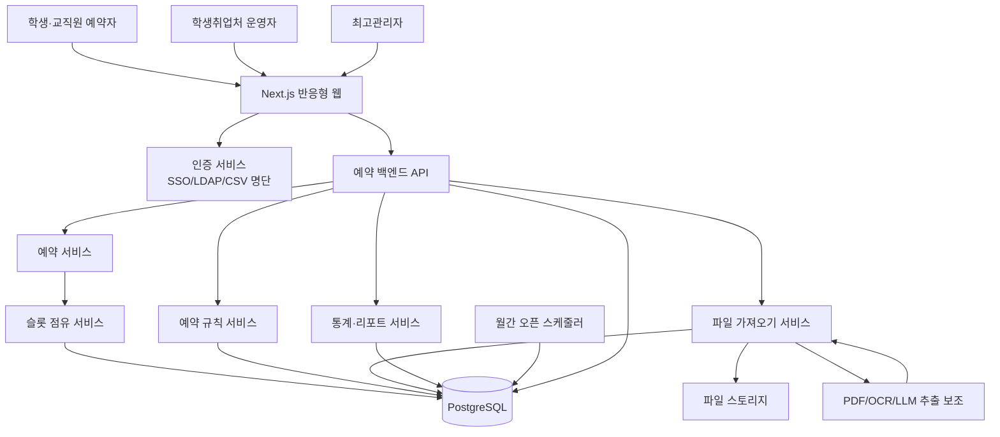
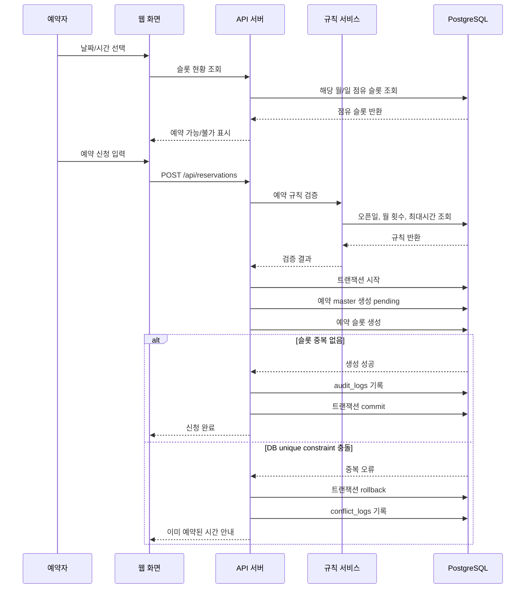
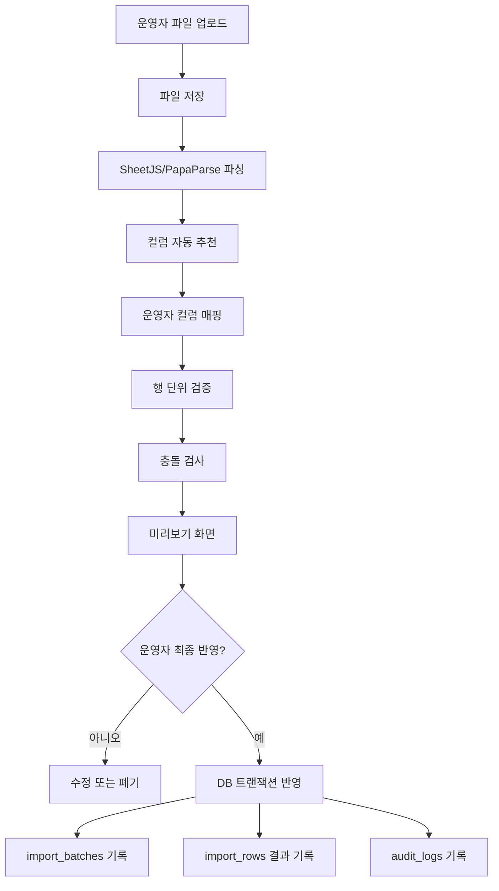
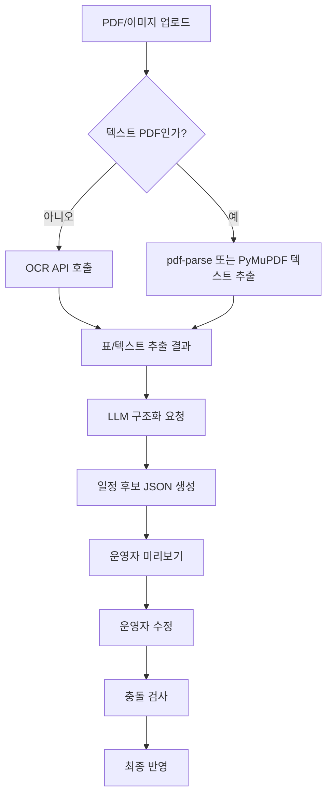
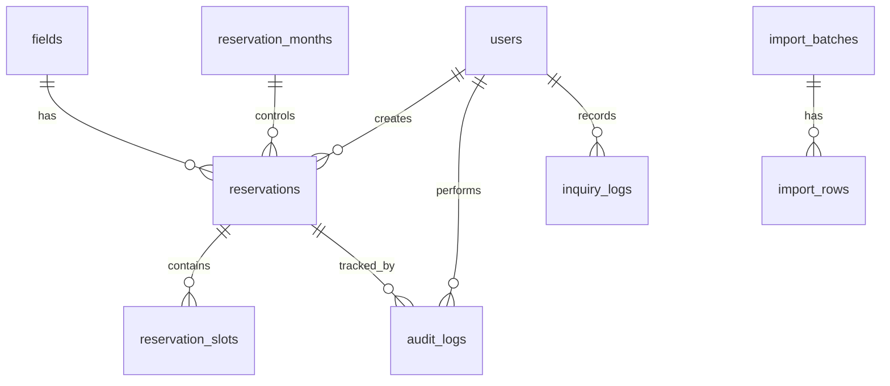

# 운동장 사용 예약 시스템 구축 — 개발 기반 문서 모음

> 이 파일은 바이브 코딩 워크숍의 목업 결과와 개발 문서 6종을 한 파일로 묶은 것입니다.
> Cursor 채팅에 이 파일을 첨부하고, "이 문서를 기반으로 개발 Plan을 만들어줘" 프롬프트를 입력하세요.

---
# 목업 화면 구상
- 도구: SKIPPED
- 목업 없이 진행 사유: 사용자가 목업 제작 없이 진행하기로 선택
(목업 결과 없음)
---# 개발기획문서

# 개발기획문서

## 1. 배경·문제정의

### 1.1 프로젝트 개요

- **프로젝트명**: 운동장 사용 예약 시스템 구축
- **대상 부서/현업**: 학생취업처 / 학생지도
- **주요 사용자**
  - 학생
  - 교직원
  - 학생취업처 운영자
- **핵심 목적**  
  운동장 예약 정보를 기존 엑셀 수기 관리에서 온라인 예약 시스템으로 전환하여, 학생·교직원이 직접 예약 현황을 확인하고 신청·수정·취소할 수 있게 한다.

---

### 1.2 현재 업무 문제

현재 운동장 예약은 학생취업처 내부 엑셀 파일을 중심으로 관리되고 있다. 이 방식은 단순해 보이지만 실제 운영에서는 다음 문제가 반복된다.

| 문제 영역 | 현재 상황 | 발생 문제 |
|---|---|---|
| 예약 정보 관리 | 내부 엑셀 파일로 관리 | 실시간 공유 어려움 |
| 예약 가능 여부 확인 | 학생·교직원이 직접 확인 불가 | 전화·방문 문의 증가 |
| 예약 접수 | 전화·방문·수기 입력 혼재 | 처리 기준과 시점 불일치 |
| 중복 예약 관리 | 운영자가 엑셀 확인 | 동시 신청·변경 시 충돌 가능 |
| 우선 배정 일정 | 수업·훈련 일정 사전 반영 필요 | 일반 예약과 충돌 가능 |
| 운영 성과 측정 | 별도 수기 집계 필요 | 문의 감소 효과 측정 어려움 |

---

### 1.3 해결해야 할 핵심 문제

이 프로젝트의 핵심 문제는 “예약 신청자가 많다”가 아니라, **운동장 예약 정보가 학생취업처 내부 엑셀에 갇혀 있어 학생·교직원이 직접 확인하고 처리할 수 없는 구조**에 있다.

따라서 시스템은 다음을 반드시 해결해야 한다.

1. 예약 가능 여부를 온라인에서 직접 확인할 수 있어야 한다.
2. 예약 신청은 온라인으로 일원화되어야 한다.
3. 동일 날짜·동일 시간대 중복 예약은 시스템이 원천 차단해야 한다.
4. 정규수업, 축구부 훈련시간 등 우선 배정 일정은 일반 예약 전에 먼저 등록되어야 한다.
5. 학생·교직원은 학번 또는 사번으로 로그인하여 본인 예약만 수정·취소해야 한다.
6. 전월 20일부터 다음 달 예약이 열리는 월간 오픈 정책이 자동 적용되어야 한다.
7. 예약 건수, 전화 문의 건수, 방문 문의 건수를 통해 업무 개선 효과를 측정해야 한다.

---

### 1.4 업무 흐름 변화

#### 기존 업무 흐름

```text
학생·교직원 전화/방문 문의
→ 운영자 엑셀 확인
→ 가능 여부 안내
→ 예약 접수
→ 운영자 엑셀 입력
→ 변경·취소 시 다시 전화/방문
→ 운영자 수기 수정
```

#### 개선 후 업무 흐름

```text
운영자 우선 배정 일정 선입력
→ 전월 20일 다음 달 예약 자동 오픈
→ 학생·교직원 로그인
→ 예약 현황 직접 조회
→ 빈 시간대 선택
→ 예약 신청
→ 시스템 중복 차단
→ 운영자 승인 또는 자동 확정
→ 본인 예약 수정·취소
→ 통계 및 성과 자동 집계
```

---

### 1.5 개발 방향

이 시스템은 단순한 데모용 예약 화면이 아니라 실제 학생취업처 업무에 투입 가능한 운영 시스템을 목표로 한다.

따라서 다음 기술 요소를 적극적으로 활용한다.

- 웹 기반 예약 캘린더
- 학번·사번 기반 로그인
- PostgreSQL 또는 Supabase 기반 예약 DB
- DB 레벨 중복 예약 차단
- 엑셀/CSV 업로드 및 파싱
- 정규수업·축구부 훈련 일정 우선 배정 등록
- 관리자 통계 대시보드
- CSV/Excel/PDF 리포트 출력
- 필요 시 PDF/OCR/LLM 기반 시간표 추출 보조
- 향후 학교 SSO, LDAP, 통합정보시스템 연동

---

## 2. 목표·기대효과

### 2.1 프로젝트 목표

이 프로젝트의 목표는 운동장 예약 업무를 온라인 중심으로 전환하여 **예약 조회, 신청, 수정, 취소, 우선 배정, 통계 관리**를 하나의 시스템에서 처리하는 것이다.

구체적 목표는 다음과 같다.

1. 운동장 예약 정보를 온라인으로 공개한다.
2. 방문·전화 예약 문의를 줄인다.
3. 동일 시간대 중복 예약을 시스템과 DB에서 차단한다.
4. 운영자가 정규수업, 축구부 훈련 등 우선 배정 일정을 일반 예약 전에 선등록할 수 있게 한다.
5. 전월 20일 다음 달 예약 오픈 정책을 자동화한다.
6. 학생·교직원은 본인 예약만 수정·취소할 수 있게 한다.
7. 예약 건수, 전화 문의 건수, 방문 문의 건수 등 운영 성과를 대시보드로 확인한다.
8. 기존 엑셀 예약 데이터를 시스템으로 이관할 수 있게 한다.

---

### 2.2 기대효과

| 구분 | 기대효과 |
|---|---|
| 학생·교직원 | 예약 가능 여부를 직접 확인하고 온라인으로 신청 가능 |
| 학생취업처 운영자 | 전화·방문 응대 및 엑셀 수기 입력 감소 |
| 행정 효율 | 예약, 수정, 취소, 우선 배정 내역이 DB에 일관되게 저장 |
| 중복 방지 | 동일 날짜·시간대 예약 충돌 원천 차단 |
| 운영 투명성 | 날짜, 시간대, 신청단체 공개로 현황 공유 |
| 성과 관리 | 월별 예약 건수, 문의 건수, 중복 차단 건수 측정 가능 |
| 확장성 | 향후 SSO 연동, 모바일 최적화, 시설 추가, 승인 결재 연동 가능 |

---

### 2.3 기술적 접근 대안

#### 2.3.1 인증 방식 대안

| 방식 | 설명 | 장점 | 단점 | 권장 단계 |
|---|---|---|---|---|
| 학교 SSO 연동 | 대학 통합 로그인 사용 | 보안성 높음, 계정 관리 부담 적음 | 전산팀 협조 필요 | 정식 운영 권장 |
| LDAP/AD 연동 | 교내 계정 디렉터리 연동 | 조직 계정 기반 관리 가능 | 인프라 접근 필요 | 중장기 |
| 명단 CSV 기반 로그인 | 학생·교직원 명단 업로드 후 인증 | 빠르게 구현 가능 | 명단 갱신 필요 | 1차 구축 현실안 |
| 이메일 OTP | 학교 이메일로 인증번호 발송 | 비밀번호 관리 부담 적음 | 메일 발송 시스템 필요 | 보조안 |

**권장안**  
워크숍 및 초기 구축에서는 **명단 CSV 기반 로그인**으로 시작하고, 정식 운영 전 또는 운영 안정화 후 학교 SSO 연동으로 전환하는 방식을 권장한다.

---

#### 2.3.2 예약 중복 차단 방식 대안

| 방식 | 설명 | 장점 | 단점 |
|---|---|---|---|
| 프론트엔드 비활성화 | 이미 예약된 슬롯을 화면에서 선택 불가 처리 | 사용자 경험 좋음 | 단독으로는 동시 신청 차단 불가 |
| 백엔드 중복 검사 | 예약 저장 전 서버에서 중복 여부 확인 | 기본적인 검증 가능 | 동시 요청에서는 경합 가능 |
| DB Unique Constraint | 동일 슬롯 저장 자체를 DB에서 차단 | 강력하고 안정적 | 슬롯 단위 설계 필요 |
| PostgreSQL Exclusion Constraint | 시간 범위 겹침을 DB에서 차단 | 유연한 시간 범위 예약 가능 | 구현 난이도 높음 |

**권장안**  
1차 운영에서는 구현과 검증이 쉬운 **슬롯 기반 Unique Constraint 방식**을 권장한다.

예시:

- 예약 단위: 1시간
- 운영 시간: 09:00~22:00
- 예약이 2시간이면 2개의 슬롯 저장
- `field_id + slot_date + slot_start_time` 조합에 unique constraint 적용
- 상태가 `pending`, `approved`, `blocked`인 슬롯은 중복 생성 불가

향후 다양한 시간 범위 예약이 필요해지면 PostgreSQL `tsrange`와 exclusion constraint 방식으로 확장할 수 있다.

---

#### 2.3.3 시스템 구축 방식 대안

| 방식 | 설명 | 장점 | 단점 | 권장 여부 |
|---|---|---|---|---|
| Supabase + Next.js | 인증, DB, API를 빠르게 구성 | Cursor로 구현 용이, PostgreSQL 사용 | 기관 내부망 정책 확인 필요 | 1차 권장 |
| 자체 서버 + PostgreSQL | 학교 서버에 직접 배포 | 데이터 통제력 높음 | 서버 운영 부담 큼 | 정식 운영 권장 가능 |
| Firebase | 빠른 개발 가능 | 실시간 기능 강점 | 관계형 예약 제약 구현이 상대적으로 불편 | 비권장 |
| 노코드 예약툴 | 빠르게 도입 가능 | 개발 부담 낮음 | 학번·사번 인증, 우선 배정, 중복 차단, 통계 확장 한계 | 비권장 |

**권장안**  
워크숍과 Cursor 기반 단계 구현을 고려하면 **Next.js + Supabase PostgreSQL** 구성을 권장한다.  
정식 운영 시에는 학교 정책에 따라 Supabase 유지, Supabase self-hosting, 또는 교내 서버 PostgreSQL 배포 중 선택할 수 있다.

---

## 3. 핵심 기능 목록

## 3.1 사용자 유형 및 권한

| 사용자 | 주요 권한 |
|---|---|
| 비로그인 사용자 | 예약 현황 조회 가능 여부는 정책에 따라 선택 |
| 일반 예약자 | 로그인, 예약 현황 조회, 예약 신청, 본인 예약 수정·취소 |
| 운영자 | 전체 예약 관리, 우선 배정 등록, 승인·반려, 문의 건수 입력, 통계 확인 |
| 최고관리자 | 운영자 계정 관리, 예약 정책 설정, 데이터 이관 관리 |

---

## 3.2 화면 단위 핵심 기능

목업은 별도로 제공되지 않았으므로, 실제 개발 예측 가능성을 높이기 위해 화면 단위로 기능을 정리한다.

---

### 화면 1. 시작 화면 / 안내 화면

#### 목적

운동장 예약 시스템의 이용 방법과 현재 예약 현황으로 진입하는 첫 화면이다.

#### 주요 기능

- 시스템 소개
- 예약 정책 안내
  - 온라인 예약 원칙
  - 다음 달 예약은 전월 20일부터 가능
  - 본인 예약만 수정·취소 가능
  - 정규수업·축구부 훈련시간은 우선 배정
  - 예약 가능 횟수 제한 안내
- 로그인 버튼
- 예약 현황 보기 버튼
- 관리자 로그인 진입

#### 필요 데이터

- 공지사항
- 예약 운영 정책
- 오픈 일정

---

### 화면 2. 로그인 화면

#### 목적

학번 또는 사번으로 사용자를 식별한다.

#### 주요 기능

- 학번/사번 입력
- 비밀번호 또는 인증 방식 입력
- 사용자 유형 확인
  - 학생
  - 교직원
  - 운영자
- 로그인 실패 안내
- 비밀번호 초기화 또는 인증 문의 안내

#### 1차 구현 방식

- 관리자 CSV 업로드를 통해 사용자 명단 등록
- `student_no` 또는 `employee_no` 기반 로그인
- 초기 비밀번호 또는 임시 인증 코드 사용
- 운영자는 별도 권한 부여

#### 향후 확장

- 학교 SSO 연동
- LDAP/AD 연동
- 학교 이메일 OTP 인증
- 통합정보시스템 사용자 자동 동기화

---

### 화면 3. 예약 현황 캘린더 화면

#### 목적

학생·교직원이 날짜별, 시간대별 운동장 예약 가능 여부를 직접 확인한다.

#### 주요 기능

- 월간 캘린더 보기
- 주간 캘린더 보기
- 날짜별 시간대 슬롯 보기
- 예약 상태 표시
  - 예약 가능
  - 신청 진행 중
  - 예약 완료
  - 정규수업
  - 축구부 훈련
  - 시설 점검
  - 오픈 전
- 공개 정보 표시
  - 날짜
  - 시간대
  - 신청단체
- 빈 슬롯 선택 후 예약 신청 화면 이동
- 이미 예약된 슬롯 선택 불가
- 오픈 전 월은 신청 버튼 비활성화

#### 공개 정보 정책 권장안

| 상태 | 공개 표시 |
|---|---|
| `pending` | 신청 진행 중 |
| `approved` | 신청단체명 표시 |
| `blocked` | 정규수업, 축구부 훈련, 시설 점검 등 유형 표시 |
| `rejected` | 표시하지 않음 |
| `cancelled` | 표시하지 않음 |

---

### 화면 4. 예약 신청 화면

#### 목적

사용자가 원하는 날짜와 시간대를 선택하여 예약을 신청한다.

#### 주요 기능

- 선택한 날짜 표시
- 선택한 시작 시간, 종료 시간 표시
- 신청단체 입력
- 사용목적 입력
- 사용자 연락처 확인
- 예약 정책 동의 체크
- 신청 버튼
- 신청 전 검증
  - 로그인 여부
  - 예약 오픈 여부
  - 동일 슬롯 중복 여부
  - 월 예약 횟수 초과 여부
  - 예약 가능 시간 범위 여부
  - 필수 입력값 여부

#### 예약 상태 정책

1차 운영에서는 두 가지 방식 중 선택 가능하다.

| 방식 | 설명 | 장점 | 단점 |
|---|---|---|---|
| 자동 확정제 | 신청 즉시 `approved` | 운영자 승인 업무 없음 | 부적절한 신청 통제 약함 |
| 승인제 | 신청 후 `pending`, 운영자 승인 후 `approved` | 운영 통제 가능 | 승인 처리 업무 필요 |

**권장안**  
학생취업처 운영 통제가 필요하므로 **승인제**를 권장한다.  
단, 중복 방지를 위해 `pending` 상태도 해당 슬롯을 차단해야 한다.

---

### 화면 5. 내 예약 관리 화면

#### 목적

예약자가 본인이 신청한 예약을 확인하고 수정·취소한다.

#### 주요 기능

- 내 예약 목록 조회
- 예약 상태 확인
  - 승인 대기
  - 승인 완료
  - 반려
  - 취소
- 예약 상세 보기
- 본인 예약 수정
- 본인 예약 취소
- 수정 시 중복 검증
- 취소 시 사유 입력
- 취소 가능 마감 시간 적용

#### 주요 정책

- 사용자는 본인 예약만 수정·취소 가능
- 이미 종료된 예약은 수정·취소 불가
- 승인 완료 예약의 수정은 운영 정책에 따라 다시 승인 대기 상태로 변경 가능
- 취소된 슬롯은 다시 예약 가능 상태로 전환

---

### 화면 6. 관리자 대시보드

#### 목적

운영자가 전체 예약 운영 상황을 한눈에 확인한다.

#### 주요 기능

- 오늘 예약 현황
- 이번 달 예약 현황
- 승인 대기 건수
- 우선 배정 등록 현황
- 전화 문의 건수
- 방문 문의 건수
- 중복 예약 차단 시도 건수
- 월별 예약 추이 그래프
- 신청단체별 예약 건수
- CSV/Excel 다운로드
- PDF 월간 리포트 생성

---

### 화면 7. 관리자 예약 관리 화면

#### 목적

운영자가 전체 예약을 조회하고 필요한 처리를 한다.

#### 주요 기능

- 전체 예약 목록 조회
- 조건 검색
  - 날짜
  - 신청단체
  - 신청자
  - 상태
  - 예약 유형
- 예약 상세 보기
- 승인
- 반려
- 관리자 취소
- 관리자 대리 등록
- 변경 이력 확인

#### 관리자 대리 등록 정책

원칙적으로 전화·방문 예약은 접수하지 않지만, 다음 예외 상황에서는 운영자가 대리 등록할 수 있다.

- 시스템 장애
- 장애인·정보취약 사용자 지원
- 긴급 행정 사유
- 공식 행사 긴급 배정

이 경우 반드시 다음 정보를 남긴다.

- 대리 등록 사유
- 처리 운영자
- 처리 일시
- 메모

---

### 화면 8. 우선 배정 일정 등록 화면

#### 목적

일반 예약 오픈 전에 정규수업, 축구부 훈련시간, 시설 점검 등 우선 배정 일정을 등록한다.

#### 주요 기능

- 우선 배정 직접 입력
- 반복 일정 등록
  - 시작일
  - 종료일
  - 요일
  - 시작 시간
  - 종료 시간
- 유형 선택
  - 정규수업
  - 축구부 훈련
  - 학교 행사
  - 시설 점검
  - 기타
- 신청단체 또는 담당부서 입력
- 기존 예약과 충돌 검사
- 등록 전 미리보기
- 일괄 등록

#### 중요 정책

- 우선 배정 일정은 일반 예약보다 우선한다.
- 등록된 우선 배정 슬롯은 일반 예약자가 선택할 수 없다.
- 이미 일반 예약이 있는 슬롯에 우선 배정을 넣으려는 경우 충돌 경고를 표시한다.

---

### 화면 9. 엑셀/CSV 가져오기 화면

#### 목적

기존 엑셀 예약표 또는 정규수업·훈련 일정을 시스템으로 이관한다.

#### 주요 기능

- 엑셀/CSV 파일 업로드
- 컬럼 자동 매핑
- 컬럼 수동 매핑
- 데이터 미리보기
- 오류 검출
  - 날짜 형식 오류
  - 시간 형식 오류
  - 필수값 누락
  - 중복 행
  - 기존 예약과 충돌
- 오류 행 다운로드
- 검수 후 최종 반영
- import batch 이력 관리

#### 지원 파일

- `.xlsx`
- `.csv`

#### 향후 확장

- PDF 시간표 업로드
- PDF 텍스트 추출
- OCR 처리
- LLM 기반 일정 구조화
- 운영자 검수 후 반영

---

### 화면 10. 예약 정책 설정 화면

#### 목적

예약 정책을 코드 수정 없이 변경할 수 있게 한다.

#### 주요 기능

- 예약 오픈일 설정
  - 기본값: 전월 20일
- 예약 단위 설정
  - 기본값: 1시간
- 운영 시간 설정
  - 예: 09:00~22:00
- 월 예약 가능 횟수 설정
  - 기본값: 1회
- 1회 최대 예약 시간 설정
  - 예: 2시간
- 취소 가능 마감 시간 설정
  - 예: 사용 시작 24시간 전
- 승인 필요 여부 설정
- 사용목적 필수 여부 설정

#### 권장 구현

1차 운영에서는 모든 정책 설정 화면을 완성하지 않더라도, 최소한 `settings` 또는 `rules` 테이블에 값을 저장하여 향후 화면에서 수정 가능하도록 설계한다.

---

### 화면 11. 문의 건수 입력 및 성과 관리 화면

#### 목적

전화·방문 문의 감소 효과를 측정한다.

#### 주요 기능

- 문의 건수 입력
  - 날짜
  - 문의 유형: 전화 / 방문 / 기타
  - 문의 내용 분류
  - 건수
  - 메모
- 월별 문의 건수 조회
- 예약 건수와 문의 건수 비교 그래프
- 전월 대비 증감률
- CSV 다운로드
- PDF 리포트 생성

---

## 3.3 핵심 데이터 구조

### 주요 테이블

| 테이블 | 용도 |
|---|---|
| `users` | 학생·교직원·운영자 정보 |
| `fields` | 운동장 또는 시설 정보 |
| `reservations` | 예약 대표 정보 |
| `reservation_slots` | 실제 차단되는 날짜·시간 슬롯 |
| `priority_blocks` | 우선 배정 일정 정보 |
| `inquiry_logs` | 전화·방문 문의 기록 |
| `settings` 또는 `rules` | 예약 정책 설정 |
| `audit_logs` | 생성·수정·취소·승인 이력 |
| `import_batches` | 파일 업로드 이력 |
| `import_rows` | 업로드 파일 개별 행 검수 결과 |
| `conflict_logs` | 중복 예약 또는 정책 위반 시도 기록 |

---

### 예약 상태값

| 상태 | 의미 | 슬롯 차단 여부 |
|---|---|---|
| `pending` | 신청 완료, 승인 대기 | 차단 |
| `approved` | 승인 완료 | 차단 |
| `rejected` | 반려 | 미차단 |
| `cancelled` | 취소 | 미차단 |
| `blocked` | 우선 배정 또는 관리자 차단 | 차단 |

---

### 예약 유형

| 유형 | 설명 |
|---|---|
| `general` | 일반 사용자 예약 |
| `class` | 정규수업 |
| `training` | 축구부 훈련 |
| `event` | 학교 행사 |
| `maintenance` | 시설 점검 |
| `admin_block` | 관리자 차단 |
| `proxy` | 관리자 대리 등록 |

---

## 3.4 주요 API 예시

실제 구현 시 Next.js API Route 또는 별도 백엔드 API로 구성할 수 있다.

| API | 기능 |
|---|---|
| `POST /api/auth/login` | 로그인 |
| `GET /api/calendar?month=YYYY-MM` | 월간 예약 현황 조회 |
| `GET /api/slots?date=YYYY-MM-DD` | 특정 날짜 슬롯 조회 |
| `POST /api/reservations` | 예약 신청 |
| `GET /api/my/reservations` | 내 예약 목록 |
| `PATCH /api/reservations/{id}` | 내 예약 수정 |
| `POST /api/reservations/{id}/cancel` | 예약 취소 |
| `GET /api/admin/reservations` | 관리자 전체 예약 조회 |
| `POST /api/admin/reservations/{id}/approve` | 예약 승인 |
| `POST /api/admin/reservations/{id}/reject` | 예약 반려 |
| `POST /api/admin/priority-blocks` | 우선 배정 등록 |
| `POST /api/admin/import` | 엑셀/CSV 업로드 |
| `GET /api/admin/stats` | 통계 조회 |
| `POST /api/admin/inquiries` | 문의 건수 입력 |
| `GET /api/admin/report/monthly` | 월간 리포트 다운로드 |

---

## 4. 1차 운영 범위(우선순위)와 향후 확장

## 4.1 1차 운영 범위 선정 원칙

1차 운영 범위는 “기능을 줄인 장난감”이 아니라, 실제 운동장 예약 업무가 온라인으로 돌아가기 위한 최소 필수 운영 단위로 정의한다.

따라서 다음 기능은 1차 운영에 포함해야 한다.

- 로그인
- 예약 현황 조회
- 예약 신청
- 중복 예약 차단
- 본인 예약 수정·취소
- 운영자 전체 예약 관리
- 우선 배정 일정 등록
- 월간 오픈 정책 적용
- 기존 엑셀/CSV 데이터 가져오기
- 기본 통계 확인

---

## 4.2 우선순위 구분

### P0. 반드시 필요한 핵심 기능

| 기능 | 포함 이유 |
|---|---|
| 학번·사번 기반 로그인 | 본인 식별과 본인 예약 관리에 필수 |
| 예약 캘린더 조회 | 전화·방문 문의 감소의 핵심 |
| 예약 신청 | 온라인 예약 일원화의 핵심 |
| DB 기반 중복 차단 | 중복 예약 0건 달성에 필수 |
| 본인 예약 수정·취소 | 운영자 수기 변경 업무 감소 |
| 운영자 예약 관리 | 승인, 반려, 예외 처리 필요 |
| 우선 배정 일정 등록 | 수업·훈련시간 충돌 방지 |
| 월간 오픈 정책 | 전월 20일 예약 오픈 규칙 반영 |
| 감사 로그 | 책임성과 이력 추적 필요 |

---

### P1. 1차 운영에 포함 권장

| 기능 | 포함 이유 |
|---|---|
| 엑셀/CSV 가져오기 | 기존 자료 이관과 수업·훈련 일정 등록에 필요 |
| 문의 건수 수동 입력 | 성과 측정 필요 |
| 기본 통계 대시보드 | 운영 성과 확인 필요 |
| CSV 다운로드 | 보고자료 작성에 필요 |
| 관리자 대리 등록 | 예외 상황 대응 필요 |
| 예약 정책 DB화 | 향후 규칙 변경 대비 |

---

### P2. 향후 확장 범위

향후 범위는 일정상 후순위일 뿐 기술적으로 불가능하거나 금지된 기능이 아니다. 1차 운영 후 실제 사용 데이터를 기반으로 확장한다.

| 기능 | 설명 |
|---|---|
| 학교 SSO 연동 | 통합 로그인으로 전환 |
| LDAP/AD 연동 | 교내 계정 디렉터리와 연동 |
| PDF 시간표 파싱 | PDF 기반 수업 시간표 자동 추출 |
| OCR/LLM 일정 추출 | 스캔본 또는 비정형 시간표 구조화 |
| PDF 월간 리포트 | 성과 보고서 자동 생성 |
| 알림 기능 | 예약 신청·승인·취소 알림 |
| 이메일/SMS/카카오 알림톡 | 사용자 안내 자동화 |
| 다중 시설 예약 | 운동장 외 체육관, 강의실 등 확장 |
| 구역 분할 예약 | 운동장 A구역, B구역 등 분할 |
| 승인 결재 연동 | 내부 전자결재 시스템 연동 |
| 통합정보시스템 연동 | 사용자·수업 데이터 자동 동기화 |
| 모바일 앱 | 웹 안정화 후 별도 앱 검토 |

---

## 4.3 1차 운영 화면 범위

| 화면 | 1차 포함 여부 | 비고 |
|---|---:|---|
| 시작/안내 화면 | 포함 | 이용 정책 안내 |
| 로그인 화면 | 포함 | CSV 명단 기반 우선 |
| 예약 현황 캘린더 | 포함 | 월간·일간 슬롯 중심 |
| 예약 신청 화면 | 포함 | 중복·정책 검증 |
| 내 예약 관리 | 포함 | 수정·취소 |
| 관리자 대시보드 | 포함 | 기본 통계 |
| 관리자 예약 관리 | 포함 | 승인·반려 |
| 우선 배정 등록 | 포함 | 직접 입력 우선 |
| 엑셀/CSV 가져오기 | 포함 권장 | 수업·훈련 일정 등록 효율화 |
| 예약 정책 설정 | 일부 포함 | DB 값 기반, 화면은 최소화 가능 |
| 문의 건수 입력 | 포함 권장 | 성과 측정 |
| PDF/OCR/LLM 추출 | 향후 | 검수형 자동화로 확장 |

---

## 4.4 권장 기술 스택

### 1차 구축 권장안

| 영역 | 권장 기술 |
|---|---|
| 프론트엔드 | Next.js, React, TypeScript |
| UI | Tailwind CSS, shadcn/ui |
| 캘린더 | FullCalendar 또는 자체 슬롯 그리드 |
| 백엔드 | Next.js API Route 또는 Supabase Edge Functions |
| DB | Supabase PostgreSQL |
| 인증 | Supabase Auth + 사용자 명단 테이블 또는 커스텀 로그인 |
| 파일 업로드 | Supabase Storage 또는 서버 업로드 |
| 엑셀 파싱 | SheetJS `xlsx` |
| CSV 파싱 | PapaParse |
| PDF 생성 | React PDF, Puppeteer, pdf-lib 중 선택 |
| 차트 | Recharts |
| 배포 | Vercel + Supabase 또는 교내 서버 |
| 감사 로그 | DB 트리거 또는 API 로직 기록 |

---

### 권장 아키텍처

```text
[학생·교직원 브라우저]
        ↓
[Next.js 반응형 웹]
        ↓
[API Route / Server Actions]
        ↓
[Supabase PostgreSQL]
        ↓
[예약 슬롯 Unique Constraint]
```

관리자 파일 업로드 흐름:

```text
[운영자 엑셀/CSV 업로드]
        ↓
[파일 파싱]
        ↓
[컬럼 매핑]
        ↓
[오류 검출]
        ↓
[미리보기 검수]
        ↓
[DB 반영]
        ↓
[예약 슬롯 차단]
```

향후 PDF/OCR/LLM 확장 흐름:

```text
[PDF/이미지 시간표 업로드]
        ↓
[PDF 텍스트 추출 또는 OCR]
        ↓
[LLM 기반 일정 구조화]
        ↓
[운영자 미리보기]
        ↓
[수정·검수]
        ↓
[최종 반영]
```

---

## 5. 일정·마일스톤(세미나 회차 기준)

아래 일정은 비전공 교직원이 Cursor 기반 바이브 코딩으로 단계적으로 구현하는 것을 전제로 한다.  
각 회차는 “기획 확인 → 구현 → 테스트 → 보완” 흐름으로 진행한다.

---

## 5.1 전체 일정 요약

| 회차 | 목표 | 주요 산출물 |
|---:|---|---|
| 1회차 | 요구사항 확정 및 데이터 모델 설계 | 화면 목록, DB 초안, 정책표 |
| 2회차 | 프로젝트 기본 구조와 로그인 구현 | Next.js 프로젝트, 로그인 화면 |
| 3회차 | 예약 캘린더 및 슬롯 조회 구현 | 예약 현황 화면 |
| 4회차 | 예약 신청 및 중복 차단 구현 | 예약 생성 API, DB 제약 |
| 5회차 | 내 예약 수정·취소 구현 | 내 예약 관리 화면 |
| 6회차 | 관리자 예약 관리 구현 | 승인·반려·취소 화면 |
| 7회차 | 우선 배정 일정 등록 구현 | 반복 일정 등록, 차단 슬롯 |
| 8회차 | 엑셀/CSV 가져오기 구현 | 업로드, 미리보기, 반영 |
| 9회차 | 월간 오픈 정책 및 규칙 적용 | 전월 20일 오픈 로직 |
| 10회차 | 통계·문의 건수·리포트 기본 구현 | 관리자 대시보드 |
| 11회차 | 통합 테스트 및 보안 점검 | 오류 수정, 권한 점검 |
| 12회차 | 시범 운영 준비 및 매뉴얼 작성 | 운영자 매뉴얼, 사용자 안내문 |

---

## 5.2 회차별 상세 계획

### 1회차. 요구사항 확정 및 DB 설계

#### 작업 내용

- 예약 정책 확정
  - 운영 시간
  - 예약 단위
  - 월 예약 가능 횟수
  - 승인제 여부
  - 취소 가능 마감 시간
- 사용자 권한 정의
- 화면 흐름 확정
- DB 테이블 초안 작성

#### 산출물

- 최종 화면 목록
- 예약 정책표
- DB ERD 초안
- 사용자 권한표

---

### 2회차. 프로젝트 기본 구조와 로그인 구현

#### 작업 내용

- Next.js 프로젝트 생성
- Supabase 연결
- 사용자 테이블 생성
- 학번·사번 기반 로그인 구현
- 관리자/일반 사용자 권한 구분

#### 산출물

- 로그인 화면
- 사용자 세션 관리
- 권한별 메뉴 표시

---

### 3회차. 예약 현황 캘린더 및 슬롯 조회 구현

#### 작업 내용

- 월간 캘린더 화면 구현
- 날짜 선택 시 시간대 슬롯 표시
- 예약 가능/불가 상태 표시
- 신청단체 공개 표시
- 오픈 전 월 신청 비활성화

#### 산출물

- 예약 현황 조회 화면
- 슬롯 조회 API

---

### 4회차. 예약 신청 및 중복 차단 구현

#### 작업 내용

- 예약 신청 화면 구현
- 예약 생성 API 구현
- 중복 예약 검사
- DB Unique Constraint 적용
- `pending`, `approved`, `blocked` 상태 슬롯 차단
- 중복 시도 로그 기록

#### 산출물

- 예약 신청 기능
- 중복 예약 차단 테스트 결과
- 예약 생성 실패 메시지 처리

---

### 5회차. 내 예약 수정·취소 구현

#### 작업 내용

- 내 예약 목록 화면 구현
- 예약 상세 화면 구현
- 본인 예약 수정 기능
- 본인 예약 취소 기능
- 수정 시 중복 검증
- 감사 로그 기록

#### 산출물

- 내 예약 관리 화면
- 예약 수정·취소 API
- 본인 권한 검증 로직

---

### 6회차. 관리자 예약 관리 구현

#### 작업 내용

- 전체 예약 목록 조회
- 조건 검색
- 승인/반려 처리
- 관리자 취소
- 관리자 대리 등록
- 처리 이력 기록

#### 산출물

- 관리자 예약 관리 화면
- 승인/반려 API
- 관리자 처리 로그

---

### 7회차. 우선 배정 일정 등록 구현

#### 작업 내용

- 우선 배정 직접 입력 화면
- 반복 일정 생성
- 정규수업/축구부 훈련/행사/점검 유형 구분
- 기존 예약과 충돌 검사
- 우선 배정 슬롯 생성

#### 산출물

- 우선 배정 등록 화면
- 반복 슬롯 생성 로직
- 충돌 검출 결과 화면

---

### 8회차. 엑셀/CSV 가져오기 구현

#### 작업 내용

- 파일 업로드
- 엑셀/CSV 파싱
- 컬럼 매핑
- 오류 검출
- 미리보기 검수
- 최종 DB 반영
- 업로드 이력 관리

#### 산출물

- 엑셀/CSV 가져오기 화면
- 오류 행 표시
- import batch 기록

---

### 9회차. 월간 오픈 정책 및 예약 규칙 적용

#### 작업 내용

- 전월 20일 다음 달 예약 오픈 로직 구현
- 오픈 전 신청 차단
- 월 예약 가능 횟수 제한
- 예약 최대 시간 제한
- 취소 가능 마감 시간 제한
- 정책값 DB 저장

#### 산출물

- 예약 정책 검증 로직
- 오픈일 자동 계산 기능
- 규칙 위반 안내 메시지

---

### 10회차. 통계·문의 건수·리포트 기본 구현

#### 작업 내용

- 월별 예약 건수 집계
- 신청단체별 예약 건수 집계
- 승인/반려/취소 건수 집계
- 전화·방문 문의 건수 입력
- 대시보드 차트 구현
- CSV 다운로드 구현

#### 산출물

- 관리자 통계 대시보드
- 문의 건수 입력 화면
- CSV 다운로드 기능

---

### 11회차. 통합 테스트 및 보안 점검

#### 작업 내용

- 권한별 접근 테스트
- 동시 예약 테스트
- 중복 예약 차단 테스트
- 오픈 전 예약 차단 테스트
- 본인 예약 외 수정 차단 테스트
- 엑셀 업로드 오류 테스트
- 모바일 화면 테스트

#### 산출물

- 테스트 체크리스트
- 오류 수정 내역
- 보안 점검 결과

---

### 12회차. 시범 운영 준비 및 매뉴얼 작성

#### 작업 내용

- 운영자 매뉴얼 작성
- 사용자 안내문 작성
- 예약 정책 공지문 작성
- 기존 엑셀 데이터 이관
- 시범 운영 일정 수립
- 문의 응대 기준 정리

#### 산출물

- 운영자 매뉴얼
- 사용자 이용 안내문
- 시범 운영 계획서
- 정식 오픈 체크리스트

---

## 5.3 Cursor 구현 순서 권장

비전공 교직원이 Cursor로 개발할 때는 한 번에 전체를 만들기보다 다음 순서로 진행하는 것이 안정적이다.

```text
1. DB 테이블 생성
2. 샘플 사용자 데이터 입력
3. 로그인 화면 구현
4. 예약 슬롯 조회 화면 구현
5. 예약 신청 API 구현
6. DB 중복 차단 제약 적용
7. 내 예약 목록 구현
8. 관리자 예약 목록 구현
9. 우선 배정 직접 입력 구현
10. 엑셀/CSV 업로드 구현
11. 월간 오픈 정책 적용
12. 통계 대시보드 구현
```

---

## 6. 성공 기준(측정지표)

## 6.1 핵심 성공 기준

| 지표 | 목표 |
|---|---:|
| 중복 예약 발생 건수 | 0건 |
| 온라인 예약 접수 비율 | 90% 이상 |
| 전화 문의 건수 | 도입 전 대비 50% 이상 감소 |
| 방문 문의 건수 | 도입 전 대비 50% 이상 감소 |
| 운영자 수기 엑셀 입력 건수 | 80% 이상 감소 |
| 본인 예약 수정·취소 처리 비율 | 70% 이상 |
| 우선 배정 일정 사전 등록률 | 100% |
| 월간 오픈일 자동 적용 성공률 | 100% |

---

## 6.2 운영 성과 지표

### 예약 관련 지표

| 지표 | 설명 |
|---|---|
| 월별 예약 신청 건수 | 월별 전체 신청량 |
| 월별 승인 건수 | 실제 사용 확정 건수 |
| 월별 반려 건수 | 부적합 신청 건수 |
| 월별 취소 건수 | 사용자 또는 운영자 취소 건수 |
| 날짜별 예약 건수 | 특정 날짜 집중도 확인 |
| 신청단체별 예약 건수 | 단체별 이용 현황 |
| 사용자 유형별 예약 건수 | 학생/교직원 이용 비율 |
| 우선 배정 슬롯 수 | 정규수업·훈련 등 차단된 시간 |
| 예약 불가 슬롯 비율 | 전체 운영 시간 대비 예약·차단 비율 |

---

### 문의 관련 지표

| 지표 | 설명 |
|---|---|
| 전화 문의 건수 | 운영자가 수동 입력 |
| 방문 문의 건수 | 운영자가 수동 입력 |
| 예약 가능 여부 문의 건수 | 시스템 조회로 대체되어야 할 문의 |
| 예약 방법 문의 건수 | 안내 개선 필요 여부 확인 |
| 취소·수정 문의 건수 | 본인 관리 기능 정착 여부 확인 |

---

### 시스템 안정성 지표

| 지표 | 목표 |
|---|---:|
| 동시 예약 중복 차단 성공률 | 100% |
| 예약 생성 API 오류율 | 1% 이하 |
| 페이지 응답 속도 | 주요 화면 3초 이내 |
| 엑셀/CSV 업로드 성공률 | 95% 이상 |
| 권한 오류 발생 건수 | 0건 |
| 본인 외 예약 수정 허용 건수 | 0건 |

---

## 6.3 정착 여부 판단 기준

시스템이 성공적으로 정착했다고 판단하려면 다음 조건을 충족해야 한다.

1. 학생·교직원이 예약 가능 여부를 전화하지 않고 직접 확인한다.
2. 운동장 예약 접수가 온라인으로 대부분 전환된다.
3. 동일 날짜·시간대 중복 예약이 발생하지 않는다.
4. 운영자가 엑셀을 별도 원장으로 사용하지 않는다.
5. 정규수업과 축구부 훈련시간이 일반 예약 전에 선등록된다.
6. 월간 오픈일이 자동 적용된다.
7. 예약, 취소, 반려, 승인 이력이 시스템에 남는다.
8. 월별 성과 보고 자료를 시스템에서 바로 추출할 수 있다.

---

## 6.4 1차 운영 후 개선 판단 질문

1차 운영 후 다음 질문을 기준으로 확장 우선순위를 결정한다.

- 학교 SSO 연동이 필요한가?
- 예약 승인제가 운영 부담을 과도하게 늘리는가?
- 월 1회 예약 제한이 적절한가?
- 운동장을 구역별로 나눠 예약해야 하는가?
- 체육관, 강당 등 다른 시설로 확장할 필요가 있는가?
- PDF 시간표 자동 추출이 실제로 필요한가?
- 문자, 이메일, 카카오 알림이 필요한가?
- 전자결재 또는 통합정보시스템 연동이 필요한가?
- 학생·교직원의 모바일 사용 비율이 높은가?

이 질문의 답변에 따라 v2.0 범위를 결정한다.

---

# SRS

# SRS

운동장 사용 예약 시스템 구축  
대상 부서: 학생취업처 / 학생지도  
문서 유형: IEEE 830 스타일 실용 SRS  
작성 기준: 문제 트리거 보고서, 아이디어 페이퍼, SCAMPER 발산 사양, 유저 스토리 맵  
목업 상태: 확정 목업 없음, 유저 스토리 기반 화면 요구사항 도출

---

## 1. 소개 및 목적

### 1.1 목적

본 문서는 학생취업처가 관리하는 운동장 사용 예약 업무를 온라인 예약 시스템으로 전환하기 위한 소프트웨어 요구사항 명세서이다.

현재 운동장 예약은 내부 엑셀 파일, 전화, 방문 문의 중심으로 운영되어 다음 문제가 발생한다.

- 학생·교직원이 예약 가능 여부를 직접 확인할 수 없음
- 운영자가 전화·방문 문의에 반복 응대
- 엑셀 기반 수기 입력으로 중복 예약 가능성 존재
- 정규수업, 축구부 훈련시간 등 우선 배정 일정과 일반 예약 간 충돌 가능
- 예약 건수, 전화 문의 건수, 방문 문의 건수 등 운영 성과 측정 어려움

본 시스템은 다음을 목표로 한다.

1. 운동장 예약 채널을 온라인으로 일원화한다.
2. 예약 현황을 날짜·시간대·신청단체 기준으로 공개한다.
3. 학번·사번 기반 로그인 후 본인 예약 신청, 수정, 취소를 지원한다.
4. 동일 날짜·동일 시간대 중복 예약을 프론트엔드, 백엔드, DB 레벨에서 차단한다.
5. 정규수업, 축구부 훈련시간 등 우선 배정 일정을 일반 예약 오픈 전에 선입력한다.
6. 다음 달 예약은 전월 20일부터 월 단위로 오픈한다.
7. 예약 건수, 문의 건수, 중복 차단 시도 등 운영 성과를 대시보드와 리포트로 확인한다.

---

### 1.2 적용 범위

본 시스템은 학생 및 교직원이 운동장 사용 예약을 온라인으로 신청하고, 학생취업처 운영자가 예약 정책, 우선 배정, 승인, 통계, 리포트를 관리하는 반응형 웹 기반 예약 시스템이다.

#### 포함 범위

- 학번·사번 기반 로그인
- 사용자 권한 관리
- 예약 현황 공개 조회
- 예약 신청
- 본인 예약 수정·취소
- 운영자 예약 승인·반려
- 우선 배정 일정 등록
- 엑셀/CSV 업로드 및 파싱
- PDF/OCR/LLM 기반 일정 추출 보조
- 기존 엑셀 예약표 이관
- 월간 예약 오픈 정책
- 월 예약 횟수 제한
- 예약 규칙 설정
- 중복 예약 차단
- 문의 건수 수동 입력
- 운영 통계 대시보드
- CSV/Excel/PDF 리포트 다운로드
- 감사 로그
- 데이터 보안 및 권한 통제

#### 후순위 또는 제외 가능 범위

| 항목 | 처리 방향 |
|---|---|
| 운동장 구역 분할 예약 | 현재 요구사항에서는 제외 가능. 향후 field/area 구조 확장 가능하게 설계 |
| 결제 기능 | 제외 |
| 대관료 정산 | 제외 |
| 복잡한 전자결재 | 제외. 단 운영자 승인·반려는 포함 |
| 모바일 네이티브 앱 | 제외. 반응형 웹 우선 |
| AI 기반 예약 추천 | 제외. 단 파일 파싱 보조용 AI/LLM 연동은 포함 |

---

### 1.3 용어 정의

| 용어 | 정의 |
|---|---|
| 예약자 | 운동장 사용을 예약하는 학생 또는 교직원 |
| 운영자 | 학생취업처 담당자. 전체 예약, 우선 배정, 통계, 문의 기록을 관리 |
| 최고관리자 | 운영자 계정, 시스템 설정, 권한, 데이터 이관을 관리하는 사용자 |
| 우선 배정 | 정규수업, 축구부 훈련, 학교 행사, 시설 점검 등 일반 예약보다 먼저 차단해야 하는 일정 |
| 일반 예약 | 학생 또는 교직원이 직접 신청하는 운동장 예약 |
| 슬롯 | 예약 가능한 최소 시간 단위. 기본값은 1시간 |
| 중복 예약 | 동일 운동장, 동일 날짜, 겹치는 시간대에 둘 이상의 차단 상태 예약이 존재하는 상황 |
| 차단 상태 | `pending`, `approved`, `blocked` 상태. 해당 시간대를 다른 사용자가 예약할 수 없음 |
| 공개 예약 현황 | 로그인 여부와 정책에 따라 날짜, 시간대, 신청단체 또는 예약 불가 상태를 보여주는 화면 |
| 월간 오픈 | 다음 달 예약을 전월 20일 00:00부터 일반 예약자에게 개방하는 정책 |
| 문의 로그 | 전화, 방문, 기타 문의 건수를 운영자가 수동 기록한 데이터 |
| 감사 로그 | 예약 생성, 수정, 취소, 승인, 반려, 관리자 대리 등록 등 주요 행위 이력 |

---

### 1.4 참고 자료

- 문제 트리거 보고서
- 운동장 사용 예약 시스템 구축 아이디어 페이퍼
- SCAMPER 발산 사양
- 유저 스토리 맵
- 화면 흐름 설계 Mermaid 다이어그램

---

## 2. 전체 설명

### 2.1 제품 관점

본 시스템은 기존 엑셀 기반 운동장 예약 장부를 대체하는 웹 기반 예약 관리 시스템이다.

권장 아키텍처는 다음과 같다.

```text
사용자 브라우저
  ↓
반응형 웹 프론트엔드
  ↓
백엔드 API 서버
  ↓
PostgreSQL 또는 Supabase PostgreSQL
  ↓
파일 저장소 / 인증 시스템 / AI·OCR·리포트 생성 모듈
```

#### 구현 대안

| 구분 | 대안 | 장점 | 단점 | 권장 여부 |
|---|---|---|---|---|
| DB | Supabase PostgreSQL | 빠른 구축, 인증·스토리지·API 연계 용이 | 학교 내부망 정책에 따라 제한 가능 | 1차 권장 |
| DB | 자체 PostgreSQL 서버 | 통제성 높음, 장기 운영 적합 | 서버 운영 부담 | 전산팀 지원 시 권장 |
| 인증 | 학교 SSO | 보안성 높음, 사용자 관리 부담 낮음 | 전산팀 협조 필요 | 최종 권장 |
| 인증 | LDAP/AD | 조직 계정 연동 가능 | 인프라 연동 필요 | 가능 시 권장 |
| 인증 | 명단 CSV 기반 | 빠른 구현 가능 | 주기적 명단 갱신 필요 | 1차 현실적 권장 |
| 중복 차단 | 슬롯 테이블 + unique constraint | 구현 쉬움, Cursor 기반 개발 적합 | 유연한 시간 범위 처리 제한 | 1차 권장 |
| 중복 차단 | PostgreSQL range + exclusion constraint | 시간 겹침 차단 강력 | 구현 난이도 높음 | v2 권장 |
| 파일 파싱 | Excel/CSV 직접 파싱 | 안정적, 구현 쉬움 | PDF·스캔본 대응 제한 | 필수 |
| PDF/OCR/LLM | OCR + LLM 구조화 | 비정형 시간표 대응 | 검수 필수, 비용 발생 | 보조 기능 권장 |

#### 1차 권장 구현 방향

비전공 교직원이 Cursor 바이브 코딩으로 단계적으로 구현할 수 있도록 다음 구성을 권장한다.

1. Next.js 또는 React 기반 반응형 웹
2. Supabase PostgreSQL
3. Supabase Auth 또는 명단 CSV 기반 인증
4. 슬롯 기반 예약 구조
5. Excel/CSV 업로드 우선 구현
6. PDF/OCR/LLM 추출은 운영자 검수형 보조 기능으로 구현
7. 통계 대시보드는 초기에는 테이블·간단 차트 중심, 이후 PDF 리포트 확장

---

### 2.2 사용자 계층

| 사용자 유형 | 주요 목적 | 주요 기능 |
|---|---|---|
| 비로그인 사용자 | 예약 현황 확인 | 공개 예약 현황 조회 |
| 일반 예약자 | 운동장 예약 신청 및 본인 예약 관리 | 로그인, 예약 조회, 예약 신청, 본인 수정·취소 |
| 운영자 | 예약 운영 관리 | 우선 배정, 전체 예약 조회, 승인·반려, 대리 등록, 문의 로그, 통계 |
| 최고관리자 | 시스템 운영 설정 | 운영자 계정 관리, 규칙 설정, 데이터 이관, 권한 관리 |

---

### 2.3 운영 정책

| 정책 | 내용 |
|---|---|
| 예약 채널 | 원칙적으로 온라인 예약만 접수 |
| 예외 대리 등록 | 장애인 지원, 시스템 장애, 긴급 행정 사유에 한해 운영자가 대리 등록 |
| 로그인 | 예약 신청, 수정, 취소는 학번 또는 사번 기반 로그인 필수 |
| 수정·취소 권한 | 예약자는 본인 예약만 수정·취소 가능 |
| 운영자 권한 | 모든 예약 조회, 승인, 반려, 취소, 우선 배정 등록 가능 |
| 월간 오픈 | 다음 달 예약은 전월 20일 00:00부터 오픈 |
| 오픈 전 권한 | 일반 사용자는 오픈 전 해당 월 예약 신청 불가, 운영자는 우선 배정 입력 가능 |
| 중복 예약 | 동일 운동장, 동일 날짜, 겹치는 시간대 예약 불가 |
| 승인제 | 일반 예약은 기본적으로 신청 후 운영자 승인 필요 |
| 슬롯 차단 | `pending`, `approved`, `blocked` 상태는 예약 불가 슬롯으로 간주 |
| 월 예약 제한 | 기본값: 사용자당 월 1회. 관리자 설정 가능 |
| 사용 목적 | 일반 예약 신청 시 필수 입력 |
| 취소 가능 마감 | 기본값: 사용 시작 24시간 전까지. 관리자 설정 가능 |

---

### 2.4 예약 상태

| 상태 | 설명 | 슬롯 차단 여부 | 공개 표시 |
|---|---|---:|---|
| `pending` | 신청 완료, 운영자 승인 대기 | 예 | 신청 진행 중 |
| `approved` | 운영자 승인 완료 | 예 | 신청단체명 공개 |
| `rejected` | 운영자 반려 | 아니오 | 미표시 |
| `cancelled` | 사용자 또는 운영자 취소 | 아니오 | 미표시 |
| `blocked` | 우선 배정 또는 관리자 차단 | 예 | 정규수업, 축구부 훈련 등 유형 표시 |

---

### 2.5 주요 데이터 개체

| 테이블 | 설명 |
|---|---|
| `users` | 사용자 정보, 학번·사번, 이름, 유형, 권한 |
| `fields` | 운동장 또는 향후 구역 정보 |
| `reservations` | 예약 마스터 정보 |
| `reservation_slots` | 예약별 점유 슬롯 |
| `priority_blocks` | 우선 배정 일정 원본 정보 |
| `inquiry_logs` | 전화·방문 문의 기록 |
| `rules` 또는 `settings` | 예약 정책 설정 |
| `audit_logs` | 주요 행위 이력 |
| `import_batches` | 파일 업로드 배치 |
| `import_rows` | 파일 업로드 행별 파싱 결과 |
| `blocked_attempt_logs` | 중복 예약, 오픈 전 신청, 월 제한 초과 등 차단 시도 기록 |

---

### 2.6 핵심 사용자 흐름

#### 일반 예약자 흐름

```text
시작 화면
→ 예약 현황 조회
→ 학번/사번 로그인
→ 날짜 및 시간 선택
→ 예약 신청 정보 입력
→ 중복·오픈일·월 제한 검사
→ 신청 완료
→ 운영자 승인 대기
→ 내 예약 관리에서 상태 확인
→ 필요 시 본인 수정 또는 취소
```

#### 운영자 흐름

```text
운영자 로그인
→ 관리자 대시보드
→ 다음 달 우선 배정 일정 등록 또는 업로드
→ 파일 파싱 결과 검수
→ 차단 슬롯 반영
→ 전월 20일 일반 예약 오픈
→ 신청 예약 승인·반려
→ 문의 건수 입력
→ 통계 확인
→ CSV/Excel/PDF 리포트 다운로드
```

---

### 2.7 제약 및 가정

| 구분 | 내용 |
|---|---|
| 운영 시간 | 기본 운영 시간은 관리자 설정으로 관리한다. 예: 09:00~22:00 |
| 예약 단위 | 기본 1시간 슬롯. 향후 30분 단위로 변경 가능해야 함 |
| 운동장 수 | 초기에는 단일 운동장으로 가정하되 `field_id`를 둬 확장 가능하게 설계 |
| 인증 | 학교 SSO가 즉시 제공되지 않을 수 있으므로 명단 CSV 기반 인증을 1차 대안으로 허용 |
| AI/OCR | AI 추출 결과는 자동 반영하지 않고 운영자 검수 후 반영 |
| 파일 업로드 | Excel, CSV는 필수. PDF는 보조 기능으로 제공 |
| 동시성 | 같은 슬롯 동시 신청 시 DB 제약조건으로 최종 차단해야 함 |

---

## 3. 기능 요구사항

### 3.1 기능 요구사항 목록

| ID | 기능명 | 설명 | 우선순위 | 관련 화면 ID | 수용 기준 |
|---|---|---|---|---|---|
| FR-001 | 사용자 로그인 | 학번 또는 사번 기반으로 사용자를 식별하고 로그인 처리한다. | 필수 | SCR-LOGIN | Given 등록된 사용자가 When 학번/사번 및 인증정보를 입력하면 Then 로그인된다. |
| FR-002 | 권한 구분 | 일반 예약자, 운영자, 최고관리자 권한을 구분한다. | 필수 | SCR-LOGIN, SCR-ADMIN | Given 사용자가 로그인하면 Then 권한에 따라 접근 가능한 메뉴가 다르게 표시된다. |
| FR-003 | 사용자 명단 CSV 가져오기 | 운영자가 학생·교직원 명단 CSV를 업로드해 사용자 계정을 생성·갱신한다. | 필수 | SCR-USER-IMPORT | Given 운영자가 CSV를 업로드하면 When 매핑과 검수를 완료할 때 Then 사용자 정보가 반영된다. |
| FR-004 | 학교 SSO/LDAP 연동 준비 | 향후 학교 SSO 또는 LDAP 연동이 가능하도록 인증 구조를 분리한다. | 권장 | SCR-LOGIN | Given SSO 설정이 활성화되면 Then 사용자는 학교 통합 로그인으로 인증할 수 있다. |
| FR-005 | 공개 예약 현황 조회 | 날짜, 시간대, 신청단체 또는 예약 불가 상태를 조회한다. | 필수 | SCR-CALENDAR | Given 사용자가 캘린더에 접근하면 Then 월간/주간 예약 현황을 확인할 수 있다. |
| FR-006 | 예약 상태별 표시 | 승인 대기, 승인 완료, 우선 배정을 구분해 공개 정책에 맞게 표시한다. | 필수 | SCR-CALENDAR | Given 슬롯 상태가 pending이면 Then “신청 진행 중”으로 표시된다. |
| FR-007 | 빈 슬롯 선택 | 예약 가능한 슬롯만 선택 가능하게 한다. | 필수 | SCR-CALENDAR | Given 이미 차단된 슬롯이면 When 사용자가 클릭할 때 Then 선택되지 않는다. |
| FR-008 | 예약 신청 | 로그인 사용자가 날짜, 시간, 신청단체, 사용목적을 입력해 예약을 신청한다. | 필수 | SCR-RESERVE | Given 필수 입력값이 유효하면 When 신청 버튼을 누를 때 Then pending 예약이 생성된다. |
| FR-009 | 예약 신청 전 정책 검사 | 오픈일, 월 예약 횟수, 운영 시간, 예약 가능 시간, 필수 입력 여부를 검사한다. | 필수 | SCR-RESERVE | Given 사용자가 오픈 전 날짜를 선택하면 Then 예약 신청이 차단된다. |
| FR-010 | 중복 예약 사전 검사 | 백엔드 API에서 동일 운동장·날짜·시간대 중복 여부를 검사한다. | 필수 | SCR-RESERVE | Given 같은 슬롯에 차단 상태 예약이 있으면 Then 예약 생성이 거절된다. |
| FR-011 | DB 레벨 중복 차단 | `reservation_slots`에 unique constraint를 적용해 동시 신청 중복을 최종 차단한다. | 필수 | API/DB | Given 두 사용자가 같은 슬롯을 동시에 신청하면 Then 하나만 성공하고 나머지는 실패한다. |
| FR-012 | 중복 차단 시도 기록 | 중복 예약, 오픈 전 신청, 월 제한 초과 등 차단 시도를 기록한다. | 권장 | SCR-ADMIN-STATS | Given 예약 정책 위반이 발생하면 Then blocked_attempt_logs에 기록된다. |
| FR-013 | 예약 신청 완료 안내 | 예약 신청 완료 후 승인 대기 상태와 예약 정보를 안내한다. | 필수 | SCR-RESERVE-COMPLETE | Given 예약 생성이 성공하면 Then 완료 화면과 내 예약 링크가 표시된다. |
| FR-014 | 내 예약 조회 | 로그인 사용자는 본인 예약 목록과 상태를 조회한다. | 필수 | SCR-MY | Given 사용자가 내 예약 화면에 접근하면 Then 본인 예약만 표시된다. |
| FR-015 | 본인 예약 수정 | 사용자는 본인 예약의 날짜, 시간, 신청단체, 사용목적을 수정할 수 있다. | 필수 | SCR-MY, SCR-RESERVE-EDIT | Given 본인 예약이고 수정 가능 기간이면 When 수정하면 Then 중복 검사 후 반영된다. |
| FR-016 | 본인 예약 취소 | 사용자는 본인 예약을 취소할 수 있다. | 필수 | SCR-MY | Given 본인 예약이고 취소 가능 기간이면 When 취소하면 Then 상태가 cancelled로 변경된다. |
| FR-017 | 취소 슬롯 재개방 | 취소된 예약의 슬롯은 다시 예약 가능 상태가 된다. | 필수 | SCR-CALENDAR | Given 예약이 cancelled가 되면 Then 해당 슬롯은 빈 슬롯으로 표시된다. |
| FR-018 | 운영자 전체 예약 조회 | 운영자는 전체 예약을 상태, 날짜, 단체, 사용자 기준으로 조회한다. | 필수 | SCR-ADMIN-RESERVATIONS | Given 운영자가 조회 조건을 입력하면 Then 해당 예약 목록이 표시된다. |
| FR-019 | 운영자 예약 승인 | 운영자는 pending 예약을 approved로 승인할 수 있다. | 필수 | SCR-ADMIN-RESERVATIONS | Given pending 예약이 있을 때 When 승인하면 Then 상태가 approved가 된다. |
| FR-020 | 운영자 예약 반려 | 운영자는 pending 예약을 사유와 함께 rejected로 반려할 수 있다. | 필수 | SCR-ADMIN-RESERVATIONS | Given 반려 사유를 입력하면 When 반려하면 Then 상태가 rejected가 되고 슬롯이 해제된다. |
| FR-021 | 운영자 예약 취소 | 운영자는 필요 시 예약을 취소하고 사유를 기록할 수 있다. | 필수 | SCR-ADMIN-RESERVATIONS | Given 운영자가 취소 사유를 입력하면 Then 예약 상태가 cancelled가 된다. |
| FR-022 | 관리자 대리 등록 | 예외 사유에 한해 운영자가 사용자를 대신해 예약을 등록한다. | 권장 | SCR-ADMIN-RESERVATIONS | Given 대리 등록 사유가 입력되면 Then 예약에 관리자 대리 등록 표시가 남는다. |
| FR-023 | 우선 배정 직접 등록 | 운영자는 정규수업, 축구부 훈련, 행사, 점검 일정을 직접 입력해 차단 슬롯을 생성한다. | 필수 | SCR-ADMIN-PRIORITY | Given 유효한 기간·요일·시간이 입력되면 Then blocked 슬롯이 생성된다. |
| FR-024 | 반복 일정 생성 | 시작일, 종료일, 요일, 시간대 기준으로 반복 우선 배정을 생성한다. | 필수 | SCR-ADMIN-PRIORITY | Given 매주 월요일 10~12시가 입력되면 Then 기간 내 월요일 슬롯이 생성된다. |
| FR-025 | 우선 배정 충돌 검사 | 우선 배정 등록 시 기존 예약과 충돌 여부를 검사한다. | 필수 | SCR-ADMIN-PRIORITY | Given 기존 승인 예약과 겹치면 Then 충돌 목록을 보여주고 반영을 막는다. |
| FR-026 | Excel/CSV 일정 업로드 | 운영자는 시간표·훈련 일정 Excel/CSV를 업로드할 수 있다. | 필수 | SCR-ADMIN-IMPORT | Given 파일을 업로드하면 Then 파싱 결과가 미리보기로 표시된다. |
| FR-027 | 컬럼 매핑 | 업로드 파일의 컬럼을 일정명, 단체, 요일, 시작일, 종료일, 시작시간, 종료시간 등에 매핑한다. | 필수 | SCR-ADMIN-IMPORT | Given 컬럼명이 다르면 When 운영자가 매핑하면 Then 파싱 기준으로 사용된다. |
| FR-028 | 업로드 오류 검출 | 날짜 오류, 시간 오류, 필수값 누락, 중복 행, 충돌 행을 검출한다. | 필수 | SCR-ADMIN-IMPORT | Given 오류 행이 있으면 Then 행별 오류 메시지가 표시된다. |
| FR-029 | 업로드 미리보기 검수 | 운영자는 파싱 결과를 검수하고 수정한 뒤 최종 반영한다. | 필수 | SCR-ADMIN-IMPORT | Given 검수가 완료되면 When 반영 버튼을 누를 때 Then 우선 배정 또는 예약으로 생성된다. |
| FR-030 | 기존 엑셀 예약표 이관 | 기존 예약표를 업로드해 예약 DB로 일괄 이관한다. | 필수 | SCR-ADMIN-IMPORT | Given 기존 예약 파일을 업로드하면 Then 검수 후 reservations에 반영된다. |
| FR-031 | PDF 일정 추출 보조 | PDF 시간표에서 텍스트 또는 표를 추출한다. | 권장 | SCR-ADMIN-IMPORT | Given PDF 파일을 업로드하면 Then 추출 후보 데이터가 표시된다. |
| FR-032 | OCR 일정 추출 보조 | 이미지 또는 스캔본 시간표를 OCR로 추출한다. | 선택 | SCR-ADMIN-IMPORT | Given 이미지 PDF가 업로드되면 Then OCR 결과가 표시된다. |
| FR-033 | LLM 구조화 보조 | OCR/PDF 텍스트를 LLM API로 일정 구조로 변환한다. | 선택 | SCR-ADMIN-IMPORT | Given 추출 텍스트가 있으면 Then 일정 후보 행으로 구조화된다. |
| FR-034 | AI 추출 검수 필수 | AI/OCR 결과는 운영자 검수 전 DB에 자동 반영하지 않는다. | 필수 | SCR-ADMIN-IMPORT | Given AI 추출이 완료돼도 Then 검수·확정 전에는 슬롯이 생성되지 않는다. |
| FR-035 | 월간 예약 자동 오픈 | 다음 달 예약을 전월 20일 00:00부터 일반 사용자에게 오픈한다. | 필수 | SCR-CALENDAR, SCR-ADMIN-RULES | Given 현재일이 전월 20일 이전이면 Then 다음 달 예약 버튼은 비활성화된다. |
| FR-036 | 오픈 정책 설정 | 운영자는 오픈일, 예약 단위, 월 예약 횟수, 최대 예약 시간 등을 설정한다. | 권장 | SCR-ADMIN-RULES | Given 설정값을 변경하면 Then 신규 예약 검사에 적용된다. |
| FR-037 | 월 예약 횟수 제한 | 기본적으로 사용자당 월 1회 예약만 허용한다. | 필수 | SCR-RESERVE | Given 사용자가 해당 월 이미 예약했다면 Then 추가 신청이 차단된다. |
| FR-038 | 예약 가능 시간 제한 | 최소·최대 예약 시간과 운영 시간을 검사한다. | 필수 | SCR-RESERVE | Given 최대 2시간 설정인데 3시간 선택하면 Then 오류가 표시된다. |
| FR-039 | 문의 로그 입력 | 운영자는 전화, 방문, 기타 문의 건수를 일자별로 입력한다. | 필수 | SCR-ADMIN-INQUIRY | Given 문의 유형과 건수를 입력하면 Then inquiry_logs에 저장된다. |
| FR-040 | 문의 로그 수정·삭제 | 운영자는 잘못 입력한 문의 로그를 수정하거나 삭제한다. | 권장 | SCR-ADMIN-INQUIRY | Given 기존 문의 로그가 있으면 Then 수정·삭제할 수 있다. |
| FR-041 | 예약 통계 대시보드 | 월별 예약 신청, 승인, 반려, 취소, 단체별 건수를 시각화한다. | 필수 | SCR-ADMIN-STATS | Given 운영자가 월을 선택하면 Then 해당 월 통계가 표시된다. |
| FR-042 | 문의 통계 대시보드 | 전화·방문 문의 건수 추이를 표시한다. | 필수 | SCR-ADMIN-STATS | Given 문의 로그가 있으면 Then 월별/일별 그래프로 표시된다. |
| FR-043 | 중복 차단 통계 | 중복 예약 시도, 오픈 전 신청 시도, 월 제한 초과 시도를 집계한다. | 권장 | SCR-ADMIN-STATS | Given 차단 로그가 있으면 Then 유형별 건수가 표시된다. |
| FR-044 | CSV/Excel 다운로드 | 예약 목록, 문의 로그, 통계를 CSV 또는 Excel로 다운로드한다. | 필수 | SCR-ADMIN-STATS | Given 조회 결과가 있으면 Then 파일로 다운로드할 수 있다. |
| FR-045 | PDF 월간 리포트 생성 | 월간 성과 리포트를 PDF로 생성한다. | 권장 | SCR-ADMIN-STATS | Given 월을 선택하면 Then 예약·문의·차단 통계가 포함된 PDF가 생성된다. |
| FR-046 | 감사 로그 기록 | 예약 생성, 수정, 취소, 승인, 반려, 대리 등록, 설정 변경을 기록한다. | 필수 | 전체 | Given 주요 행위가 발생하면 Then 사용자, 시각, 변경 전후 값이 기록된다. |
| FR-047 | 알림 기능 | 예약 신청, 승인, 반려, 취소 결과를 화면 또는 이메일로 안내한다. | 권장 | SCR-MY, SCR-ADMIN | Given 예약 상태가 변경되면 Then 사용자에게 알림이 제공된다. |
| FR-048 | 검색 및 필터 | 날짜, 상태, 신청단체, 사용자, 예약 유형으로 목록을 필터링한다. | 필수 | SCR-ADMIN-RESERVATIONS | Given 필터 조건을 입력하면 Then 조건에 맞는 결과만 표시된다. |
| FR-049 | 빈 상태 안내 | 예약, 문의, 통계 데이터가 없을 때 적절한 빈 상태 메시지를 표시한다. | 필수 | 전체 | Given 조회 결과가 없으면 Then 빈 상태 안내와 다음 행동이 표시된다. |
| FR-050 | 오류 복구 안내 | 파일 파싱 실패, 예약 충돌, 네트워크 오류 등 상황에서 복구 방법을 안내한다. | 필수 | 전체 | Given 오류가 발생하면 Then 사용자가 이해할 수 있는 오류 메시지가 표시된다. |

---

### 3.2 주요 기능별 상세 요구

#### 3.2.1 예약 중복 차단

시스템은 동일 운동장, 동일 날짜, 동일 슬롯에 대해 다음 상태의 데이터가 이미 존재할 경우 신규 예약 또는 우선 배정 생성을 차단해야 한다.

- `pending`
- `approved`
- `blocked`

1차 구현은 슬롯 기반 구조를 권장한다.

예시:

```text
field_id + slot_date + slot_start_time
```

위 조합에 대해 차단 상태 슬롯이 중복 생성되지 않도록 DB unique constraint 또는 부분 unique index를 적용한다.

v2에서는 PostgreSQL `tsrange` 또는 `tstzrange`와 GiST exclusion constraint를 사용해 임의 시간 범위 겹침을 차단할 수 있다.

---

#### 3.2.2 파일 업로드·파싱

시스템은 다음 파일 입력을 지원해야 한다.

| 파일 유형 | 필수 여부 | 용도 |
|---|---:|---|
| CSV | 필수 | 사용자 명단, 예약표, 시간표, 문의 로그 |
| Excel `.xlsx` | 필수 | 기존 예약표, 수업 시간표, 훈련 일정 |
| PDF | 권장 | 정규수업 시간표 또는 스캔 일정 |
| 이미지 PDF/스캔본 | 선택 | OCR 기반 일정 추출 |

파일 업로드는 반드시 다음 절차를 따른다.

```text
파일 업로드
→ 파일 형식 검사
→ 컬럼 매핑
→ 파싱
→ 행별 오류 검출
→ 충돌 검사
→ 미리보기
→ 운영자 수정
→ 최종 반영
→ 결과 로그 저장
```

AI/OCR/LLM을 사용하더라도 결과는 자동 반영하지 않으며, 운영자 검수 후 반영해야 한다.

---

#### 3.2.3 외부 AI/LLM 연동

AI/LLM 연동은 예약 추천이 아니라 파일 파싱 보조 용도로 사용한다.

| 항목 | 요구사항 |
|---|---|
| 사용 목적 | PDF/OCR 텍스트를 일정 구조로 변환 |
| 가능한 API | OpenAI API, Azure OpenAI, Google Vision, Azure Document Intelligence, Naver CLOVA OCR |
| 처리 방식 | 원문 추출 → LLM 구조화 → 운영자 검수 → DB 반영 |
| 필수 통제 | AI 결과 자동 반영 금지 |
| 개인정보 | 학번, 사번, 이름 등 불필요한 개인정보는 AI API 전송 전 마스킹 또는 제외 |
| 로그 | AI 요청 시각, 파일명, 처리 결과, 오류 여부를 기록하되 민감 원문 저장은 최소화 |

권장안:

1. 1차: Excel/CSV 파싱 구현
2. 2차: PDF 텍스트 추출 구현
3. 3차: OCR 및 LLM 구조화 보조 추가

---

#### 3.2.4 예약 규칙 설정

예약 정책은 코드에 하드코딩하지 않고 `rules` 또는 `settings` 테이블로 관리해야 한다.

| 규칙 | 기본값 |
|---|---|
| 다음 달 예약 오픈일 | 전월 20일 00:00 |
| 사용자당 월 예약 횟수 | 1회 |
| 예약 단위 | 1시간 |
| 최소 예약 시간 | 1시간 |
| 최대 예약 시간 | 2시간 |
| 승인 필요 여부 | true |
| 사용목적 필수 여부 | true |
| 취소 가능 마감 | 사용 시작 24시간 전 |
| 공개 현황 표시 방식 | 승인 완료는 단체명, 대기는 신청 진행 중 |

---

## 4. 비기능 요구사항

| ID | 분류 | 요구사항 | 우선순위 | 수용 기준 |
|---|---|---|---|---|
| NFR-001 | 보안 | 모든 예약 생성, 수정, 취소, 관리자 기능은 인증된 사용자만 접근 가능해야 한다. | 필수 | 비로그인 사용자가 보호 API 호출 시 401 또는 로그인 화면으로 이동 |
| NFR-002 | 권한 | 일반 예약자는 본인 예약만 수정·취소할 수 있어야 한다. | 필수 | 타인 예약 수정 요청 시 403 반환 |
| NFR-003 | 관리자 권한 | 운영자와 최고관리자 메뉴는 해당 권한 사용자에게만 표시되어야 한다. | 필수 | 일반 사용자는 관리자 URL 직접 접근 시 차단 |
| NFR-004 | 개인정보 보호 | 학번, 사번, 이름, 연락처 등 개인정보는 최소 수집하고 목적 내에서만 사용한다. | 필수 | 개인정보 항목과 처리 목적이 문서화됨 |
| NFR-005 | 암호화 | 로그인 비밀번호 또는 인증 비밀값은 평문 저장하지 않는다. | 필수 | 해시 또는 외부 인증 사용 |
| NFR-006 | 전송 보안 | 서비스는 HTTPS를 사용해야 한다. | 필수 | 운영 환경에서 HTTP 접근 시 HTTPS로 리다이렉트 |
| NFR-007 | DB 보안 | DB 접근 키와 API 키는 환경변수 또는 Secret Manager로 관리한다. | 필수 | 소스코드에 키가 노출되지 않음 |
| NFR-008 | AI API 보안 | 외부 AI/LLM API 호출 시 민감 개인정보 전송을 최소화한다. | 필수 | 전송 전 마스킹 또는 제외 로직 존재 |
| NFR-009 | 감사 가능성 | 주요 변경 행위는 감사 로그로 남겨야 한다. | 필수 | 예약 상태 변경 시 audit_logs 생성 |
| NFR-010 | 동시성 | 같은 슬롯 동시 예약 시 중복 생성이 없어야 한다. | 필수 | 부하 테스트에서 동일 슬롯 예약은 1건만 성공 |
| NFR-011 | 성능 | 예약 현황 월간 조회는 일반 조건에서 3초 이내 응답해야 한다. | 필수 | 테스트 데이터 기준 95% 요청 3초 이내 |
| NFR-012 | 가용성 | 학기 중 운영 시간에는 안정적으로 접근 가능해야 한다. | 권장 | 월 가용성 99% 목표 |
| NFR-013 | 백업 | 예약 DB는 정기 백업되어야 한다. | 필수 | 일 1회 이상 백업 또는 Supabase 자동 백업 설정 |
| NFR-014 | 복구 | 장애 발생 시 최근 백업으로 복구할 수 있어야 한다. | 필수 | 복구 절차 문서화 |
| NFR-015 | 데이터 무결성 | 예약, 슬롯, 사용자, 감사 로그 간 참조 무결성을 유지해야 한다. | 필수 | FK 또는 애플리케이션 검증 적용 |
| NFR-016 | 파일 안정성 | 업로드 파일은 크기, 확장자, MIME 타입을 검사해야 한다. | 필수 | 허용되지 않은 파일 업로드 차단 |
| NFR-017 | 파일 보관 | 원본 파일은 권한 있는 관리자만 접근 가능해야 한다. | 필수 | 일반 사용자가 파일 URL 직접 접근 불가 |
| NFR-018 | 접근성 | 주요 화면은 키보드 조작과 명확한 텍스트 안내를 제공해야 한다. | 권장 | 버튼, 입력 필드에 레이블 제공 |
| NFR-019 | 반응형 | PC, 태블릿, 모바일 브라우저에서 사용 가능해야 한다. | 필수 | 360px~1440px 화면에서 주요 기능 사용 가능 |
| NFR-020 | 사용성 | 비전공 사용자도 예약 가능 여부를 직관적으로 확인할 수 있어야 한다. | 필수 | 빈 슬롯, 예약 불가 슬롯, 대기 슬롯 색상 구분 |
| NFR-021 | 유지보수성 | 예약 정책은 설정값으로 관리하고 코드 수정 없이 변경 가능해야 한다. | 권장 | 관리자 설정 변경 후 신규 예약에 반영 |
| NFR-022 | 확장성 | 향후 운동장 구역 분할 또는 복수 시설 예약을 추가할 수 있어야 한다. | 권장 | `field_id` 또는 시설 테이블 구조 포함 |
| NFR-023 | 로깅 | API 오류, 파일 파싱 오류, AI 연동 오류는 로그로 남겨야 한다. | 필수 | 오류 발생 시 추적 가능한 로그 생성 |
| NFR-024 | 알림 실패 대응 | 이메일 또는 외부 알림 실패가 예약 상태 변경 자체를 실패시키면 안 된다. | 권장 | 알림 실패 시 재시도 또는 실패 로그 기록 |
| NFR-025 | 브라우저 호환성 | 최신 Chrome, Edge, Safari 모바일 브라우저에서 동작해야 한다. | 권장 | 주요 브라우저 수동 테스트 통과 |
| NFR-026 | 데이터 보존 | 예약 및 감사 로그 보존 기간을 설정할 수 있어야 한다. | 권장 | 기본 3년 보존, 정책 변경 가능 |
| NFR-027 | 운영자 실수 방지 | 대량 업로드 반영 전 미리보기와 확인 단계를 제공해야 한다. | 필수 | 확인 없이 DB 반영 불가 |
| NFR-028 | 오류 메시지 | 사용자가 이해할 수 있는 한국어 오류 메시지를 제공해야 한다. | 필수 | 기술 오류를 그대로 노출하지 않음 |
| NFR-029 | 개인정보 다운로드 통제 | 개인정보 포함 데이터 다운로드는 운영자 이상 권한만 가능해야 한다. | 필수 | 일반 사용자 다운로드 불가 |
| NFR-030 | 시간대 기준 | 서버와 DB는 한국 시간 기준 예약 정책을 일관되게 적용해야 한다. | 필수 | 전월 20일 00:00 KST 기준 오픈 |

---

## 5. UI/UX 요구사항

### 5.1 화면 목록

| 화면 ID | 화면명 | 주요 사용자 | 설명 |
|---|---|---|---|
| SCR-HOME | 시작 화면 | 전체 | 시스템 안내, 예약 현황 진입, 로그인 진입 |
| SCR-LOGIN | 로그인 화면 | 예약자, 운영자 | 학번·사번 기반 로그인 |
| SCR-CALENDAR | 예약 현황 화면 | 전체 | 월간/주간 캘린더, 날짜·시간대·신청단체 조회 |
| SCR-RESERVE | 예약 신청 화면 | 예약자 | 선택한 슬롯에 대한 예약 신청 |
| SCR-RESERVE-COMPLETE | 예약 신청 완료 화면 | 예약자 | 신청 완료 및 승인 대기 안내 |
| SCR-MY | 내 예약 관리 화면 | 예약자 | 본인 예약 조회, 수정, 취소 |
| SCR-RESERVE-EDIT | 예약 수정 화면 | 예약자 | 본인 예약 정보 수정 |
| SCR-ADMIN | 관리자 대시보드 | 운영자 | 예약, 우선 배정, 문의, 통계 진입 |
| SCR-ADMIN-RESERVATIONS | 전체 예약 관리 화면 | 운영자 | 예약 조회, 승인, 반려, 취소, 대리 등록 |
| SCR-ADMIN-PRIORITY | 우선 배정 등록 화면 | 운영자 | 정규수업, 훈련, 행사, 점검 일정 등록 |
| SCR-ADMIN-IMPORT | 파일 업로드/가져오기 화면 | 운영자 | Excel/CSV/PDF 업로드, 매핑, 검수 |
| SCR-USER-IMPORT | 사용자 명단 가져오기 화면 | 최고관리자 | 학생·교직원 명단 CSV 업로드 |
| SCR-ADMIN-RULES | 예약 규칙 설정 화면 | 최고관리자 | 오픈일, 예약 단위, 월 제한 등 설정 |
| SCR-ADMIN-INQUIRY | 문의 로그 관리 화면 | 운영자 | 전화·방문 문의 건수 입력 |
| SCR-ADMIN-STATS | 통계 및 리포트 화면 | 운영자 | 예약·문의·중복 차단 통계, 다운로드 |

---

### 5.2 UI 요구사항 목록

| ID | 화면 ID | UI 요구사항 | 필드/버튼/상태 |
|---|---|---|---|
| UIR-001 | SCR-HOME | 시스템 목적과 온라인 예약 원칙을 명확히 안내한다. | 안내문, 예약 현황 보기 버튼, 로그인 버튼 |
| UIR-002 | SCR-HOME | 전화·방문 예약은 원칙적으로 접수하지 않는다는 정책을 표시한다. | 정책 안내 박스 |
| UIR-003 | SCR-LOGIN | 학번 또는 사번 입력 필드를 제공한다. | 학번/사번 입력 |
| UIR-004 | SCR-LOGIN | 인증 방식에 따라 비밀번호, SSO 버튼, 임시 인증 필드를 제공한다. | 비밀번호 입력, SSO 로그인 버튼 |
| UIR-005 | SCR-LOGIN | 로그인 실패 시 원인을 한국어로 안내한다. | 오류 상태 |
| UIR-006 | SCR-LOGIN | 로그인 처리 중 로딩 상태를 표시한다. | 로그인 버튼 비활성화, 로딩 스피너 |
| UIR-007 | SCR-CALENDAR | 월간 캘린더와 주간/일간 시간표 뷰를 제공한다. | 월 이동, 오늘 버튼, 주간 보기 전환 |
| UIR-008 | SCR-CALENDAR | 각 슬롯은 빈 슬롯, 승인 대기, 승인 완료, 우선 배정을 색상과 텍스트로 구분한다. | 슬롯 배지 |
| UIR-009 | SCR-CALENDAR | 승인 완료 예약은 신청단체명을 표시한다. | 단체명 |
| UIR-010 | SCR-CALENDAR | 승인 대기 예약은 “신청 진행 중”으로 표시한다. | 상태 라벨 |
| UIR-011 | SCR-CALENDAR | 우선 배정은 정규수업, 축구부 훈련, 행사, 점검 등 유형을 표시한다. | 우선 배정 유형 |
| UIR-012 | SCR-CALENDAR | 예약 가능한 슬롯만 클릭 가능하게 표시한다. | 선택 가능 상태 |
| UIR-013 | SCR-CALENDAR | 예약 불가 슬롯 클릭 시 불가 사유를 안내한다. | 토스트 또는 모달 |
| UIR-014 | SCR-CALENDAR | 오픈 전 월의 슬롯은 조회 가능하되 예약 버튼은 비활성화한다. | 비활성 버튼, 오픈일 안내 |
| UIR-015 | SCR-CALENDAR | 예약 데이터가 없을 때 빈 상태 메시지를 표시한다. | “해당 기간 예약이 없습니다.” |
| UIR-016 | SCR-CALENDAR | 현황 로딩 중 스켈레톤 또는 로딩 표시를 제공한다. | 로딩 상태 |
| UIR-017 | SCR-RESERVE | 선택한 날짜, 시작시간, 종료시간을 명확히 표시한다. | 날짜, 시간대 표시 |
| UIR-018 | SCR-RESERVE | 신청단체 입력 필드를 제공한다. | 신청단체명 |
| UIR-019 | SCR-RESERVE | 사용목적 입력 필드를 필수로 제공한다. | 사용목적 |
| UIR-020 | SCR-RESERVE | 필요 시 연락처 또는 비상 연락 정보를 입력할 수 있게 한다. | 연락처 선택/필수 정책 |
| UIR-021 | SCR-RESERVE | 예약 정책 요약을 신청 전 표시한다. | 월 1회 제한, 승인 필요, 취소 마감 |
| UIR-022 | SCR-RESERVE | 신청 버튼 클릭 시 중복 확인 중 로딩 상태를 표시한다. | 신청 버튼 비활성화 |
| UIR-023 | SCR-RESERVE | 중복 예약 또는 정책 위반 발생 시 구체적 사유를 표시한다. | 오류 메시지 |
| UIR-024 | SCR-RESERVE | 신청 전 확인 모달을 제공한다. | 확인, 취소 버튼 |
| UIR-025 | SCR-RESERVE-COMPLETE | 예약 신청 완료 후 승인 대기 상태를 안내한다. | 완료 메시지 |
| UIR-026 | SCR-RESERVE-COMPLETE | 예약 상세, 내 예약으로 이동, 현황으로 돌아가기 버튼을 제공한다. | 버튼 2~3개 |
| UIR-027 | SCR-MY | 본인 예약 목록을 상태별로 표시한다. | 상태 필터, 예약 카드/테이블 |
| UIR-028 | SCR-MY | 각 예약에는 날짜, 시간, 단체, 목적, 상태, 신청일을 표시한다. | 예약 정보 |
| UIR-029 | SCR-MY | 수정 가능 예약에는 수정 버튼을 표시한다. | 수정 버튼 |
| UIR-030 | SCR-MY | 취소 가능 예약에는 취소 버튼을 표시한다. | 취소 버튼 |
| UIR-031 | SCR-MY | 취소 시 확인 모달과 취소 사유 입력을 제공한다. | 취소 확인 모달 |
| UIR-032 | SCR-MY | 본인 예약이 없을 경우 예약 현황으로 이동하는 버튼을 제공한다. | 빈 상태, 예약하러 가기 |
| UIR-033 | SCR-RESERVE-EDIT | 기존 예약 정보를 기본값으로 표시한다. | 날짜, 시간, 단체, 목적 |
| UIR-034 | SCR-RESERVE-EDIT | 수정 저장 시 중복 검사를 수행 중임을 표시한다. | 저장 버튼 로딩 |
| UIR-035 | SCR-ADMIN | 운영자에게 오늘 신청, 승인 대기, 이번 달 예약, 문의 건수 요약을 제공한다. | 요약 카드 |
| UIR-036 | SCR-ADMIN | 주요 관리 메뉴 바로가기를 제공한다. | 예약 관리, 우선 배정, 업로드, 통계 |
| UIR-037 | SCR-ADMIN-RESERVATIONS | 예약 목록을 테이블 형태로 제공한다. | 날짜, 시간, 사용자, 단체, 상태 |
| UIR-038 | SCR-ADMIN-RESERVATIONS | 상태, 기간, 단체, 사용자 검색 필터를 제공한다. | 필터 입력 |
| UIR-039 | SCR-ADMIN-RESERVATIONS | pending 예약에 승인/반려 버튼을 표시한다. | 승인, 반려 버튼 |
| UIR-040 | SCR-ADMIN-RESERVATIONS | 반려 시 사유 입력 모달을 제공한다. | 반려 사유 |
| UIR-041 | SCR-ADMIN-RESERVATIONS | 운영자 취소 시 취소 사유 입력을 요구한다. | 취소 사유 |
| UIR-042 | SCR-ADMIN-RESERVATIONS | 대리 등록 시 예외 사유를 필수 입력하게 한다. | 대리 등록 사유 |
| UIR-043 | SCR-ADMIN-PRIORITY | 우선 배정 유형 선택을 제공한다. | 정규수업, 축구부 훈련, 행사, 점검, 기타 |
| UIR-044 | SCR-ADMIN-PRIORITY | 일정명, 사용단체, 시작일, 종료일, 요일, 시작시간, 종료시간, 메모를 입력받는다. | 입력 폼 |
| UIR-045 | SCR-ADMIN-PRIORITY | 반복 일정 생성 결과를 미리보기로 보여준다. | 생성 예정 슬롯 목록 |
| UIR-046 | SCR-ADMIN-PRIORITY | 기존 예약과 충돌하는 경우 충돌 목록을 표시한다. | 충돌 테이블 |
| UIR-047 | SCR-ADMIN-IMPORT | 파일 업로드 영역을 제공한다. | 드래그앤드롭, 파일 선택 버튼 |
| UIR-048 | SCR-ADMIN-IMPORT | 지원 파일 형식과 최대 크기를 안내한다. | 안내 텍스트 |
| UIR-049 | SCR-ADMIN-IMPORT | 컬럼 매핑 UI를 제공한다. | 원본 컬럼, 시스템 필드 선택 |
| UIR-050 | SCR-ADMIN-IMPORT | 파싱 결과를 행 단위 테이블로 표시한다. | 미리보기 테이블 |
| UIR-051 | SCR-ADMIN-IMPORT | 오류 행은 색상과 메시지로 표시한다. | 오류 배지 |
| UIR-052 | SCR-ADMIN-IMPORT | 충돌 행은 기존 예약 정보와 함께 표시한다. | 충돌 상세 |
| UIR-053 | SCR-ADMIN-IMPORT | 운영자가 행을 수정하거나 제외할 수 있게 한다. | 수정, 제외 버튼 |
| UIR-054 | SCR-ADMIN-IMPORT | 최종 반영 전 확인 체크박스를 제공한다. | 확인 체크박스, 반영 버튼 |
| UIR-055 | SCR-ADMIN-IMPORT | PDF/OCR/LLM 추출 결과는 “검수 필요” 상태로 표시한다. | 검수 필요 라벨 |
| UIR-056 | SCR-USER-IMPORT | 사용자 명단 CSV 업로드와 매핑 UI를 제공한다. | 학번/사번, 이름, 사용자 유형, 권한 |
| UIR-057 | SCR-USER-IMPORT | 신규, 갱신, 비활성화 예정 사용자를 구분 표시한다. | 상태 컬럼 |
| UIR-058 | SCR-ADMIN-RULES | 예약 오픈일, 예약 단위, 월 제한, 최대 시간, 취소 마감을 설정할 수 있게 한다. | 설정 폼 |
| UIR-059 | SCR-ADMIN-RULES | 설정 변경 전 영향 범위를 안내한다. | 경고 메시지 |
| UIR-060 | SCR-ADMIN-INQUIRY | 문의일, 문의 유형, 내용 분류, 건수, 메모를 입력받는다. | 입력 폼 |
| UIR-061 | SCR-ADMIN-INQUIRY | 최근 문의 로그 목록과 수정·삭제 버튼을 제공한다. | 목록 테이블 |
| UIR-062 | SCR-ADMIN-STATS | 월별 예약 건수, 승인, 반려, 취소 통계를 표시한다. | 그래프, 카드 |
| UIR-063 | SCR-ADMIN-STATS | 전화·방문 문의 건수 추이를 표시한다. | 그래프 |
| UIR-064 | SCR-ADMIN-STATS | 신청단체별 예약 건수를 표시한다. | 순위 테이블 |
| UIR-065 | SCR-ADMIN-STATS | 중복 차단 시도 건수를 유형별로 표시한다. | 차단 통계 |
| UIR-066 | SCR-ADMIN-STATS | CSV, Excel, PDF 다운로드 버튼을 제공한다. | 다운로드 버튼 |
| UIR-067 | 전체 | 모든 저장성 작업은 완료 메시지를 표시한다. | 성공 토스트 |
| UIR-068 | 전체 | 네트워크 오류 발생 시 재시도 안내를 표시한다. | 오류 토스트, 재시도 버튼 |
| UIR-069 | 전체 | 삭제·취소·반려 등 되돌리기 어려운 작업은 확인 모달을 제공한다. | 확인 모달 |
| UIR-070 | 전체 | 모바일 화면에서도 핵심 버튼이 접히거나 가려지지 않아야 한다. | 반응형 레이아웃 |

---

### 5.3 화면별 주요 입력·출력

#### SCR-CALENDAR 예약 현황 화면

| 구분 | 내용 |
|---|---|
| 입력 | 월 선택, 주 선택, 날짜 선택, 상태 필터 |
| 출력 | 날짜, 시간대, 신청단체, 예약 상태, 우선 배정 유형 |
| 버튼 | 이전 달, 다음 달, 오늘, 예약 신청, 로그인 |
| 로딩 상태 | 캘린더 스켈레톤 |
| 빈 상태 | “해당 기간에 등록된 예약이 없습니다.” |
| 오류 상태 | “예약 현황을 불러오지 못했습니다. 다시 시도해 주세요.” |
| 완료 상태 | 슬롯 선택 후 예약 신청 화면으로 이동 |

#### SCR-RESERVE 예약 신청 화면

| 구분 | 내용 |
|---|---|
| 입력 | 신청단체, 사용목적, 연락처, 메모 |
| 출력 | 선택 날짜, 시작시간, 종료시간, 예약 정책 |
| 버튼 | 신청, 취소, 현황으로 돌아가기 |
| 로딩 상태 | 중복 확인 중 |
| 빈 상태 | 해당 없음 |
| 오류 상태 | 중복 예약, 오픈 전, 월 제한 초과, 필수값 누락 |
| 완료 상태 | 신청 완료 및 승인 대기 안내 |

#### SCR-ADMIN-IMPORT 파일 업로드 화면

| 구분 | 내용 |
|---|---|
| 입력 | 파일, 업로드 유형, 컬럼 매핑, 행 수정값 |
| 출력 | 파싱 결과, 오류 행, 충돌 행, 반영 가능 건수 |
| 버튼 | 파일 선택, 파싱, 다시 업로드, 행 제외, 최종 반영 |
| 로딩 상태 | 업로드 중, 파싱 중, AI 추출 중 |
| 빈 상태 | “업로드된 파일이 없습니다.” |
| 오류 상태 | 파일 형식 오류, 날짜 해석 오류, 시간 충돌, AI 추출 실패 |
| 완료 상태 | “총 N건 반영 완료, M건 제외” |

---

## 6. 부록

### 6.1 권장 구현 순서

비전공 교직원이 Cursor를 활용해 단계적으로 구현하는 현실성을 고려한 순서이다.

#### 1단계: 데이터 구조와 기본 예약

1. Supabase 또는 PostgreSQL 프로젝트 생성
2. `users`, `fields`, `reservations`, `reservation_slots`, `rules`, `audit_logs` 테이블 생성
3. 슬롯 기반 unique constraint 적용
4. 기본 로그인 구현
5. 예약 현황 조회 API 구현
6. 예약 신청 API 구현
7. 중복 예약 차단 테스트

#### 2단계: 사용자 화면

1. 시작 화면
2. 로그인 화면
3. 예약 현황 캘린더
4. 예약 신청 화면
5. 예약 완료 화면
6. 내 예약 관리
7. 본인 수정·취소

#### 3단계: 운영자 기능

1. 관리자 대시보드
2. 전체 예약 조회
3. 승인·반려·취소
4. 우선 배정 직접 등록
5. 반복 일정 생성
6. 월간 오픈 정책 적용

#### 4단계: 파일 업로드

1. 기존 예약표 Excel/CSV 업로드
2. 컬럼 매핑
3. 파싱 미리보기
4. 오류 검출
5. 충돌 검사
6. 최종 반영
7. 사용자 명단 CSV 업로드

#### 5단계: 통계와 리포트

1. 문의 로그 입력
2. 예약 통계
3. 문의 통계
4. 중복 차단 통계
5. CSV/Excel 다운로드
6. PDF 월간 리포트

#### 6단계: 고도화

1. 학교 SSO/LDAP 연동
2. PDF 파싱
3. OCR 연동
4. LLM 일정 구조화 보조
5. 이메일 또는 알림 연동
6. PostgreSQL range 기반 시간 겹침 제약 고도화

---

### 6.2 데이터 모델 초안

#### `users`

| 필드 | 설명 |
|---|---|
| id | 내부 사용자 ID |
| login_id | 학번 또는 사번 |
| name | 이름 |
| user_type | student, staff |
| role | user, operator, admin |
| department | 학과 또는 부서 |
| status | active, inactive |
| created_at | 생성일 |
| updated_at | 수정일 |

#### `reservations`

| 필드 | 설명 |
|---|---|
| id | 예약 ID |
| field_id | 운동장 ID |
| user_id | 신청자 ID |
| group_name | 신청단체 |
| purpose | 사용목적 |
| status | pending, approved, rejected, cancelled, blocked |
| reservation_type | general, priority, proxy |
| rejection_reason | 반려 사유 |
| cancel_reason | 취소 사유 |
| proxy_reason | 관리자 대리 등록 사유 |
| created_by | 생성자 |
| updated_by | 수정자 |
| created_at | 생성일 |
| updated_at | 수정일 |

#### `reservation_slots`

| 필드 | 설명 |
|---|---|
| id | 슬롯 ID |
| reservation_id | 예약 ID |
| field_id | 운동장 ID |
| slot_date | 사용일 |
| slot_start_time | 시작시간 |
| slot_end_time | 종료시간 |
| status | 슬롯 상태 |
| created_at | 생성일 |

#### `priority_blocks`

| 필드 | 설명 |
|---|---|
| id | 우선 배정 ID |
| title | 일정명 |
| block_type | 정규수업, 축구부 훈련, 행사, 점검, 기타 |
| group_name | 사용단체 |
| start_date | 시작일 |
| end_date | 종료일 |
| weekdays | 반복 요일 |
| start_time | 시작시간 |
| end_time | 종료시간 |
| memo | 메모 |
| created_by | 등록자 |

#### `inquiry_logs`

| 필드 | 설명 |
|---|---|
| id | 문의 로그 ID |
| inquiry_date | 문의일 |
| inquiry_type | 전화, 방문, 기타 |
| category | 예약 가능 여부, 예약 방법, 취소 문의, 기타 |
| count | 건수 |
| memo | 메모 |
| created_by | 등록자 |

#### `rules`

| 필드 | 설명 |
|---|---|
| key | 규칙 키 |
| value | 규칙 값 |
| description | 설명 |
| updated_by | 수정자 |
| updated_at | 수정일 |

#### `audit_logs`

| 필드 | 설명 |
|---|---|
| id | 로그 ID |
| actor_id | 행위자 |
| action | 행위 유형 |
| entity_type | 대상 유형 |
| entity_id | 대상 ID |
| before_value | 변경 전 값 |
| after_value | 변경 후 값 |
| ip_address | IP |
| created_at | 발생 시각 |

---

### 6.3 중복 예약 차단 설계 초안

1차 권장 방식은 슬롯 기반이다.

```text
예약 단위: 1시간
예약 시간: 10:00~12:00
생성 슬롯:
- 10:00~11:00
- 11:00~12:00
```

각 슬롯에 대해 다음 조건을 만족해야 한다.

```text
field_id + slot_date + slot_start_time
```

차단 상태 슬롯은 중복될 수 없다.

상태가 `rejected`, `cancelled`인 예약의 슬롯은 예약 가능으로 간주한다.

구현 방식 예시:

- 애플리케이션 레벨에서 먼저 중복 검사
- DB 트랜잭션 내에서 슬롯 insert
- unique constraint 위반 시 사용자에게 “방금 다른 사용자가 먼저 신청했습니다.” 안내
- 실패 로그를 `blocked_attempt_logs`에 기록

---

### 6.4 AI/LLM 사용 시 안전 원칙

| 원칙 | 내용 |
|---|---|
| 자동 반영 금지 | AI 결과는 반드시 운영자 검수 후 반영 |
| 개인정보 최소화 | 학번, 사번, 이름 등은 전송하지 않거나 마스킹 |
| 결과 신뢰 제한 | LLM 구조화 결과는 후보 데이터로만 취급 |
| 오류 추적 | AI 요청 실패, 파싱 실패를 로그화 |
| 비용 통제 | 파일 크기, 요청 횟수, 관리자 권한 제한 |
| 대체 수단 | AI 실패 시 Excel/CSV 수동 업로드와 직접 입력으로 업무 지속 |

---

### 6.5 충돌 및 미결정 사항

| 항목 | 내용 | 결정 필요 |
|---|---|---|
| 승인제 필수 여부 | 문제 트리거 보고서에는 명시적 승인제가 없으나 아이디어 페이퍼에는 모든 일반 예약 승인제가 포함됨 | 기본 승인제로 설계하되 운영 설정에서 승인 필요 여부를 변경 가능하게 할지 결정 |
| 공개 범위 | 날짜·시간대·신청단체 공개 요구가 있으나 pending 상태 단체명 공개 여부는 개인정보·혼선 이슈가 있음 | 권장안: approved는 단체명, pending은 “신청 진행 중” |
| 로그인 방식 | 학번·사번 로그인 요구는 있으나 학교 SSO 제공 여부 미확정 | 1차 CSV 명단 기반, 향후 SSO/LDAP 연동 권장 |
| 예약 단위 | 1시간 또는 30분 미확정 | 1차 1시간 기본, 설정값으로 관리 |
| 운영 시간 | 운동장 운영 시간이 명시되지 않음 | 관리자 설정값으로 관리 |
| 월 예약 횟수 제한 | SCAMPER에는 월 1회 제한이 있으나 원문 문제 트리거에는 없음 | 기본 1회로 두되 운영 설정에서 변경 가능하게 설계 |
| 취소 가능 마감 | 아이디어 페이퍼 기본값 24시간 전이나 현업 확정 필요 | 기본 24시간, 설정 가능 |
| 연락처 수집 | 예약 운영상 필요할 수 있으나 개인정보 최소화 원칙 고려 필요 | 필수 여부 현업 결정 |
| PDF/OCR/LLM | 필수 업무 흐름은 Excel/CSV로 가능하나 PDF 시간표 대응 요구가 있음 | 1차 Excel/CSV, 2차 PDF/OCR/LLM 권장 |

---

### 6.6 확정 목업 정보

본 프로젝트는 사용자가 목업 제작 없이 진행하기로 선택했다.

| 항목 | 값 |
|---|---|
| 확정 목업 존재 여부 | 없음 |
| 목업 도구 | SKIPPED |
| 목업 없이 진행 사유 | 사용자가 목업 제작 없이 진행하기로 선택 |
| 확정 목업 버전 | 해당 없음 |
| 확정 목업 SHA-256 | 해당 없음 |
| 확정 시각 | 해당 없음 |
| 화면 요구사항 도출 근거 | 문제 트리거 보고서, 아이디어 페이퍼, 유저 스토리 맵, Mermaid 화면 흐름 |

---

### 6.7 성공 판단 지표

| 지표 | 목표 |
|---|---|
| 중복 예약 발생 건수 | 0건 |
| 온라인 예약 건수 | 도입 전 대비 증가 |
| 전화 문의 건수 | 도입 전 대비 감소 |
| 방문 문의 건수 | 도입 전 대비 감소 |
| 운영자 수기 입력 업무 | 감소 |
| 기존 엑셀 이관 정확도 | 운영자 검수 기준 오류 최소화 |
| 우선 배정 충돌 | 일반 예약 오픈 전 차단 |
| 예약 현황 조회 가능성 | 학생·교직원이 직접 확인 가능 |

---

### 6.8 최종 권장안 요약

본 시스템은 단순 예약 입력 폼이 아니라, 학생취업처의 운동장 예약 업무를 실제로 온라인 전환하기 위한 운영 시스템으로 구축해야 한다.

권장 구현은 다음과 같다.

1. **반응형 웹 기반 예약 시스템**
2. **PostgreSQL/Supabase 기반 트랜잭션 DB**
3. **슬롯 기반 중복 예약 DB 제약조건**
4. **학번·사번 기반 로그인**
5. **운영자 우선 배정 선입력**
6. **전월 20일 월간 예약 자동 오픈**
7. **일반 예약 승인제**
8. **본인 예약 수정·취소**
9. **Excel/CSV 업로드와 검수 기반 이관**
10. **PDF/OCR/LLM은 검수형 보조 기능으로 단계적 확장**
11. **전화·방문 문의 건수 수동 입력 및 성과 대시보드**
12. **감사 로그, 권한, 보안, 백업을 포함한 실제 운영 수준 설계**

---

# 아키텍처 설계서

# 아키텍처 설계서

## 1. 기술 스택(문제에 맞게 선정한 프론트엔드·백엔드·DB·외부 AI/연동)과 선택 근거

### 1.1 권장 아키텍처 요약

운동장 사용 예약 시스템은 **반응형 웹 기반 예약 시스템 + PostgreSQL 트랜잭션 DB + 관리자 설정형 예약 규칙 + 엑셀/CSV/PDF 업로드 파싱 + 학번·사번 인증 연동** 구조로 설계한다.

핵심 설계 원칙은 다음과 같다.

1. **예약 채널 온라인 일원화**
2. **동일 날짜·시간대 중복 예약 DB 레벨 차단**
3. **정규수업·축구부 훈련 등 우선 배정 일정 선입력**
4. **전월 20일 다음 달 예약 자동 오픈**
5. **본인 예약만 수정·취소**
6. **운영자가 매년 바뀌는 예약 규칙을 직접 수정 가능**
7. **기존 엑셀 장부와 수업 시간표 파일을 업로드해 전환 가능**
8. **전화·방문 문의 건수까지 성과 지표로 관리**

---

### 1.2 전체 기술 스택 권장안

| 영역 | 권장 기술 | 선택 근거 |
|---|---|---|
| 프론트엔드 | Next.js, React, TypeScript, Tailwind CSS | 반응형 웹 구현에 적합하고 관리자/사용자 화면을 하나의 프로젝트에서 관리 가능 |
| UI 컴포넌트 | shadcn/ui, FullCalendar 또는 React Big Calendar | 캘린더 기반 예약 현황 조회에 적합 |
| 백엔드 | Next.js API Route 또는 NestJS | Cursor 기반 단계 구현은 Next.js API가 쉽고, 확장성과 계층 분리는 NestJS가 우수 |
| DB | PostgreSQL 또는 Supabase PostgreSQL | 중복 예약 방지를 위한 트랜잭션, unique constraint, audit log 관리에 적합 |
| ORM | Prisma | TypeScript 환경에서 DB 스키마 관리와 마이그레이션이 쉬움 |
| 인증 | 1순위 학교 SSO/SAML/OIDC, 2순위 LDAP/AD, 3순위 명단 CSV 기반 로그인 | 학교 환경에 따라 유연하게 대응 |
| 파일 업로드 | Supabase Storage, S3 호환 스토리지 또는 서버 로컬 임시 저장 | 엑셀/CSV/PDF 가져오기, 이관 파일 보관 |
| 엑셀/CSV 파싱 | SheetJS(xlsx), PapaParse | 기존 예약 장부 및 우선 일정 업로드에 적합 |
| PDF 파싱 | pdf-parse, PyMuPDF 별도 파서 서비스 | PDF 시간표 추출 대응 |
| OCR | Azure Document Intelligence, Google Vision API, Naver CLOVA OCR | 스캔본 시간표 대응 |
| LLM 보조 | Azure OpenAI 또는 OpenAI API | PDF/OCR 결과를 일정 구조로 정리하는 보조 도구 |
| 스케줄러 | pg_cron, Supabase Scheduled Functions, GitHub Actions Cron, 서버 cron | 전월 20일 예약 오픈, 리포트 생성 등에 사용 |
| 리포트 | ExcelJS, jsPDF 또는 Playwright PDF | 월간 예약/문의 성과 리포트 생성 |
| 배포 | Vercel + Supabase 또는 Docker 기반 VM/NAS/클라우드 | 학교 운영 환경에 따라 선택 가능 |
| 모니터링 | Sentry, Supabase Logs, Grafana/Prometheus 선택 | 오류 추적 및 운영 안정성 확보 |

---

### 1.3 구현 난이도별 대안 비교

#### 대안 A. Next.js + Supabase 기반

| 항목 | 내용 |
|---|---|
| 구성 | Next.js, Supabase Auth 또는 자체 인증, Supabase PostgreSQL, Supabase Storage |
| 장점 | 빠른 개발, DB/스토리지/인증/배포 구성이 단순, Cursor로 구현하기 쉬움 |
| 단점 | 학교 내부망 연동이나 복잡한 SSO 연동 시 추가 작업 필요 |
| 적합도 | 워크숍 이후 실제 운영까지 빠르게 연결하려는 경우 적합 |

#### 대안 B. Next.js + NestJS + PostgreSQL

| 항목 | 내용 |
|---|---|
| 구성 | Next.js 프론트엔드, NestJS API 서버, PostgreSQL |
| 장점 | 계층 분리 명확, 장기 유지보수와 학교 시스템 연동에 강함 |
| 단점 | 프로젝트가 2개로 나뉘어 초기 구현 난이도 상승 |
| 적합도 | 학교 정보시스템, SSO, LDAP, 내부망 배포까지 고려하는 정식 구축에 적합 |

#### 대안 C. Django + PostgreSQL

| 항목 | 내용 |
|---|---|
| 구성 | Django, Django Admin, PostgreSQL |
| 장점 | 관리자 화면과 권한 관리가 강력하고 행정 시스템에 적합 |
| 단점 | React 기반 캘린더 UX는 별도 프론트엔드 개발이 필요할 수 있음 |
| 적합도 | 관리자 업무 중심, Python 기반 PDF/OCR/AI 파싱을 강화할 때 적합 |

---

### 1.4 최종 권장안

현실적인 구현 속도, Cursor 기반 단계 개발, 실제 운영 가능성을 모두 고려하면 다음 구성을 권장한다.

> **Next.js + TypeScript + Prisma + PostgreSQL/Supabase + Tailwind CSS + FullCalendar + 파일 업로드 파싱 모듈**

초기에는 Supabase PostgreSQL을 사용하되, 학교 내부 정책상 외부 클라우드 사용이 어렵다면 동일 스키마를 학교 내부 PostgreSQL 서버로 이전할 수 있게 설계한다.

---

### 1.5 예약 중복 차단 방식 선택

중복 예약 차단은 프론트엔드 화면에서만 처리하면 안 된다. 동시에 두 명이 같은 시간대를 신청할 수 있기 때문이다.

따라서 다음 3중 방어를 적용한다.

1. **프론트엔드 캘린더에서 예약 불가 슬롯 비활성화**
2. **백엔드 API에서 예약 생성 전 정책 및 중복 검사**
3. **DB unique constraint로 최종 중복 차단**

#### 권장 구현 방식: 슬롯 기반

비전공 교직원이 Cursor로 단계 구현하는 현실성을 고려해 1차 운영은 **슬롯 기반 예약 모델**을 권장한다.

예시:

- 예약 단위: 1시간
- 운영 시간: 09:00~22:00
- 2시간 예약이면 `reservation_slots`에 2개 행 생성
- 같은 운동장, 같은 날짜, 같은 시작시간은 동시에 하나만 활성 상태로 존재 가능

DB 제약 예시:

```sql
UNIQUE (field_id, slot_date, start_time)
WHERE status IN ('pending', 'approved', 'blocked');
```

PostgreSQL 부분 인덱스를 Prisma에서 직접 표현하기 어렵다면 SQL migration으로 별도 생성한다.

---

### 1.6 향후 확장 가능한 고급 방식

추후 10분 단위, 불규칙 시간, 복수 구역 예약까지 확장해야 한다면 PostgreSQL의 `tsrange`와 GiST exclusion constraint를 사용할 수 있다.

예시 개념:

```sql
EXCLUDE USING gist (
  field_id WITH =,
  time_range WITH &&
)
WHERE status IN ('pending', 'approved', 'blocked');
```

다만 초기 구현에서는 슬롯 기반이 운영자 이해도와 유지보수 측면에서 더 유리하다.

---

## 2. 컴포넌트·서비스 구성

## 2.1 전체 컴포넌트 구조



---

## 2.2 화면 구성

### 2.2.1 공통 화면

| 화면 | 주요 기능 | 접근 권한 |
|---|---|---|
| 시작 화면 | 시스템 안내, 예약 현황 바로가기, 로그인 | 전체 |
| 로그인 화면 | 학번·사번 로그인, SSO 이동 | 전체 |
| 예약 현황 화면 | 월간/주간 캘린더, 날짜·시간대·신청단체 조회 | 전체 또는 로그인 사용자 |
| 공지/이용규칙 화면 | 예약 가능 기간, 취소 정책, 이용 수칙 안내 | 전체 |

예약 현황은 전화 문의 감소가 목적이므로 로그인 전에도 일부 공개할 수 있다. 단, 신청단체명 노출 범위는 학교 정책에 맞게 조정한다.

권장 공개 방식:

| 상태 | 공개 표시 |
|---|---|
| 승인 완료 | 신청단체명 표시 |
| 승인 대기 | 신청 진행 중 |
| 우선 배정 | 정규수업, 축구부 훈련, 시설점검 등 유형 표시 |
| 취소·반려 | 표시하지 않음 |

---

### 2.2.2 예약자 화면

| 화면 | 주요 기능 |
|---|---|
| 내 예약 목록 | 본인이 신청한 예약 목록, 상태 확인 |
| 예약 신청 화면 | 날짜, 시간대, 신청단체, 사용목적, 인원 입력 |
| 예약 상세 화면 | 예약 정보, 승인 상태, 변경 이력 |
| 예약 수정 화면 | 본인 예약 수정, 중복 검사 재수행 |
| 예약 취소 화면 | 취소 사유 입력, 취소 가능 마감시간 검증 |

---

### 2.2.3 운영자 화면

| 화면 | 주요 기능 |
|---|---|
| 관리자 대시보드 | 오늘 예약, 승인 대기, 월별 통계 요약 |
| 전체 예약 관리 | 검색, 필터, 승인, 반려, 취소, 대리 등록 |
| 우선 배정 등록 | 정규수업, 축구부 훈련, 행사, 점검 일정 등록 |
| 반복 일정 등록 | 요일 반복, 기간 반복, 시간 반복 |
| 엑셀/CSV 가져오기 | 기존 예약표, 수업 시간표, 훈련 일정 업로드 |
| 가져오기 미리보기 | 컬럼 매핑, 오류 확인, 충돌 확인, 최종 반영 |
| 문의 건수 입력 | 전화/방문 문의 건수 수동 입력 |
| 통계 화면 | 예약 건수, 문의 건수, 중복 차단 건수 |
| 리포트 다운로드 | CSV, Excel, PDF 월간 리포트 생성 |
| 규칙 설정 | 오픈일, 월 예약 횟수, 최대 예약 시간 등 수정 |

---

### 2.2.4 최고관리자 화면

| 화면 | 주요 기능 |
|---|---|
| 사용자 관리 | 운영자 권한 부여, 사용자 조회 |
| 인증 설정 | SSO/LDAP/CSV 명단 방식 설정 |
| 운동장/시설 관리 | 운동장명, 운영시간, 예약 단위 설정 |
| 시스템 설정 | 파일 업로드 제한, 공개 범위 설정 |
| 감사 로그 조회 | 예약 생성·수정·취소·관리자 조작 이력 조회 |

---

## 2.3 주요 서비스 모듈

### 2.3.1 인증 서비스

역할:

- 학번·사번 기반 로그인
- 사용자 유형 식별: 학생, 교직원, 운영자
- 세션/JWT 발급
- 본인 예약 수정·취소 권한 검증

구현 대안:

1. 학교 SSO/OIDC/SAML 연동
2. LDAP/AD 연동
3. CSV 명단 업로드 기반 계정 검증

초기 구축 권장:

- 학교 SSO 연동 가능 여부 확인 전까지는 **CSV 명단 기반 로그인**으로 시작
- 이후 SSO로 교체 가능하게 `external_id`, `login_provider` 컬럼을 둔다

---

### 2.3.2 예약 서비스

역할:

- 예약 신청
- 예약 수정
- 예약 취소
- 예약 승인/반려
- 본인 권한 검증
- 상태 변경 이력 기록

예약 상태:

| 상태 | 의미 | 슬롯 차단 여부 |
|---|---|---|
| `pending` | 신청 완료, 승인 대기 | 차단 |
| `approved` | 승인 완료 | 차단 |
| `rejected` | 반려 | 미차단 |
| `cancelled` | 취소 | 미차단 |
| `blocked` | 우선 배정 또는 관리자 차단 | 차단 |

---

### 2.3.3 슬롯 점유 서비스

역할:

- 예약 요청 시간을 슬롯 단위로 분해
- 각 슬롯의 점유 가능 여부 확인
- DB transaction 안에서 슬롯 생성
- unique constraint 충돌 발생 시 사용자 친화 메시지 반환

예시:

```text
사용자 요청:
2026-04-10 14:00~16:00

생성 슬롯:
2026-04-10 14:00~15:00
2026-04-10 15:00~16:00
```

---

### 2.3.4 예약 규칙 서비스

매년 바뀔 수 있는 운영 정책을 코드가 아니라 DB 설정으로 관리한다.

관리자가 화면에서 수정 가능한 규칙 예시:

| 규칙 | 기본값 | 설명 |
|---|---:|---|
| 예약 오픈일 | 전월 20일 00:00 | 다음 달 예약 신청 시작일 |
| 월 예약 가능 횟수 | 1회 | 사용자 1명당 월 예약 횟수 |
| 최소 예약 시간 | 1시간 | 한 번에 예약 가능한 최소 시간 |
| 최대 예약 시간 | 2시간 | 한 번에 예약 가능한 최대 시간 |
| 예약 단위 | 1시간 | 슬롯 생성 단위 |
| 운영 시작 시간 | 09:00 | 운동장 운영 시작 |
| 운영 종료 시간 | 22:00 | 운동장 운영 종료 |
| 승인 필요 여부 | true | 일반 예약 승인제 여부 |
| 사용목적 필수 여부 | true | 예약 신청 시 목적 입력 필수 |
| 취소 가능 마감 | 시작 24시간 전 | 이후 취소 제한 |
| 공개 범위 | 신청단체명 | 캘린더 공개 정보 수준 |

---

### 2.3.5 우선 배정 서비스

역할:

- 정규수업 시간표 등록
- 축구부 훈련시간 등록
- 학교 행사/시설점검 차단 등록
- 반복 일정 생성
- 일반 예약 오픈 전 선입력

등록 방식:

1. 관리자 직접 입력
2. 엑셀/CSV 업로드
3. PDF/OCR/LLM 추출 후 검수 반영

---

### 2.3.6 파일 가져오기 서비스

기존 엑셀 예약표와 수업·훈련 시간표 업로드를 처리한다.

처리 흐름:

```text
파일 업로드
→ 파일 저장
→ 컬럼 자동 인식
→ 운영자 컬럼 매핑
→ 날짜·시간 형식 검증
→ 반복 일정 해석
→ 기존 예약과 충돌 검사
→ 미리보기 표시
→ 운영자 최종 확인
→ DB 반영
→ import_batches, import_rows 기록
```

지원 파일:

| 파일 유형 | 용도 |
|---|---|
| CSV | 기존 예약 장부, 명단, 문의 통계 |
| XLSX | 기존 예약 장부, 수업 시간표, 훈련 일정 |
| PDF | 수업 시간표, 행사 일정 |
| 이미지 | 스캔본 시간표, 촬영본 일정표 |

PDF/OCR/LLM은 자동 반영하지 않고 반드시 운영자가 검수한다.

---

### 2.3.7 통계·리포트 서비스

역할:

- 월별 예약 신청 건수
- 승인/반려/취소 건수
- 신청단체별 예약 건수
- 사용자 유형별 예약 건수
- 우선 배정 슬롯 수
- 전화 문의 건수
- 방문 문의 건수
- 중복 차단 시도 건수
- CSV/Excel/PDF 리포트 생성

---

### 2.3.8 감사 로그 서비스

역할:

- 누가
- 언제
- 어떤 예약을
- 생성/수정/취소/승인/반려/대리 등록했는지 기록

감사 로그는 행정 민원 대응과 내부 통제에 중요하므로 반드시 남긴다.

---

## 2.4 API 경계 설계

### 인증 API

| Method | Endpoint | 설명 |
|---|---|---|
| POST | `/api/auth/login` | 학번·사번 로그인 |
| POST | `/api/auth/logout` | 로그아웃 |
| GET | `/api/auth/me` | 현재 로그인 사용자 조회 |

---

### 예약 현황 API

| Method | Endpoint | 설명 |
|---|---|---|
| GET | `/api/calendar?month=2026-04` | 월간 예약 현황 조회 |
| GET | `/api/slots?date=2026-04-10` | 특정 날짜 슬롯 현황 조회 |
| GET | `/api/reservations/:id` | 예약 상세 조회 |

---

### 예약자 API

| Method | Endpoint | 설명 |
|---|---|---|
| POST | `/api/reservations` | 예약 신청 |
| PATCH | `/api/reservations/:id` | 본인 예약 수정 |
| POST | `/api/reservations/:id/cancel` | 본인 예약 취소 |
| GET | `/api/my/reservations` | 내 예약 목록 |

---

### 운영자 API

| Method | Endpoint | 설명 |
|---|---|---|
| GET | `/api/admin/reservations` | 전체 예약 조회 |
| POST | `/api/admin/reservations/:id/approve` | 예약 승인 |
| POST | `/api/admin/reservations/:id/reject` | 예약 반려 |
| POST | `/api/admin/reservations/:id/cancel` | 관리자 취소 |
| POST | `/api/admin/blocks` | 우선 배정/차단 등록 |
| POST | `/api/admin/imports` | 파일 업로드 |
| GET | `/api/admin/imports/:id/preview` | 업로드 미리보기 |
| POST | `/api/admin/imports/:id/commit` | 업로드 반영 |
| GET | `/api/admin/statistics` | 통계 조회 |
| POST | `/api/admin/inquiries` | 문의 건수 입력 |
| GET | `/api/admin/reports/monthly` | 월간 리포트 다운로드 |
| GET | `/api/admin/settings/rules` | 규칙 조회 |
| PATCH | `/api/admin/settings/rules` | 규칙 수정 |

---

## 3. 데이터 흐름(외부 API·AI 연동 포함)

## 3.1 일반 예약 신청 흐름



---

## 3.2 예약 수정 흐름

```text
로그인 사용자 확인
→ 예약 소유자 확인
→ 취소 가능/수정 가능 마감시간 검증
→ 변경 대상 슬롯 계산
→ 기존 예약 슬롯 해제 또는 상태 변경
→ 신규 슬롯 생성 시 중복 검사
→ 성공 시 예약 정보 수정
→ audit_logs 기록
```

수정 중 신규 시간대가 이미 점유되어 있으면 수정은 실패하고 기존 예약은 유지된다. 이를 위해 전체 과정을 DB transaction으로 묶는다.

---

## 3.3 예약 취소 흐름

```text
사용자 로그인
→ 내 예약 목록 조회
→ 예약 상세 확인
→ 취소 버튼 클릭
→ 취소 가능 마감시간 검증
→ 예약 상태 cancelled 변경
→ reservation_slots 상태 cancelled 변경
→ audit_logs 기록
→ 해당 슬롯 다시 예약 가능 상태 전환
```

---

## 3.4 운영자 우선 배정 직접 입력 흐름

```text
운영자 로그인
→ 관리자 화면
→ 우선 일정 등록
→ 유형 선택: 정규수업/축구부 훈련/행사/점검/기타
→ 기간, 요일, 시간 입력
→ 시스템이 실제 날짜별 슬롯 생성
→ 기존 예약과 충돌 검사
→ 충돌 없으면 blocked 슬롯 생성
→ 충돌 있으면 충돌 목록 표시 후 운영자 결정
```

우선 배정은 일반 예약 오픈 전에 등록하는 것이 원칙이다. 다만 이미 일반 예약이 있는 월에 뒤늦게 우선 배정을 넣어야 할 경우에는 충돌 예약 목록을 보여주고 운영자가 개별 조정해야 한다.

---

## 3.5 엑셀/CSV 기반 기존 예약 이관 흐름



검증 항목:

| 검증 항목 | 예시 |
|---|---|
| 필수값 누락 | 날짜, 시작시간, 종료시간, 신청단체 없음 |
| 날짜 형식 오류 | 2026.13.40 |
| 시간 형식 오류 | 25:00 |
| 종료시간 오류 | 시작시간보다 종료시간이 빠름 |
| 운영시간 외 예약 | 08:00 예약 |
| 슬롯 중복 | 이미 등록된 예약과 겹침 |
| 오픈 정책 위반 | 일반 예약 오픈 전 일반 예약 입력 |

운영자가 이관을 최종 승인하기 전에는 실제 예약 테이블에 반영하지 않는다.

---

## 3.6 수업 시간표·훈련 일정 업로드 흐름

```text
엑셀/CSV 업로드
→ 컬럼 매핑
→ 요일·기간·시간대 해석
→ 반복 날짜 생성
→ blocked 슬롯 후보 생성
→ 기존 예약 충돌 검사
→ 운영자 미리보기
→ 최종 반영
```

예시 입력:

| 일정명 | 단체 | 요일 | 시작일 | 종료일 | 시작시간 | 종료시간 |
|---|---|---|---|---|---|---|
| 체육수업 | 스포츠학부 | 월,수 | 2026-03-02 | 2026-06-19 | 10:00 | 12:00 |
| 축구부 훈련 | 축구부 | 화,목,금 | 2026-03-02 | 2026-06-19 | 16:00 | 18:00 |

생성 결과:

```text
해당 기간 내 매주 월/수 10:00~12:00 blocked 생성
해당 기간 내 매주 화/목/금 16:00~18:00 blocked 생성
```

---

## 3.7 PDF/OCR/LLM 일정 추출 보조 흐름

PDF나 스캔본 시간표만 있는 경우를 대비해 보조 파이프라인을 둔다.



LLM 사용 시 원칙:

- AI 결과는 **자동 반영 금지**
- 반드시 운영자 검수 후 반영
- 추출 원문과 구조화 결과를 함께 저장
- 잘못된 차단 일정 발생 시 감사 로그로 추적 가능해야 함

LLM 구조화 예시 출력:

```json
[
  {
    "title": "축구부 훈련",
    "groupName": "축구부",
    "daysOfWeek": ["TUE", "THU", "FRI"],
    "startDate": "2026-03-02",
    "endDate": "2026-06-19",
    "startTime": "16:00",
    "endTime": "18:00",
    "type": "SOCCER_TRAINING"
  }
]
```

---

## 3.8 월간 예약 오픈 흐름

월간 예약 오픈은 코드에 고정하지 않고 `reservation_months`와 `rules`로 관리한다.

기본 정책:

```text
다음 달 예약은 전월 20일 00:00 오픈
```

동작 방식:

1. 스케줄러가 매일 00:00 실행
2. 다음 달 예약 월이 존재하는지 확인
3. 없으면 `reservation_months` 생성
4. 오픈일이 도래하면 상태를 `open`으로 변경
5. 일반 사용자 신청 버튼 활성화

운영자는 관리자 화면에서 특정 월을 수동으로 열거나 닫을 수 있다. 예를 들어 학교 행사, 잔디 공사, 기상 이슈 등으로 특정 월 예약을 일시 중지할 수 있어야 한다.

---

## 3.9 통계·성과 리포트 흐름

```text
예약 데이터 집계
+ 문의 건수 수동 입력
+ 중복 차단 로그 집계
→ 월간 대시보드 표시
→ CSV/Excel 다운로드
→ PDF 리포트 생성
```

주요 지표:

| 지표 | 수집 방식 |
|---|---|
| 월별 예약 건수 | reservations 자동 집계 |
| 승인 건수 | reservations 상태 집계 |
| 취소 건수 | reservations 상태 집계 |
| 신청단체별 이용 건수 | reservations group_name 집계 |
| 전화 문의 건수 | inquiry_logs 수동 입력 |
| 방문 문의 건수 | inquiry_logs 수동 입력 |
| 중복 차단 시도 | conflict_logs 자동 기록 |
| 월 예약 제한 차단 | rule_violation_logs 자동 기록 |

---

## 4. 데이터 저장·영속(DB 스키마 개요)

## 4.1 핵심 테이블 개요



---

## 4.2 users

학번·사번 기반 사용자 정보를 저장한다.

| 컬럼 | 타입 | 설명 |
|---|---|---|
| id | uuid | 내부 사용자 ID |
| external_id | varchar | 학번 또는 사번 |
| name | varchar | 이름 |
| email | varchar | 이메일 |
| phone | varchar | 연락처 |
| user_type | enum | student, staff |
| role | enum | user, operator, admin |
| department | varchar | 학과/부서 |
| login_provider | varchar | sso, ldap, csv |
| is_active | boolean | 활성 여부 |
| created_at | timestamp | 생성일 |
| updated_at | timestamp | 수정일 |

---

## 4.3 fields

운동장 또는 시설 정보를 저장한다. 현재는 운동장 1개만 사용하더라도 확장을 위해 분리한다.

| 컬럼 | 타입 | 설명 |
|---|---|---|
| id | uuid | 시설 ID |
| name | varchar | 운동장명 |
| description | text | 설명 |
| open_time | time | 운영 시작 시간 |
| close_time | time | 운영 종료 시간 |
| slot_minutes | int | 예약 단위 |
| is_active | boolean | 사용 여부 |

---

## 4.4 reservations

예약 마스터 정보다.

| 컬럼 | 타입 | 설명 |
|---|---|---|
| id | uuid | 예약 ID |
| field_id | uuid | 운동장 ID |
| user_id | uuid | 예약자 |
| reservation_month | varchar | 예: 2026-04 |
| usage_date | date | 사용일 |
| start_time | time | 시작시간 |
| end_time | time | 종료시간 |
| group_name | varchar | 신청단체 |
| purpose | text | 사용목적 |
| participant_count | int | 사용 인원 |
| reservation_type | enum | general, class, soccer_training, event, maintenance, admin_block |
| status | enum | pending, approved, rejected, cancelled, blocked |
| source | enum | user, admin, import, sso, api |
| created_by | uuid | 생성자 |
| approved_by | uuid | 승인자 |
| approved_at | timestamp | 승인일 |
| cancelled_by | uuid | 취소자 |
| cancelled_at | timestamp | 취소일 |
| cancel_reason | text | 취소 사유 |
| memo | text | 관리자 메모 |
| created_at | timestamp | 생성일 |
| updated_at | timestamp | 수정일 |

---

## 4.5 reservation_slots

실제 중복 차단의 기준이 되는 슬롯 테이블이다.

| 컬럼 | 타입 | 설명 |
|---|---|---|
| id | uuid | 슬롯 ID |
| reservation_id | uuid | 예약 ID |
| field_id | uuid | 운동장 ID |
| slot_date | date | 슬롯 날짜 |
| start_time | time | 슬롯 시작 |
| end_time | time | 슬롯 종료 |
| status | enum | pending, approved, blocked, cancelled, rejected |
| created_at | timestamp | 생성일 |

중복 차단 인덱스:

```sql
CREATE UNIQUE INDEX uniq_active_slot
ON reservation_slots (field_id, slot_date, start_time)
WHERE status IN ('pending', 'approved', 'blocked');
```

이 인덱스가 있으면 동시에 두 명이 같은 슬롯을 신청해도 DB가 최종 차단한다.

---

## 4.6 reservation_months

월간 예약 오픈 상태를 관리한다.

| 컬럼 | 타입 | 설명 |
|---|---|---|
| id | uuid | ID |
| month | varchar | 2026-04 |
| open_at | timestamp | 일반 예약 오픈일 |
| close_at | timestamp | 예약 종료일 |
| status | enum | preparing, open, closed, paused |
| priority_input_deadline | timestamp | 우선 배정 입력 권장 마감 |
| notice | text | 해당 월 공지 |
| created_at | timestamp | 생성일 |
| updated_at | timestamp | 수정일 |

---

## 4.7 rules

운영자가 변경 가능한 예약 정책을 저장한다.

| 컬럼 | 타입 | 설명 |
|---|---|---|
| id | uuid | ID |
| key | varchar | 규칙 키 |
| value | jsonb | 규칙 값 |
| description | text | 설명 |
| editable_by_operator | boolean | 운영자 수정 가능 여부 |
| effective_from | date | 적용 시작일 |
| effective_to | date | 적용 종료일 |
| updated_by | uuid | 수정자 |
| updated_at | timestamp | 수정일 |

예시 데이터:

```json
{
  "key": "monthly_reservation_limit",
  "value": { "count": 1 }
}
```

```json
{
  "key": "next_month_open_day",
  "value": { "day": 20, "time": "00:00" }
}
```

```json
{
  "key": "max_reservation_hours",
  "value": { "hours": 2 }
}
```

---

## 4.8 inquiry_logs

전화·방문 문의 건수를 기록한다.

| 컬럼 | 타입 | 설명 |
|---|---|---|
| id | uuid | ID |
| inquiry_date | date | 문의일 |
| channel | enum | phone, visit, other |
| category | enum | availability, how_to_reserve, cancel, other |
| count | int | 건수 |
| memo | text | 메모 |
| recorded_by | uuid | 입력자 |
| created_at | timestamp | 생성일 |

---

## 4.9 conflict_logs

중복 예약 시도, 오픈 전 예약 시도, 월 횟수 초과 등 차단 이벤트를 기록한다.

| 컬럼 | 타입 | 설명 |
|---|---|---|
| id | uuid | ID |
| user_id | uuid | 사용자 |
| field_id | uuid | 운동장 |
| attempted_date | date | 시도 날짜 |
| attempted_start_time | time | 시도 시작 |
| attempted_end_time | time | 시도 종료 |
| reason | enum | slot_conflict, before_open, monthly_limit, outside_hours, max_duration_exceeded |
| message | text | 상세 메시지 |
| created_at | timestamp | 발생 시각 |

---

## 4.10 import_batches

파일 업로드 단위를 저장한다.

| 컬럼 | 타입 | 설명 |
|---|---|---|
| id | uuid | 가져오기 ID |
| file_name | varchar | 원본 파일명 |
| file_type | varchar | csv, xlsx, pdf, image |
| import_type | enum | existing_reservation, priority_schedule, user_list, inquiry |
| storage_path | varchar | 저장 경로 |
| status | enum | uploaded, parsed, validated, committed, failed, cancelled |
| uploaded_by | uuid | 업로드 사용자 |
| committed_by | uuid | 최종 반영자 |
| committed_at | timestamp | 반영일 |
| created_at | timestamp | 생성일 |

---

## 4.11 import_rows

가져오기 파일의 행 단위 검증 결과를 저장한다.

| 컬럼 | 타입 | 설명 |
|---|---|---|
| id | uuid | ID |
| batch_id | uuid | 가져오기 ID |
| row_number | int | 원본 행 번호 |
| raw_data | jsonb | 원본 데이터 |
| mapped_data | jsonb | 매핑된 데이터 |
| validation_status | enum | valid, warning, error |
| validation_message | text | 오류 메시지 |
| created_reservation_id | uuid | 반영된 예약 ID |
| created_at | timestamp | 생성일 |

---

## 4.12 audit_logs

예약과 관리자 작업 이력을 저장한다.

| 컬럼 | 타입 | 설명 |
|---|---|---|
| id | uuid | 로그 ID |
| actor_user_id | uuid | 수행자 |
| action | varchar | create, update, cancel, approve, reject, import_commit 등 |
| entity_type | varchar | reservation, rule, import 등 |
| entity_id | uuid | 대상 ID |
| before_data | jsonb | 변경 전 |
| after_data | jsonb | 변경 후 |
| ip_address | varchar | IP |
| user_agent | text | 브라우저 정보 |
| created_at | timestamp | 발생 시각 |

---

## 5. 인증·권한·보안

## 5.1 인증 방식

### 5.1.1 1순위: 학교 SSO 연동

학교 통합 로그인 시스템이 OIDC, SAML, CAS 중 하나를 지원한다면 이를 최우선 적용한다.

장점:

- 학번·사번 검증 신뢰도 높음
- 비밀번호를 예약 시스템이 보관하지 않음
- 재학생/재직자 상태를 중앙에서 관리 가능

---

### 5.1.2 2순위: LDAP/AD 연동

학교 내부 LDAP 또는 Active Directory가 있다면 서버에서 LDAP bind 방식으로 로그인 검증한다.

장점:

- 내부망 환경에 적합
- 교직원 계정과 연계 가능

주의:

- 방화벽, 포트, 계정 정책 협의 필요
- LDAP 접속 계정 정보는 Secret Manager 또는 환경변수로 안전하게 관리

---

### 5.1.3 3순위: 명단 CSV 기반 로그인

워크숍 또는 단기 구축에서는 명단 CSV 기반으로 시작할 수 있다.

운영 방식:

1. 학생·교직원 명단 CSV 업로드
2. 학번·사번, 이름, 학과/부서, 이메일 저장
3. 최초 로그인 시 학번·사번 + 추가 검증값 사용  
   예: 생년월일 뒤 6자리, 학교 이메일 인증, 임시 비밀번호

주의:

- 단순히 학번만 입력하면 로그인되는 방식은 권장하지 않는다.
- 최소한 임시 비밀번호 또는 이메일 인증을 붙인다.

---

## 5.2 권한 모델

| 권한 | 설명 |
|---|---|
| 일반 예약자 | 예약 현황 조회, 예약 신청, 본인 예약 수정·취소 |
| 운영자 | 전체 예약 조회, 승인·반려, 우선 배정 등록, 통계 관리 |
| 최고관리자 | 운영자 관리, 규칙 설정, 인증 설정, 시스템 관리 |

---

## 5.3 권한 통제 정책

### 일반 예약자

- 본인 예약만 상세 조회 가능
- 본인 예약만 수정 가능
- 본인 예약만 취소 가능
- 승인/반려 처리는 불가
- 우선 배정 등록 불가
- 다른 사용자의 개인정보 조회 불가

### 운영자

- 전체 예약 조회 가능
- 예약 승인/반려/관리자 취소 가능
- 우선 배정 일정 등록 가능
- 전화·방문 문의 건수 입력 가능
- 리포트 다운로드 가능
- 규칙 중 운영자 허용 항목만 수정 가능

### 최고관리자

- 운영자 계정 부여/회수
- 인증 방식 설정
- 시설 정보 관리
- 전체 감사 로그 조회

---

## 5.4 개인정보 및 공개 범위

공개 캘린더에는 필요한 최소 정보만 노출한다.

권장 공개 항목:

| 항목 | 공개 여부 |
|---|---|
| 날짜 | 공개 |
| 시간대 | 공개 |
| 신청단체명 | 승인 완료 시 공개 |
| 예약자 이름 | 비공개 |
| 학번·사번 | 비공개 |
| 연락처 | 비공개 |
| 사용목적 | 선택 공개 또는 비공개 |
| 승인 대기 상태 | “신청 진행 중”으로 표시 |

---

## 5.5 보안 대책

| 영역 | 대책 |
|---|---|
| 통신 | HTTPS 적용 |
| 세션 | HttpOnly Secure Cookie 또는 안전한 JWT |
| 비밀번호 | 자체 계정 사용 시 bcrypt/argon2 해시 |
| 권한 | 서버 API에서 매 요청마다 role 검증 |
| DB | RLS 또는 API 계층 접근 통제 |
| 파일 업로드 | 확장자, MIME type, 크기 제한 |
| 악성 파일 | 업로드 파일 바이러스 검사 또는 격리 저장 |
| SQL Injection | Prisma ORM 사용, raw query 최소화 |
| XSS | React 기본 escaping, 사용자 입력 sanitize |
| CSRF | SameSite Cookie, CSRF token |
| 감사 로그 | 생성·수정·취소·승인·반려 전체 기록 |
| 관리자 보호 | 운영자 2차 인증 선택 적용 |
| API Rate Limit | 로그인, 예약 신청, 파일 업로드 제한 |
| 백업 | DB 일일 백업, 파일 스토리지 백업 |

---

## 5.6 동시성 제어

예약 시스템에서 가장 중요한 보안·정합성 요소는 중복 예약 방지다.

적용 방식:

1. API에서 트랜잭션 시작
2. 예약 마스터 생성
3. 슬롯 행 일괄 생성
4. DB unique constraint가 충돌 여부 최종 판단
5. 충돌 시 rollback
6. 사용자에게 “방금 다른 사용자가 예약했습니다” 안내
7. `conflict_logs` 기록

이 방식은 프론트엔드에서 슬롯이 비어 보였더라도 최종적으로 DB가 중복을 막아준다.

---

## 5.7 감사 및 행정 대응

다음 작업은 반드시 `audit_logs`에 남긴다.

- 예약 신청
- 예약 수정
- 예약 취소
- 운영자 승인
- 운영자 반려
- 운영자 대리 등록
- 우선 배정 등록
- 파일 가져오기 반영
- 예약 규칙 변경
- 운영자 권한 변경

감사 로그는 사용자 민원, 예약 분쟁, 행정 감사 대응에 필요하다.

---

## 6. 배포·운영·확장 전략

## 6.1 권장 배포 구조

### 6.1.1 빠른 운영형 배포

```text
Vercel
+ Supabase PostgreSQL
+ Supabase Storage
+ Sentry
```

장점:

- 초기 구축 빠름
- 서버 관리 부담 적음
- 워크숍 이후 실제 사용 가능
- DB 백업과 관리 도구 제공

주의:

- 학교 개인정보·클라우드 사용 정책 확인 필요
- SSO 연동 시 도메인, 콜백 URL 협의 필요

---

### 6.1.2 학교 내부망 배포

```text
Docker Compose
+ Next.js App
+ PostgreSQL
+ Nginx
+ MinIO Storage
```

장점:

- 학교 내부 보안 정책에 적합
- 데이터 외부 반출 부담 감소
- LDAP/내부 SSO 연동이 쉬움

단점:

- 서버 운영 담당 필요
- 백업과 모니터링 직접 구성 필요

---

### 6.1.3 정식 고가용성 배포

```text
Load Balancer
+ Web/API App 2대 이상
+ Managed PostgreSQL
+ Object Storage
+ Redis
+ Monitoring
```

확장이 필요한 경우에 적용한다. 운동장 예약 시스템 단독으로는 초기부터 과도한 구성이 필요하지 않지만, 향후 다른 시설 예약까지 확장한다면 고려한다.

---

## 6.2 환경 분리

최소 3개 환경을 둔다.

| 환경 | 용도 |
|---|---|
| local | 개발자 또는 Cursor 구현 환경 |
| staging | 운영자 테스트, 파일 업로드 검증 |
| production | 실제 운영 |

운영자는 새 학기 수업 시간표 업로드, 예약 규칙 변경 등을 먼저 staging에서 검증한 뒤 production에 반영할 수 있다.

---

## 6.3 백업 전략

| 대상 | 주기 | 보관 |
|---|---|---|
| PostgreSQL DB | 매일 자동 백업 | 최소 30일 |
| 업로드 파일 | 매일 또는 실시간 복제 | 최소 1년 |
| 리포트 PDF | 월별 보관 | 최소 3년 |
| 감사 로그 | 장기 보관 | 학교 규정에 따름 |

복구 시나리오:

1. 특정 예약만 잘못 변경됨 → audit_logs 기반 수동 복구
2. 파일 가져오기 오반영 → import_batch 단위 rollback 기능 또는 관리자 일괄 취소
3. DB 장애 → 최신 백업 복원
4. 전체 시스템 장애 → 읽기 전용 공지 페이지로 대체 안내

---

## 6.4 운영 절차

### 매월 반복 운영 절차

```text
1. 운영자가 다음 달 정규수업 시간표 확보
2. 축구부 훈련시간 확보
3. 우선 배정 일정 직접 입력 또는 파일 업로드
4. 시스템에서 충돌 검증
5. 운영자 검수 후 최종 반영
6. 전월 20일 00:00 다음 달 예약 자동 오픈
7. 학생·교직원 온라인 신청
8. 운영자 승인/반려
9. 월말 문의 건수 입력
10. 월간 리포트 다운로드
```

---

## 6.5 예약 규칙 변경 운영

매년 바뀔 수 있는 정책은 코드 수정 없이 관리자 화면에서 관리한다.

예시 변경:

| 변경 상황 | 관리자 조치 |
|---|---|
| 월 예약 가능 횟수 1회 → 2회 | 규칙 설정에서 값 변경 |
| 예약 오픈일 20일 → 15일 | 오픈일 규칙 변경 |
| 최대 예약 시간 2시간 → 3시간 | 최대 시간 규칙 변경 |
| 승인제 폐지 | 승인 필요 여부 false |
| 특정 기간 공사로 전체 차단 | 우선 배정/시설점검 차단 등록 |
| 특정 월 예약 일시 중지 | reservation_months 상태 paused |

규칙 변경도 audit log에 기록한다.

---

## 6.6 단계별 구현 순서

비전공 교직원이 Cursor로 구현할 수 있도록 다음 순서를 권장한다.

### 1단계. 프로젝트 기반 구축

- Next.js 프로젝트 생성
- PostgreSQL 또는 Supabase 연결
- Prisma 설정
- 기본 테이블 생성
- 관리자/사용자 레이아웃 구성

산출물:

- 로그인 전 메인 화면
- DB 연결 확인
- 기본 라우팅

---

### 2단계. 사용자·권한·로그인

- users 테이블 구현
- CSV 명단 업로드 또는 수동 사용자 생성
- 학번·사번 로그인
- role 기반 메뉴 분기
- `/api/auth/me` 구현

산출물:

- 일반 사용자 로그인
- 운영자 로그인
- 권한별 화면 접근 제한

---

### 3단계. 예약 현황 캘린더

- fields 생성
- reservation_months 생성
- reservations, reservation_slots 조회 API
- 월간/주간 캘린더 UI
- 예약 상태별 색상 표시

산출물:

- 날짜·시간대·신청단체 조회
- 예약 불가 슬롯 표시

---

### 4단계. 예약 신청과 중복 차단

- 예약 신청 API
- 슬롯 생성 로직
- DB unique index 적용
- 오픈일 규칙 검증
- 월 예약 횟수 제한 검증
- 최대 예약 시간 검증
- conflict_logs 기록

산출물:

- 온라인 예약 신청
- 동일 시간 중복 신청 원천 차단
- 동시에 신청해도 DB에서 차단

---

### 5단계. 내 예약 수정·취소

- 내 예약 목록
- 본인 예약 상세
- 수정 API
- 취소 API
- 취소 가능 마감시간 검증
- audit_logs 기록

산출물:

- 본인만 수정·취소 가능
- 취소 슬롯 재예약 가능

---

### 6단계. 운영자 승인·반려

- 승인 대기 목록
- 승인 API
- 반려 API
- 상태 변경
- 공개 캘린더 표시 정책 적용

산출물:

- 승인제 예약 프로세스 완성

---

### 7단계. 우선 배정 일정 등록

- 관리자 직접 등록
- 반복 요일/기간 입력
- blocked 슬롯 생성
- 충돌 검사
- 우선 배정 캘린더 표시

산출물:

- 정규수업·축구부 훈련시간 차단

---

### 8단계. 엑셀/CSV 가져오기

- 파일 업로드
- SheetJS/PapaParse 파싱
- 컬럼 매핑
- 미리보기
- 오류 검증
- 최종 반영

산출물:

- 기존 엑셀 예약표 이관
- 수업 시간표·훈련 일정 업로드 반영

---

### 9단계. 규칙 설정 화면

- rules 테이블 UI
- 오픈일, 월 예약 횟수, 최대 예약 시간 수정
- 변경 이력 저장

산출물:

- 매년 정책 변경 시 코드 수정 없이 운영 가능

---

### 10단계. 통계·리포트

- inquiry_logs 입력
- 월별 예약 통계
- 신청단체별 통계
- 전화·방문 문의 통계
- CSV/Excel 다운로드
- PDF 리포트 생성

산출물:

- 학생취업처 성과 측정 대시보드
- 업무개선 보고 자료

---

### 11단계. PDF/OCR/LLM 보조 기능

- PDF 텍스트 추출
- OCR API 연동
- LLM 구조화
- 운영자 검수 화면
- 최종 반영

산출물:

- 스캔본 수업 시간표도 반자동 등록 가능

이 단계는 필수 운영 이후 v2로 진행해도 된다. 다만 파일 업로드와 검수 구조는 초기부터 확장 가능하게 설계한다.

---

## 6.7 장애 대응

| 장애 상황 | 대응 |
|---|---|
| DB unique constraint 충돌 | 사용자에게 이미 예약된 시간 안내 |
| 파일 업로드 파싱 실패 | 행별 오류 표시, 반영 차단 |
| OCR/LLM 추출 오류 | 자동 반영 금지, 운영자 검수 필수 |
| SSO 장애 | 관리자 공지, 임시 로그인 정책 적용 가능 |
| DB 장애 | 백업 복원, 읽기 전용 공지 |
| 예약 오픈일 스케줄러 실패 | 운영자 수동 오픈 기능 제공 |
| 실수로 우선 배정 잘못 반영 | import_batch 또는 audit log 기반 취소/복구 |

---

## 6.8 확장 전략

향후 다음 기능으로 확장할 수 있다.

| 확장 기능 | 설계상 준비 |
|---|---|
| 운동장 구역 분할 예약 | fields를 facility/zone 구조로 확장 |
| 체육관·강의실 예약 통합 | fields와 rules를 시설별로 분리 |
| 모바일 푸시/알림 | 이메일, SMS, 카카오 알림톡 연동 |
| 승인 알림 | 예약 상태 변경 시 알림 발송 |
| 대기 예약 | 슬롯별 waitlist 테이블 추가 |
| 반복 일반 예약 | recurring_reservations 추가 |
| 결제/대관료 | payments 테이블 추가 |
| 전자결재 연동 | approval_workflows 추가 |
| 학교 포털 연동 | SSO/OIDC 정식 적용 |
| 데이터 분석 | BI 도구 또는 Metabase 연동 |

---

## 6.9 최종 권장 구현 범위

초기 운영에서 반드시 포함해야 할 범위는 다음이다.

1. 학번·사번 기반 로그인
2. 예약 현황 캘린더 공개
3. 예약 신청
4. 본인 예약 수정·취소
5. DB 레벨 중복 차단
6. 운영자 승인·반려
7. 우선 배정 일정 선입력
8. 월간 예약 오픈 정책
9. 규칙 설정 테이블
10. 기존 엑셀/CSV 업로드 이관
11. 전화·방문 문의 건수 입력
12. 통계 대시보드
13. 감사 로그

PDF/OCR/LLM 추출은 초기 필수는 아니지만, 정규수업 시간표가 PDF 또는 스캔본으로만 전달되는 현실을 고려해 v2 확장 기능으로 포함할 것을 권장한다.

이 구조로 구축하면 운동장 예약 업무는 기존의

```text
전화·방문 문의
→ 운영자 엑셀 확인
→ 수기 입력
→ 중복 확인
```

방식에서

```text
우선 배정 선입력
→ 온라인 예약 현황 공개
→ 사용자 셀프 예약
→ 시스템 중복 차단
→ 운영자 승인
→ 통계 자동 집계
```

방식으로 전환된다. 결과적으로 중복 예약 0건, 전화·방문 문의 감소, 운영자 수기 업무 감소, 예약 정책 변경의 자체 관리가 가능해진다.

---

# 데이터 · 연동 스펙

# 데이터·연동 스펙

## 1. 데이터 객체·스키마 정의(표)

### 1.1 핵심 데이터 객체 목록

| 객체 | 설명 | 주요 사용자 | 비고 |
|---|---|---|---|
| 사용자 `users` | 학번·사번 기반 로그인 사용자 | 예약자, 운영자 | 학생, 교직원, 운영자 구분 |
| 운동장 `fields` | 예약 가능한 운동장 또는 시설 단위 | 운영자 | 현재는 단일 운동장도 테이블화 권장 |
| 예약 `reservations` | 사용자가 신청한 예약의 헤더 정보 | 예약자, 운영자 | 신청단체, 목적, 상태 관리 |
| 예약 슬롯 `reservation_slots` | 예약이 점유하는 날짜·시간 단위 | 시스템 | 중복 차단의 핵심 테이블 |
| 우선 배정 일정 `priority_blocks` | 정규수업, 축구부 훈련, 행사 등 선차단 일정 | 운영자 | 실제 차단은 슬롯으로 생성 |
| 월간 오픈 정책 `monthly_openings` | 월별 예약 오픈 상태와 오픈 일시 | 운영자, 시스템 | 전월 20일 자동 오픈 |
| 운영 규칙 `rules` | 예약 가능 시간, 월 횟수 제한 등 정책값 | 운영자 | 하드코딩 방지 |
| 문의 기록 `inquiry_logs` | 전화·방문 문의 건수 기록 | 운영자 | 성과 측정용 |
| 감사 로그 `audit_logs` | 생성·수정·취소·승인 등 이력 | 시스템 | 분쟁·추적 대응 |
| 가져오기 배치 `import_batches` | 엑셀/CSV/PDF 업로드 작업 단위 | 운영자 | 미리보기·검수·반영 |
| 가져오기 행 `import_rows` | 업로드 파일의 개별 행 파싱 결과 | 운영자 | 오류 검출 및 수정 |
| 중복·정책 차단 로그 `reservation_attempt_logs` | 중복 예약, 오픈 전 신청 등 실패 시도 | 시스템 | 정책 개선·성과 측정 |
| 첨부파일 `attachments` | 업로드 원본 파일 및 리포트 파일 | 운영자 | 엑셀, CSV, PDF 등 |

---

### 1.2 사용자 `users`

| 필드명 | 타입 | 필수 | 설명 | 예시 |
|---|---:|---:|---|---|
| `id` | UUID | Y | 내부 사용자 ID | `uuid` |
| `login_id` | VARCHAR(50) | Y | 학번 또는 사번 | `202312345`, `E10293` |
| `name` | VARCHAR(100) | Y | 사용자명 | `홍길동` |
| `user_type` | VARCHAR(20) | Y | 사용자 유형 | `student`, `staff`, `admin`, `super_admin` |
| `department` | VARCHAR(100) | N | 학과, 부서 | `체육교육과` |
| `email` | VARCHAR(255) | N | 이메일 | `user@univ.ac.kr` |
| `phone` | VARCHAR(30) | N | 연락처 | `010-1234-5678` |
| `auth_provider` | VARCHAR(30) | Y | 인증 방식 | `csv`, `sso`, `ldap` |
| `is_active` | BOOLEAN | Y | 계정 활성 여부 | `true` |
| `last_login_at` | TIMESTAMPTZ | N | 마지막 로그인 일시 |  |
| `created_at` | TIMESTAMPTZ | Y | 생성 일시 |  |
| `updated_at` | TIMESTAMPTZ | Y | 수정 일시 |  |

---

### 1.3 운동장 `fields`

| 필드명 | 타입 | 필수 | 설명 | 예시 |
|---|---:|---:|---|---|
| `id` | UUID | Y | 운동장 ID |  |
| `name` | VARCHAR(100) | Y | 운동장명 | `대운동장` |
| `location` | VARCHAR(255) | N | 위치 | `본관 뒤편` |
| `description` | TEXT | N | 설명 |  |
| `open_time` | TIME | Y | 기본 운영 시작 시간 | `09:00` |
| `close_time` | TIME | Y | 기본 운영 종료 시간 | `22:00` |
| `slot_minutes` | INT | Y | 예약 슬롯 단위 | `60` |
| `is_active` | BOOLEAN | Y | 사용 여부 | `true` |
| `created_at` | TIMESTAMPTZ | Y | 생성 일시 |  |
| `updated_at` | TIMESTAMPTZ | Y | 수정 일시 |  |

> 현재 요구사항에서는 운동장 구역 분할을 제외 가능하지만, 향후 풋살장·농구장·운동장 A/B 구역 확장을 위해 `fields` 테이블은 반드시 두는 것을 권장한다.

---

### 1.4 예약 `reservations`

| 필드명 | 타입 | 필수 | 설명 | 예시 |
|---|---:|---:|---|---|
| `id` | UUID | Y | 예약 ID |  |
| `field_id` | UUID | Y | 운동장 ID |  |
| `requester_user_id` | UUID | Y | 신청자 사용자 ID |  |
| `requester_login_id` | VARCHAR(50) | Y | 신청 당시 학번·사번 스냅샷 | `202312345` |
| `requester_name` | VARCHAR(100) | Y | 신청 당시 이름 스냅샷 | `홍길동` |
| `requester_type` | VARCHAR(20) | Y | 신청자 유형 | `student`, `staff`, `admin_proxy` |
| `organization_name` | VARCHAR(100) | Y | 신청단체명 | `축구동아리 FC` |
| `purpose` | VARCHAR(500) | Y | 사용 목적 | `동아리 정기 연습` |
| `usage_date` | DATE | Y | 사용일 | `2026-04-03` |
| `start_time` | TIME | Y | 시작 시간 | `18:00` |
| `end_time` | TIME | Y | 종료 시간 | `20:00` |
| `status` | VARCHAR(20) | Y | 예약 상태 | `pending`, `approved`, `rejected`, `cancelled`, `blocked` |
| `reservation_type` | VARCHAR(30) | Y | 예약 유형 | `general`, `class`, `training`, `event`, `maintenance`, `admin_block` |
| `approval_required` | BOOLEAN | Y | 승인 필요 여부 | `true` |
| `approved_by` | UUID | N | 승인자 ID |  |
| `approved_at` | TIMESTAMPTZ | N | 승인 일시 |  |
| `rejected_by` | UUID | N | 반려자 ID |  |
| `rejected_at` | TIMESTAMPTZ | N | 반려 일시 |  |
| `reject_reason` | VARCHAR(500) | N | 반려 사유 |  |
| `cancelled_by` | UUID | N | 취소자 ID |  |
| `cancelled_at` | TIMESTAMPTZ | N | 취소 일시 |  |
| `cancel_reason` | VARCHAR(500) | N | 취소 사유 |  |
| `source` | VARCHAR(30) | Y | 생성 경로 | `web`, `admin`, `excel_import`, `csv_import`, `pdf_import`, `api` |
| `import_batch_id` | UUID | N | 가져오기 배치 ID |  |
| `admin_memo` | TEXT | N | 운영자 메모 |  |
| `created_at` | TIMESTAMPTZ | Y | 생성 일시 |  |
| `updated_at` | TIMESTAMPTZ | Y | 수정 일시 |  |

---

### 1.5 예약 슬롯 `reservation_slots`

예약 충돌 차단을 위해 실제 점유 시간은 `reservation_slots`에 기록한다.

예를 들어 18:00~20:00 예약이고 슬롯 단위가 1시간이면 다음 2개 행이 생성된다.

| 예약 ID | 날짜 | 슬롯 시작 |
|---|---|---|
| A | 2026-04-03 | 18:00 |
| A | 2026-04-03 | 19:00 |

| 필드명 | 타입 | 필수 | 설명 |
|---|---:|---:|---|
| `id` | UUID | Y | 슬롯 ID |
| `reservation_id` | UUID | Y | 예약 ID |
| `field_id` | UUID | Y | 운동장 ID |
| `slot_date` | DATE | Y | 슬롯 날짜 |
| `slot_start_time` | TIME | Y | 슬롯 시작 시간 |
| `slot_end_time` | TIME | Y | 슬롯 종료 시간 |
| `status` | VARCHAR(20) | Y | 슬롯 점유 상태 |
| `created_at` | TIMESTAMPTZ | Y | 생성 일시 |

슬롯 차단 대상 상태:

| 상태 | 차단 여부 | 설명 |
|---|---:|---|
| `pending` | Y | 승인 대기 중이지만 슬롯 선점 |
| `approved` | Y | 승인 완료 |
| `blocked` | Y | 우선 배정, 수업, 훈련, 점검 등 |
| `rejected` | N | 반려되어 슬롯 해제 |
| `cancelled` | N | 취소되어 슬롯 해제 |

> 권장 구현: `reservation_slots`에는 차단 상태의 슬롯만 유지하고, 예약 반려·취소 시 해당 슬롯을 삭제하거나 상태를 변경한다. 중복 차단은 부분 unique index로 처리한다.

---

### 1.6 우선 배정 일정 `priority_blocks`

| 필드명 | 타입 | 필수 | 설명 | 예시 |
|---|---:|---:|---|---|
| `id` | UUID | Y | 우선 배정 ID |  |
| `field_id` | UUID | Y | 운동장 ID |  |
| `title` | VARCHAR(200) | Y | 일정명 | `축구부 정기 훈련` |
| `block_type` | VARCHAR(30) | Y | 차단 유형 | `class`, `training`, `event`, `maintenance`, `admin_block` |
| `organization_name` | VARCHAR(100) | Y | 사용 단체 | `축구부` |
| `start_date` | DATE | Y | 시작일 | `2026-03-01` |
| `end_date` | DATE | Y | 종료일 | `2026-06-30` |
| `days_of_week` | INT[] | N | 반복 요일 | `{1,3,5}` |
| `start_time` | TIME | Y | 시작 시간 | `07:00` |
| `end_time` | TIME | Y | 종료 시간 | `09:00` |
| `created_reservation_ids` | UUID[] | N | 생성된 차단 예약 ID 목록 |  |
| `source` | VARCHAR(30) | Y | 입력 경로 | `manual`, `excel_import`, `csv_import`, `pdf_ocr_ai` |
| `import_batch_id` | UUID | N | 가져오기 배치 ID |  |
| `memo` | TEXT | N | 메모 |  |
| `created_by` | UUID | Y | 등록자 |  |
| `created_at` | TIMESTAMPTZ | Y | 생성 일시 |  |
| `updated_at` | TIMESTAMPTZ | Y | 수정 일시 |  |

---

### 1.7 월간 오픈 정책 `monthly_openings`

| 필드명 | 타입 | 필수 | 설명 | 예시 |
|---|---:|---:|---|---|
| `id` | UUID | Y | 월간 오픈 ID |  |
| `target_month` | CHAR(7) | Y | 예약 대상 월 | `2026-04` |
| `open_at` | TIMESTAMPTZ | Y | 일반 예약 오픈 일시 | `2026-03-20 00:00:00+09` |
| `close_at` | TIMESTAMPTZ | N | 해당 월 예약 마감 일시 |  |
| `is_open` | BOOLEAN | Y | 현재 오픈 여부 | `true` |
| `priority_input_status` | VARCHAR(20) | Y | 우선 배정 입력 상태 | `not_started`, `in_progress`, `completed` |
| `opened_by` | UUID | N | 수동 오픈 처리자 |  |
| `created_at` | TIMESTAMPTZ | Y | 생성 일시 |  |
| `updated_at` | TIMESTAMPTZ | Y | 수정 일시 |  |

---

### 1.8 운영 규칙 `rules`

| 필드명 | 타입 | 필수 | 설명 | 예시 |
|---|---:|---:|---|---|
| `id` | UUID | Y | 규칙 ID |  |
| `rule_key` | VARCHAR(100) | Y | 규칙 키 | `monthly_reservation_limit` |
| `rule_value` | JSONB | Y | 규칙 값 | `{"value":1}` |
| `description` | VARCHAR(500) | N | 설명 | `아이디당 월 예약 가능 횟수` |
| `is_active` | BOOLEAN | Y | 활성 여부 | `true` |
| `created_at` | TIMESTAMPTZ | Y | 생성 일시 |  |
| `updated_at` | TIMESTAMPTZ | Y | 수정 일시 |  |

초기 규칙값 권장:

| 규칙 키 | 기본값 | 설명 |
|---|---:|---|
| `monthly_reservation_limit` | `1` | 사용자 1명당 월 일반 예약 가능 횟수 |
| `min_reservation_minutes` | `60` | 최소 예약 시간 |
| `max_reservation_minutes` | `120` | 최대 예약 시간 |
| `slot_minutes` | `60` | 예약 단위 |
| `open_day_of_previous_month` | `20` | 전월 오픈일 |
| `approval_required` | `true` | 일반 예약 승인 필요 여부 |
| `purpose_required` | `true` | 사용 목적 필수 여부 |
| `cancel_deadline_hours` | `24` | 사용 시작 전 취소 가능 마감 시간 |
| `public_show_pending_as` | `신청 진행 중` | 승인 대기 공개 문구 |

---

### 1.9 문의 기록 `inquiry_logs`

| 필드명 | 타입 | 필수 | 설명 | 예시 |
|---|---:|---:|---|---|
| `id` | UUID | Y | 문의 기록 ID |  |
| `inquiry_date` | DATE | Y | 문의일 | `2026-04-01` |
| `channel` | VARCHAR(20) | Y | 문의 채널 | `phone`, `visit`, `etc` |
| `category` | VARCHAR(50) | Y | 문의 분류 | `availability`, `how_to_reserve`, `cancel`, `etc` |
| `count` | INT | Y | 건수 | `5` |
| `memo` | TEXT | N | 메모 |  |
| `created_by` | UUID | Y | 입력 운영자 |  |
| `created_at` | TIMESTAMPTZ | Y | 생성 일시 |  |
| `updated_at` | TIMESTAMPTZ | Y | 수정 일시 |  |

---

### 1.10 감사 로그 `audit_logs`

| 필드명 | 타입 | 필수 | 설명 |
|---|---:|---:|---|
| `id` | UUID | Y | 로그 ID |
| `actor_user_id` | UUID | N | 행위자 사용자 ID |
| `actor_login_id` | VARCHAR(50) | N | 행위자 학번·사번 |
| `action` | VARCHAR(50) | Y | 행위 |
| `target_type` | VARCHAR(50) | Y | 대상 객체 |
| `target_id` | UUID | N | 대상 ID |
| `before_data` | JSONB | N | 변경 전 데이터 |
| `after_data` | JSONB | N | 변경 후 데이터 |
| `ip_address` | INET | N | IP |
| `user_agent` | TEXT | N | 브라우저 정보 |
| `created_at` | TIMESTAMPTZ | Y | 발생 일시 |

주요 `action` 예시:

| 액션 | 설명 |
|---|---|
| `LOGIN_SUCCESS` | 로그인 성공 |
| `LOGIN_FAIL` | 로그인 실패 |
| `RESERVATION_CREATE` | 예약 신청 |
| `RESERVATION_UPDATE` | 예약 수정 |
| `RESERVATION_CANCEL` | 예약 취소 |
| `RESERVATION_APPROVE` | 예약 승인 |
| `RESERVATION_REJECT` | 예약 반려 |
| `PRIORITY_BLOCK_CREATE` | 우선 배정 등록 |
| `IMPORT_PREVIEW` | 가져오기 미리보기 |
| `IMPORT_COMMIT` | 가져오기 최종 반영 |
| `RULE_UPDATE` | 운영 규칙 변경 |

---

### 1.11 가져오기 배치 `import_batches`

| 필드명 | 타입 | 필수 | 설명 |
|---|---:|---:|---|
| `id` | UUID | Y | 배치 ID |
| `import_type` | VARCHAR(30) | Y | 가져오기 유형: `reservation`, `priority_block`, `user_roster` |
| `file_name` | VARCHAR(255) | Y | 원본 파일명 |
| `file_type` | VARCHAR(20) | Y | `xlsx`, `csv`, `pdf`, `image` |
| `file_path` | TEXT | Y | 저장 경로 |
| `status` | VARCHAR(30) | Y | `uploaded`, `parsed`, `validated`, `committed`, `failed`, `cancelled` |
| `total_rows` | INT | Y | 전체 행 수 |
| `valid_rows` | INT | Y | 정상 행 수 |
| `error_rows` | INT | Y | 오류 행 수 |
| `warning_rows` | INT | Y | 경고 행 수 |
| `mapping_config` | JSONB | N | 컬럼 매핑 정보 |
| `parse_result` | JSONB | N | 파싱 요약 |
| `created_by` | UUID | Y | 업로드 운영자 |
| `created_at` | TIMESTAMPTZ | Y | 생성 일시 |
| `committed_at` | TIMESTAMPTZ | N | 최종 반영 일시 |

---

### 1.12 가져오기 행 `import_rows`

| 필드명 | 타입 | 필수 | 설명 |
|---|---:|---:|---|
| `id` | UUID | Y | 행 ID |
| `batch_id` | UUID | Y | 배치 ID |
| `row_number` | INT | Y | 원본 행 번호 |
| `raw_data` | JSONB | Y | 원본 행 데이터 |
| `normalized_data` | JSONB | N | 정규화된 데이터 |
| `validation_status` | VARCHAR(20) | Y | `valid`, `warning`, `error` |
| `validation_messages` | JSONB | N | 오류·경고 메시지 |
| `target_id` | UUID | N | 반영된 예약 또는 우선 배정 ID |
| `created_at` | TIMESTAMPTZ | Y | 생성 일시 |

---

### 1.13 중복·정책 차단 로그 `reservation_attempt_logs`

| 필드명 | 타입 | 필수 | 설명 | 예시 |
|---|---:|---:|---|---|
| `id` | UUID | Y | 로그 ID |  |
| `user_id` | UUID | N | 시도 사용자 |  |
| `field_id` | UUID | Y | 운동장 ID |  |
| `usage_date` | DATE | Y | 사용 희망일 | `2026-04-03` |
| `start_time` | TIME | Y | 시작 시간 | `18:00` |
| `end_time` | TIME | Y | 종료 시간 | `20:00` |
| `attempt_type` | VARCHAR(50) | Y | 실패 유형 | `duplicate_slot`, `before_open`, `monthly_limit`, `validation_error`, `db_conflict` |
| `message` | VARCHAR(500) | N | 사용자 표시 메시지 |  |
| `request_payload` | JSONB | N | 요청값 |  |
| `created_at` | TIMESTAMPTZ | Y | 발생 일시 |  |

---

## 2. 저장소 설계(데이터베이스 테이블/인덱스, 필요시 캐시)

## 2.1 권장 저장소 구성

### 권장안 A: PostgreSQL 또는 Supabase PostgreSQL

| 항목 | 내용 |
|---|---|
| DB | PostgreSQL 15 이상 |
| 구현 난이도 | 중간 |
| 장점 | 트랜잭션, unique index, JSONB, 통계 쿼리, Row Level Security 지원 |
| 단점 | 초기 스키마 설계 필요 |
| 권장 여부 | 최우선 권장 |

비전공 교직원이 Cursor로 단계 구현하는 경우에는 **Supabase PostgreSQL + Next.js 또는 React + 서버 API** 조합이 가장 현실적이다.

### 대안 B: 학교 내부 서버 PostgreSQL

| 항목 | 내용 |
|---|---|
| DB | 학교 전산실 운영 PostgreSQL |
| 장점 | 내부 보안 정책 준수 용이, SSO·LDAP 연동에 유리 |
| 단점 | 전산팀 협조 필요, 배포·권한 절차 발생 |
| 권장 상황 | 실제 운영 전환, 개인정보 보안 기준이 높은 경우 |

### 대안 C: MySQL

| 항목 | 내용 |
|---|---|
| DB | MySQL 8 |
| 장점 | 학교 기존 인프라에 있을 가능성 |
| 단점 | PostgreSQL 대비 시간 범위 제약 기능 약함 |
| 권장 상황 | 기존 인프라가 MySQL로 고정된 경우 |

> 결론: 1차 구축은 **PostgreSQL/Supabase**를 권장한다. 중복 예약 차단, 통계, 가져오기 검증, 이력 관리에 가장 적합하다.

---

## 2.2 주요 테이블 DDL 예시

아래 DDL은 실제 구현 출발점으로 사용할 수 있는 수준의 예시다.

```sql
CREATE EXTENSION IF NOT EXISTS "uuid-ossp";

CREATE TABLE users (
  id UUID PRIMARY KEY DEFAULT uuid_generate_v4(),
  login_id VARCHAR(50) NOT NULL UNIQUE,
  name VARCHAR(100) NOT NULL,
  user_type VARCHAR(20) NOT NULL CHECK (user_type IN ('student', 'staff', 'admin', 'super_admin')),
  department VARCHAR(100),
  email VARCHAR(255),
  phone VARCHAR(30),
  auth_provider VARCHAR(30) NOT NULL DEFAULT 'csv',
  is_active BOOLEAN NOT NULL DEFAULT true,
  last_login_at TIMESTAMPTZ,
  created_at TIMESTAMPTZ NOT NULL DEFAULT now(),
  updated_at TIMESTAMPTZ NOT NULL DEFAULT now()
);

CREATE TABLE fields (
  id UUID PRIMARY KEY DEFAULT uuid_generate_v4(),
  name VARCHAR(100) NOT NULL,
  location VARCHAR(255),
  description TEXT,
  open_time TIME NOT NULL DEFAULT '09:00',
  close_time TIME NOT NULL DEFAULT '22:00',
  slot_minutes INT NOT NULL DEFAULT 60,
  is_active BOOLEAN NOT NULL DEFAULT true,
  created_at TIMESTAMPTZ NOT NULL DEFAULT now(),
  updated_at TIMESTAMPTZ NOT NULL DEFAULT now()
);

CREATE TABLE reservations (
  id UUID PRIMARY KEY DEFAULT uuid_generate_v4(),
  field_id UUID NOT NULL REFERENCES fields(id),
  requester_user_id UUID NOT NULL REFERENCES users(id),
  requester_login_id VARCHAR(50) NOT NULL,
  requester_name VARCHAR(100) NOT NULL,
  requester_type VARCHAR(20) NOT NULL,
  organization_name VARCHAR(100) NOT NULL,
  purpose VARCHAR(500) NOT NULL,
  usage_date DATE NOT NULL,
  start_time TIME NOT NULL,
  end_time TIME NOT NULL,
  status VARCHAR(20) NOT NULL CHECK (status IN ('pending', 'approved', 'rejected', 'cancelled', 'blocked')),
  reservation_type VARCHAR(30) NOT NULL DEFAULT 'general',
  approval_required BOOLEAN NOT NULL DEFAULT true,
  approved_by UUID REFERENCES users(id),
  approved_at TIMESTAMPTZ,
  rejected_by UUID REFERENCES users(id),
  rejected_at TIMESTAMPTZ,
  reject_reason VARCHAR(500),
  cancelled_by UUID REFERENCES users(id),
  cancelled_at TIMESTAMPTZ,
  cancel_reason VARCHAR(500),
  source VARCHAR(30) NOT NULL DEFAULT 'web',
  import_batch_id UUID,
  admin_memo TEXT,
  created_at TIMESTAMPTZ NOT NULL DEFAULT now(),
  updated_at TIMESTAMPTZ NOT NULL DEFAULT now(),
  CHECK (start_time < end_time)
);

CREATE TABLE reservation_slots (
  id UUID PRIMARY KEY DEFAULT uuid_generate_v4(),
  reservation_id UUID NOT NULL REFERENCES reservations(id) ON DELETE CASCADE,
  field_id UUID NOT NULL REFERENCES fields(id),
  slot_date DATE NOT NULL,
  slot_start_time TIME NOT NULL,
  slot_end_time TIME NOT NULL,
  status VARCHAR(20) NOT NULL CHECK (status IN ('pending', 'approved', 'blocked')),
  created_at TIMESTAMPTZ NOT NULL DEFAULT now(),
  CHECK (slot_start_time < slot_end_time)
);
```

---

## 2.3 중복 예약 차단 인덱스

### 2.3.1 1차 권장: 슬롯 기반 unique index

```sql
CREATE UNIQUE INDEX uq_reservation_slot_active
ON reservation_slots(field_id, slot_date, slot_start_time);
```

이 인덱스는 동일 운동장, 동일 날짜, 동일 슬롯 시작 시간에 2개 이상의 차단 슬롯이 들어가는 것을 DB 레벨에서 막는다.

예:

| 기존 슬롯 | 신규 요청 | 결과 |
|---|---|---|
| 2026-04-03 18:00~19:00 | 18:00~19:00 | 차단 |
| 2026-04-03 18:00~19:00 | 18:00~20:00 | 18:00 슬롯에서 차단 |
| 2026-04-03 19:00~20:00 | 18:00~20:00 | 19:00 슬롯에서 차단 |
| 2026-04-03 18:00~19:00 | 19:00~20:00 | 허용 |

### 2.3.2 고도화 대안: PostgreSQL exclusion constraint

향후 10분·15분 단위 등 가변 시간 예약이 필요하면 `tsrange` 기반 exclusion constraint를 검토한다.

```sql
CREATE EXTENSION IF NOT EXISTS btree_gist;

ALTER TABLE reservations
ADD COLUMN usage_range TSRANGE GENERATED ALWAYS AS (
  tsrange(
    usage_date::timestamp + start_time,
    usage_date::timestamp + end_time,
    '[)'
  )
) STORED;

ALTER TABLE reservations
ADD CONSTRAINT no_overlap_reservations
EXCLUDE USING gist (
  field_id WITH =,
  usage_range WITH &&
)
WHERE (status IN ('pending', 'approved', 'blocked'));
```

| 방식 | 장점 | 단점 |
|---|---|---|
| 슬롯 기반 unique index | 구현 쉬움, 캘린더 UI와 잘 맞음 | 예약 단위가 고정되어야 함 |
| 시간 범위 exclusion constraint | 가변 시간 충돌 차단에 강함 | 비전공자 구현·디버깅 난이도 높음 |

> 현재 업무에는 **슬롯 기반 unique index**를 권장한다.

---

## 2.4 조회 성능 인덱스

```sql
CREATE INDEX idx_reservations_date_field
ON reservations(field_id, usage_date);

CREATE INDEX idx_reservations_requester
ON reservations(requester_user_id, usage_date DESC);

CREATE INDEX idx_reservations_status
ON reservations(status);

CREATE INDEX idx_slots_calendar
ON reservation_slots(field_id, slot_date, slot_start_time);

CREATE INDEX idx_inquiry_logs_date_channel
ON inquiry_logs(inquiry_date, channel);

CREATE INDEX idx_audit_logs_target
ON audit_logs(target_type, target_id, created_at DESC);

CREATE INDEX idx_import_rows_batch
ON import_rows(batch_id, row_number);
```

---

## 2.5 트랜잭션 처리 원칙

예약 생성은 반드시 하나의 DB 트랜잭션으로 처리한다.

```text
1. 사용자 인증 확인
2. 월간 오픈 여부 확인
3. 예약 시간 검증
4. 월 예약 횟수 제한 확인
5. reservations 행 생성
6. 예약 시간 범위에 해당하는 reservation_slots 다건 생성
7. unique index 충돌 발생 시 전체 rollback
8. audit_logs 기록
9. 성공 응답 반환
```

동시 신청 상황:

```text
사용자 A와 사용자 B가 동시에 같은 슬롯 신청
→ 둘 다 API 중복 검사에서는 통과할 수 있음
→ reservation_slots unique index에서 한 명만 성공
→ 실패 사용자는 "이미 다른 사용자가 신청한 시간대입니다." 메시지 반환
→ reservation_attempt_logs에 db_conflict 기록
```

---

## 2.6 캐시 설계

### 2.6.1 1차 운영

초기에는 별도 Redis 없이 PostgreSQL 조회로 충분하다.

권장:

| 대상 | 방식 |
|---|---|
| 월간 캘린더 예약 현황 | API 응답 캐시 30초 또는 프론트 메모리 캐시 |
| 운영 규칙 `rules` | 서버 메모리 캐시 5분 |
| 사용자 세션 | Supabase Auth 또는 서버 세션 |

### 2.6.2 이용량 증가 시 Redis 도입

| 캐시 키 | 값 | TTL |
|---|---|---:|
| `calendar:{field_id}:{yyyy-mm}` | 월간 예약 현황 JSON | 30~60초 |
| `rules:active` | 활성 규칙 JSON | 5분 |
| `monthly_opening:{yyyy-mm}` | 월간 오픈 상태 | 1분 |

주의:

- 예약 생성·수정·취소·승인·반려 시 해당 월 캐시는 즉시 무효화한다.
- 캐시는 조회 성능용이며, 중복 예약 판단은 반드시 DB에서 한다.

---

## 3. 입력 검증 규칙(필드별)

## 3.1 공통 검증 규칙

| 항목 | 규칙 |
|---|---|
| 시간대 | 서버 기준 시간대는 `Asia/Seoul`로 통일 |
| 날짜 | `YYYY-MM-DD` 형식 |
| 시간 | `HH:mm` 24시간 형식 |
| 문자열 | 앞뒤 공백 제거 |
| HTML | 사용자 입력 필드는 HTML 태그 제거 또는 이스케이프 |
| 권한 | 일반 사용자는 본인 데이터만 수정·취소 가능 |
| 감사 로그 | 생성·수정·취소·승인·반려는 모두 기록 |
| 트랜잭션 | 예약과 슬롯 생성은 반드시 단일 트랜잭션 처리 |

---

## 3.2 사용자 `users` 필드별 검증

| 필드 | 검증 규칙 | 오류 메시지 예시 |
|---|---|---|
| `login_id` | 필수, 4~50자, 영문·숫자·하이픈·언더스코어 허용, 중복 불가 | `학번 또는 사번 형식이 올바르지 않습니다.` |
| `name` | 필수, 2~100자 | `이름을 입력해 주세요.` |
| `user_type` | `student`, `staff`, `admin`, `super_admin` 중 하나 | `사용자 유형이 올바르지 않습니다.` |
| `department` | 선택, 최대 100자 | `부서명은 100자 이내로 입력해 주세요.` |
| `email` | 선택, 이메일 형식, 최대 255자 | `이메일 형식이 올바르지 않습니다.` |
| `phone` | 선택, 숫자·하이픈 허용, 최대 30자 | `연락처 형식이 올바르지 않습니다.` |
| `is_active` | Boolean | `계정 활성 상태 값이 올바르지 않습니다.` |

---

## 3.3 예약 생성 `reservations` 필드별 검증

| 필드 | 검증 규칙 | 오류 메시지 예시 |
|---|---|---|
| `field_id` | 필수, 존재하고 활성화된 운동장이어야 함 | `예약 가능한 운동장이 아닙니다.` |
| `requester_user_id` | 로그인 사용자 ID와 일치해야 함. 관리자 대리 등록 시 운영자 권한 필요 | `로그인이 필요합니다.` |
| `organization_name` | 필수, 2~100자, 개인정보 과다 입력 금지 | `신청단체명을 2자 이상 입력해 주세요.` |
| `purpose` | 필수, 5~500자 | `사용 목적을 5자 이상 입력해 주세요.` |
| `usage_date` | 필수, 과거 날짜 불가, 예약 대상 월 오픈 이후 신청 가능 | `아직 예약 오픈 전입니다.` |
| `start_time` | 필수, 운영 시작 시간 이상, 슬롯 단위와 일치 | `시작 시간이 운영 시간 또는 예약 단위와 맞지 않습니다.` |
| `end_time` | 필수, 시작 시간보다 뒤, 운영 종료 시간 이하 | `종료 시간이 올바르지 않습니다.` |
| `start_time`, `end_time` | 예약 길이는 최소·최대 예약 시간 규칙 준수 | `예약 가능 시간은 최소 1시간, 최대 2시간입니다.` |
| `status` | 일반 사용자의 신규 예약은 기본 `pending` | `예약 상태를 직접 지정할 수 없습니다.` |
| `reservation_type` | 일반 사용자는 `general`만 가능 | `일반 사용자는 우선 배정 일정을 등록할 수 없습니다.` |
| 월 예약 횟수 | 동일 사용자, 동일 월, 상태 `pending` 또는 `approved` 일반 예약 건수가 제한 이하 | `해당 월 예약 가능 횟수를 초과했습니다.` |
| 중복 슬롯 | `reservation_slots`에 동일 슬롯이 없어야 함 | `이미 예약 또는 차단된 시간대입니다.` |

---

## 3.4 예약 수정 검증

| 항목 | 검증 규칙 |
|---|---|
| 수정 권한 | 일반 사용자는 본인 예약만 수정 가능 |
| 수정 가능 상태 | `pending` 상태만 일반 사용자가 시간·목적 수정 가능. `approved` 수정은 정책에 따라 취소 후 재신청 또는 운영자 승인 필요 |
| 시간 변경 | 변경 후 슬롯도 중복 검사 수행 |
| 취소 마감 | 사용 시작 N시간 전까지만 취소 가능. 기본 24시간 |
| 승인 완료 예약 취소 | 허용하되 감사 로그와 취소 사유 필수 권장 |
| 우선 배정 수정 | 운영자 이상만 가능 |

---

## 3.5 예약 승인·반려 검증

| 필드 | 검증 규칙 |
|---|---|
| `reservation_id` | 존재하는 예약이어야 함 |
| `status` | 승인 대상은 `pending`만 가능 |
| `approved_by` | 운영자 또는 최고관리자만 가능 |
| 반려 사유 | 반려 시 5~500자 입력 권장 |
| 승인 시 슬롯 | 이미 슬롯은 `pending`으로 점유되어 있어야 하며 상태를 `approved`로 변경 |
| 반려 시 슬롯 | 해당 예약의 슬롯을 삭제하거나 비차단 상태로 변경 |

---

## 3.6 우선 배정 일정 검증

| 필드 | 검증 규칙 | 오류 메시지 예시 |
|---|---|---|
| `title` | 필수, 2~200자 | `일정명을 입력해 주세요.` |
| `block_type` | `class`, `training`, `event`, `maintenance`, `admin_block` 중 하나 | `우선 배정 유형이 올바르지 않습니다.` |
| `organization_name` | 필수, 2~100자 | `사용 단체를 입력해 주세요.` |
| `start_date` | 필수 | `시작일을 입력해 주세요.` |
| `end_date` | 필수, 시작일 이상 | `종료일은 시작일보다 빠를 수 없습니다.` |
| `days_of_week` | 반복 일정인 경우 필수, 0~6 또는 1~7 체계 중 하나로 통일 | `반복 요일을 선택해 주세요.` |
| `start_time` | 필수, 운영 시간 내, 슬롯 단위와 일치 | `시작 시간이 올바르지 않습니다.` |
| `end_time` | 필수, 시작 시간보다 뒤 | `종료 시간이 올바르지 않습니다.` |
| 충돌 검증 | 기존 `pending`, `approved`, `blocked` 슬롯과 충돌 불가 | `기존 예약과 충돌하는 우선 배정 일정이 있습니다.` |
| 권한 | 운영자 이상만 등록 가능 | `우선 배정 등록 권한이 없습니다.` |

---

## 3.7 문의 기록 검증

| 필드 | 검증 규칙 |
|---|---|
| `inquiry_date` | 필수, 미래 날짜 입력 불가 |
| `channel` | `phone`, `visit`, `etc` 중 하나 |
| `category` | `availability`, `how_to_reserve`, `cancel`, `complaint`, `etc` 중 하나 |
| `count` | 필수, 0 이상 999 이하 정수 |
| `memo` | 선택, 최대 1,000자 |

---

## 3.8 가져오기 파일 검증

| 항목 | 검증 규칙 |
|---|---|
| 파일 확장자 | `xlsx`, `csv`, `pdf`, `png`, `jpg`, `jpeg` 허용 |
| 파일 크기 | 기본 20MB 이하. PDF/OCR 파일은 50MB까지 별도 허용 가능 |
| 행 수 | 엑셀/CSV는 5,000행 이하 권장 |
| 인코딩 | CSV는 UTF-8 우선, CP949 자동 감지 지원 |
| 필수 컬럼 | 예약·우선 배정 유형별 필수 컬럼 존재 |
| 날짜 해석 | `YYYY-MM-DD`, `YYYY.MM.DD`, `YYYY/MM/DD`, 엑셀 serial date 지원 |
| 시간 해석 | `09:00`, `9:00`, `0900`, 엑셀 time serial 지원 |
| 미리보기 | 오류가 있는 행은 최종 반영 불가 |
| 충돌 | 기존 예약과 충돌하는 행은 오류 또는 경고 처리 후 운영자 선택 |
| AI 추출 | PDF/OCR/LLM 결과는 자동 반영 금지, 운영자 검수 후 반영 |

---

## 4. 가져오기·내보내기(엑셀/CSV/PDF 업로드·파싱 및 다운로드)

## 4.1 가져오기 대상

| 가져오기 유형 | 파일 형식 | 목적 | 필수 여부 |
|---|---|---|---|
| 기존 예약 이관 | Excel, CSV | 기존 엑셀 예약표를 DB로 전환 | 필수 |
| 우선 배정 일정 | Excel, CSV, PDF | 정규수업, 축구부 훈련시간 선입력 | 필수 |
| 사용자 명단 | Excel, CSV | 학번·사번 기반 로그인 명단 구축 | SSO 전까지 권장 |
| 문의 기록 | Excel, CSV | 기존 전화·방문 문의 건수 이관 | 선택 |
| PDF 시간표 | PDF, 이미지 | 수업·훈련 일정 구조화 보조 | 선택 |

---

## 4.2 기존 예약 엑셀/CSV 권장 템플릿

| 컬럼명 | 필수 | 설명 | 예시 |
|---|---:|---|---|
| `운동장명` | N | 단일 운동장인 경우 생략 가능 | `대운동장` |
| `사용일` | Y | 예약 날짜 | `2026-04-03` |
| `시작시간` | Y | 시작 시간 | `18:00` |
| `종료시간` | Y | 종료 시간 | `20:00` |
| `신청단체` | Y | 단체명 | `축구동아리 FC` |
| `신청자학번사번` | N | 학번 또는 사번 | `202312345` |
| `신청자명` | N | 신청자명 | `홍길동` |
| `사용목적` | N | 사용 목적 | `동아리 연습` |
| `예약상태` | N | 기존 상태 | `approved` |
| `예약유형` | N | 일반, 행사 등 | `general` |
| `비고` | N | 메모 |  |

가져오기 시 상태 매핑:

| 원본 값 | 시스템 상태 |
|---|---|
| `확정`, `승인`, `예약완료` | `approved` |
| `대기`, `신청` | `pending` |
| `취소` | `cancelled` |
| `반려` | `rejected` |
| `차단`, `수업`, `훈련`, `점검` | `blocked` |

---

## 4.3 우선 배정 일정 엑셀/CSV 권장 템플릿

| 컬럼명 | 필수 | 설명 | 예시 |
|---|---:|---|---|
| `일정명` | Y | 수업명, 훈련명 | `축구부 아침훈련` |
| `유형` | Y | 정규수업, 축구부훈련, 행사, 점검, 기타 | `축구부훈련` |
| `사용단체` | Y | 단체명 | `축구부` |
| `시작일` | Y | 반복 시작일 | `2026-03-01` |
| `종료일` | Y | 반복 종료일 | `2026-06-30` |
| `요일` | Y | 반복 요일 | `월,수,금` |
| `시작시간` | Y | 시작 시간 | `07:00` |
| `종료시간` | Y | 종료 시간 | `09:00` |
| `담당자` | N | 담당자 | `체육부` |
| `비고` | N | 메모 |  |

요일 매핑:

| 입력값 | 내부값 |
|---|---:|
| `일`, `일요일`, `Sun` | 0 |
| `월`, `월요일`, `Mon` | 1 |
| `화`, `화요일`, `Tue` | 2 |
| `수`, `수요일`, `Wed` | 3 |
| `목`, `목요일`, `Thu` | 4 |
| `금`, `금요일`, `Fri` | 5 |
| `토`, `토요일`, `Sat` | 6 |

---

## 4.4 사용자 명단 CSV/Excel 템플릿

| 컬럼명 | 필수 | 설명 | 예시 |
|---|---:|---|---|
| `학번사번` | Y | 로그인 ID | `202312345` |
| `이름` | Y | 사용자명 | `홍길동` |
| `사용자유형` | Y | 학생, 교직원, 운영자 | `학생` |
| `학과부서` | N | 학과 또는 부서 | `경영학과` |
| `이메일` | N | 이메일 | `user@univ.ac.kr` |
| `연락처` | N | 휴대폰 | `010-1234-5678` |
| `활성여부` | N | Y/N | `Y` |

---

## 4.5 가져오기 처리 흐름

```text
1. 운영자 파일 업로드
2. import_batches 생성
3. 원본 파일 attachments 또는 object storage 저장
4. 파일 파싱
5. 컬럼 자동 매핑
6. 운영자 컬럼 매핑 확인
7. 행 단위 정규화
8. 필드별 검증
9. 기존 예약과 충돌 검사
10. 미리보기 화면 제공
11. 운영자 오류 수정 또는 제외 처리
12. 최종 반영
13. reservations, reservation_slots, priority_blocks 생성
14. audit_logs 기록
15. 결과 다운로드 제공
```

---

## 4.6 PDF/OCR/LLM 시간표 추출

PDF 시간표만 제공되는 경우 다음 방식을 사용한다.

### 기술 옵션

| 방식 | 도구 | 장점 | 단점 |
|---|---|---|---|
| PDF 텍스트 추출 | `pdf-parse`, `PyMuPDF` | 비용 낮음, 빠름 | 스캔 PDF에는 취약 |
| 표 추출 | Tabula, Camelot | 표 구조 인식 가능 | PDF 형식에 따라 실패 가능 |
| OCR | Google Vision, Azure Document Intelligence, Naver CLOVA OCR | 이미지·스캔본 처리 가능 | 외부 API 비용 발생 |
| LLM 구조화 | OpenAI API, Azure OpenAI | 비정형 문서 보정 우수 | 검수 필수, 비용 발생 |

### 권장 흐름

```text
PDF 업로드
→ 텍스트 추출 시도
→ 실패 또는 품질 낮으면 OCR 수행
→ 추출 텍스트를 LLM으로 일정 JSON 구조화
→ 운영자 미리보기
→ 운영자가 날짜·요일·시간 확인
→ 최종 반영
```

### LLM 구조화 출력 JSON 예시

```json
{
  "items": [
    {
      "title": "축구부 아침훈련",
      "block_type": "training",
      "organization_name": "축구부",
      "start_date": "2026-03-01",
      "end_date": "2026-06-30",
      "days_of_week": [1, 3, 5],
      "start_time": "07:00",
      "end_time": "09:00",
      "confidence": 0.91,
      "source_text": "월수금 07:00~09:00 축구부 훈련"
    }
  ]
}
```

> 중요: AI 추출 결과는 절대 자동 예약 반영하지 않는다. 반드시 운영자 검수 후 반영한다.

---

## 4.7 내보내기 기능

### 4.7.1 예약 현황 다운로드

| 형식 | 내용 | 대상 |
|---|---|---|
| CSV | 날짜, 시간, 신청단체, 상태 | 운영자 |
| Excel | 월간 예약표, 상태별 색상 | 운영자 |
| PDF | 월간 예약 현황표 | 운영자, 보고용 |

예약 현황 다운로드 컬럼:

| 컬럼 |
|---|
| 예약ID |
| 운동장명 |
| 사용일 |
| 시작시간 |
| 종료시간 |
| 신청단체 |
| 신청자학번사번 |
| 신청자명 |
| 사용자유형 |
| 사용목적 |
| 예약상태 |
| 예약유형 |
| 승인자 |
| 승인일시 |
| 생성경로 |
| 등록일시 |
| 비고 |

---

### 4.7.2 성과 리포트 다운로드

| 형식 | 포함 내용 |
|---|---|
| CSV | 월별 지표 원자료 |
| Excel | 월별·일별·단체별 피벗용 데이터 |
| PDF | 보고서 형태의 월간 성과 리포트 |

PDF 리포트 포함 항목:

| 항목 | 설명 |
|---|---|
| 월별 예약 신청 건수 | 전체 신청 건수 |
| 승인·반려·취소 건수 | 상태별 처리 결과 |
| 신청단체별 이용 현황 | 상위 N개 단체 |
| 전화 문의 건수 | 운영자 입력 기반 |
| 방문 문의 건수 | 운영자 입력 기반 |
| 중복 차단 시도 건수 | 시스템 로그 기반 |
| 전월 대비 증감률 | 예약 증가, 문의 감소 효과 |

---

## 5. 외부 연동·API 스펙(엔드포인트·인증·외부 AI 호출 포함)

## 5.1 인증 연동 방식

### 5.1.1 인증 방식 비교

| 방식 | 설명 | 장점 | 단점 | 권장 단계 |
|---|---|---|---|---|
| 학교 SSO | 대학 통합 로그인 연동 | 보안성 높음, 계정 관리 불필요 | 전산팀 협조 필요 | 실제 운영 최종 권장 |
| LDAP/AD | 교내 디렉터리 인증 | 내부 계정 기반 | 네트워크·권한 필요 | 학교 인프라 있을 때 |
| 명단 CSV 기반 | 사용자 명단 업로드 후 로그인 | 빠른 구현 | 주기적 갱신 필요 | 1차 구축 권장 |
| Supabase Auth | 이메일/OTP 등 | 구현 쉬움 | 학번·사번 정책과 별도 조정 필요 | 보조 가능 |

### 5.1.2 권장 구현 순서

```text
1단계: 명단 CSV 기반 사용자 등록 + 학번/사번 로그인
2단계: 학교 SSO 또는 LDAP 연동
3단계: 사용자 권한·재학·재직 상태 자동 동기화
```

### 5.1.3 로그인 API 예시

```http
POST /api/auth/login
Content-Type: application/json
```

요청:

```json
{
  "login_id": "202312345",
  "password": "사용자비밀번호 또는 임시인증값"
}
```

응답:

```json
{
  "access_token": "jwt-token",
  "refresh_token": "refresh-token",
  "user": {
    "id": "uuid",
    "login_id": "202312345",
    "name": "홍길동",
    "user_type": "student"
  }
}
```

> 단순 학번만 입력하고 로그인되는 방식은 보안상 권장하지 않는다. 최소한 초기 비밀번호, 생년월일 일부, 학교 SSO, OTP 중 하나를 결합해야 한다.

---

## 5.2 API 공통 규칙

| 항목 | 규칙 |
|---|---|
| Base URL | `/api` |
| 인증 | `Authorization: Bearer {JWT}` |
| 응답 형식 | JSON |
| 날짜 | `YYYY-MM-DD` |
| 시간 | `HH:mm` |
| 타임존 | `Asia/Seoul` |
| 오류 응답 | `code`, `message`, `details` 포함 |
| 관리자 API | `admin`, `super_admin` 권한 필요 |

공통 오류 응답:

```json
{
  "code": "DUPLICATE_SLOT",
  "message": "이미 예약 또는 차단된 시간대입니다.",
  "details": {
    "field_id": "uuid",
    "usage_date": "2026-04-03",
    "start_time": "18:00",
    "end_time": "20:00"
  }
}
```

---

## 5.3 공개 예약 현황 API

### 5.3.1 월간 예약 현황 조회

```http
GET /api/public/calendar?field_id={field_id}&month=2026-04
```

인증:

- 조회는 비로그인 공개 가능 또는 로그인 사용자만 가능 중 정책 선택.
- 개인정보 최소화를 위해 공개 응답에는 학번·사번·개인명 미포함.

응답:

```json
{
  "field": {
    "id": "uuid",
    "name": "대운동장",
    "open_time": "09:00",
    "close_time": "22:00",
    "slot_minutes": 60
  },
  "month": "2026-04",
  "is_open_for_general_users": true,
  "items": [
    {
      "date": "2026-04-03",
      "start_time": "18:00",
      "end_time": "20:00",
      "display_status": "reserved",
      "display_name": "축구동아리 FC"
    },
    {
      "date": "2026-04-04",
      "start_time": "07:00",
      "end_time": "09:00",
      "display_status": "blocked",
      "display_name": "축구부 훈련"
    },
    {
      "date": "2026-04-05",
      "start_time": "19:00",
      "end_time": "20:00",
      "display_status": "pending",
      "display_name": "신청 진행 중"
    }
  ]
}
```

공개 표시 정책:

| 실제 상태 | 공개 표시 |
|---|---|
| `approved` | 신청단체명 |
| `blocked` | 우선 배정 유형 또는 사용단체 |
| `pending` | `신청 진행 중` |
| `cancelled`, `rejected` | 미표시 |

---

## 5.4 예약자 API

### 5.4.1 내 예약 목록

```http
GET /api/my/reservations?month=2026-04
Authorization: Bearer {JWT}
```

응답:

```json
{
  "items": [
    {
      "id": "uuid",
      "field_name": "대운동장",
      "usage_date": "2026-04-03",
      "start_time": "18:00",
      "end_time": "20:00",
      "organization_name": "축구동아리 FC",
      "purpose": "동아리 연습",
      "status": "pending",
      "can_edit": true,
      "can_cancel": true
    }
  ]
}
```

---

### 5.4.2 예약 신청

```http
POST /api/reservations
Authorization: Bearer {JWT}
Content-Type: application/json
```

요청:

```json
{
  "field_id": "uuid",
  "usage_date": "2026-04-03",
  "start_time": "18:00",
  "end_time": "20:00",
  "organization_name": "축구동아리 FC",
  "purpose": "동아리 정기 연습"
}
```

처리:

```text
1. 로그인 확인
2. 월간 오픈 여부 확인
3. 운영 시간·슬롯 단위 검증
4. 월 예약 횟수 제한 확인
5. reservations 생성, 상태 pending
6. reservation_slots 생성
7. unique index 충돌 시 rollback
8. audit_logs 기록
```

성공 응답:

```json
{
  "id": "uuid",
  "status": "pending",
  "message": "예약 신청이 완료되었습니다. 운영자 승인 후 확정됩니다."
}
```

주요 오류:

| 코드 | 메시지 |
|---|---|
| `MONTH_NOT_OPEN` | `아직 해당 월 예약이 오픈되지 않았습니다.` |
| `DUPLICATE_SLOT` | `이미 예약 또는 차단된 시간대입니다.` |
| `MONTHLY_LIMIT_EXCEEDED` | `해당 월 예약 가능 횟수를 초과했습니다.` |
| `INVALID_TIME_RANGE` | `예약 시간이 올바르지 않습니다.` |
| `FIELD_CLOSED` | `운영 시간 외에는 예약할 수 없습니다.` |

---

### 5.4.3 예약 수정

```http
PATCH /api/reservations/{reservation_id}
Authorization: Bearer {JWT}
Content-Type: application/json
```

요청:

```json
{
  "usage_date": "2026-04-04",
  "start_time": "19:00",
  "end_time": "21:00",
  "organization_name": "축구동아리 FC",
  "purpose": "일정 변경으로 인한 시간 변경"
}
```

검증:

| 항목 | 규칙 |
|---|---|
| 권한 | 본인 예약만 가능 |
| 상태 | 기본적으로 `pending`만 수정 가능 |
| 슬롯 | 변경 시간에 대해 중복 검사 |
| 로그 | 변경 전·후 감사 로그 기록 |

---

### 5.4.4 예약 취소

```http
POST /api/reservations/{reservation_id}/cancel
Authorization: Bearer {JWT}
Content-Type: application/json
```

요청:

```json
{
  "cancel_reason": "팀 일정 변경"
}
```

응답:

```json
{
  "id": "uuid",
  "status": "cancelled",
  "message": "예약이 취소되었습니다."
}
```

---

## 5.5 운영자 API

### 5.5.1 전체 예약 조회

```http
GET /api/admin/reservations?month=2026-04&status=pending
Authorization: Bearer {JWT}
```

권한:

- `admin`
- `super_admin`

---

### 5.5.2 예약 승인

```http
POST /api/admin/reservations/{reservation_id}/approve
Authorization: Bearer {JWT}
```

응답:

```json
{
  "id": "uuid",
  "status": "approved",
  "message": "예약이 승인되었습니다."
}
```

처리:

```text
1. 운영자 권한 확인
2. 예약 상태 pending 확인
3. reservation_slots 상태 pending → approved 변경
4. reservations 상태 approved 변경
5. audit_logs 기록
```

---

### 5.5.3 예약 반려

```http
POST /api/admin/reservations/{reservation_id}/reject
Authorization: Bearer {JWT}
Content-Type: application/json
```

요청:

```json
{
  "reject_reason": "학교 행사 준비로 사용이 어렵습니다."
}
```

처리:

```text
1. 운영자 권한 확인
2. 예약 상태 pending 확인
3. reservation_slots 삭제 또는 해제
4. reservations 상태 rejected 변경
5. audit_logs 기록
```

---

### 5.5.4 우선 배정 등록

```http
POST /api/admin/priority-blocks
Authorization: Bearer {JWT}
Content-Type: application/json
```

요청:

```json
{
  "field_id": "uuid",
  "title": "축구부 정기 훈련",
  "block_type": "training",
  "organization_name": "축구부",
  "start_date": "2026-03-01",
  "end_date": "2026-06-30",
  "days_of_week": [1, 3, 5],
  "start_time": "07:00",
  "end_time": "09:00",
  "memo": "학기 중 정기 훈련"
}
```

응답:

```json
{
  "priority_block_id": "uuid",
  "created_reservations_count": 52,
  "conflicts": [],
  "message": "우선 배정 일정이 등록되었습니다."
}
```

충돌 발생 응답:

```json
{
  "code": "PRIORITY_BLOCK_CONFLICT",
  "message": "기존 예약과 충돌하는 일정이 있습니다.",
  "conflicts": [
    {
      "date": "2026-04-03",
      "start_time": "07:00",
      "end_time": "09:00",
      "existing_organization": "체육수업"
    }
  ]
}
```

---

### 5.5.5 월간 오픈 설정

```http
GET /api/admin/monthly-openings?year=2026
Authorization: Bearer {JWT}
```

```http
PATCH /api/admin/monthly-openings/2026-04
Authorization: Bearer {JWT}
Content-Type: application/json
```

요청:

```json
{
  "open_at": "2026-03-20T00:00:00+09:00",
  "is_open": true,
  "priority_input_status": "completed"
}
```

---

### 5.5.6 문의 기록 입력

```http
POST /api/admin/inquiry-logs
Authorization: Bearer {JWT}
Content-Type: application/json
```

요청:

```json
{
  "inquiry_date": "2026-04-01",
  "channel": "phone",
  "category": "availability",
  "count": 7,
  "memo": "예약 가능 여부 문의"
}
```

---

### 5.5.7 통계 조회

```http
GET /api/admin/statistics/summary?month=2026-04
Authorization: Bearer {JWT}
```

응답:

```json
{
  "month": "2026-04",
  "reservation": {
    "total": 45,
    "pending": 5,
    "approved": 34,
    "rejected": 3,
    "cancelled": 3,
    "blocked": 28
  },
  "inquiries": {
    "phone": 12,
    "visit": 4,
    "etc": 2
  },
  "attempts": {
    "duplicate_slot": 8,
    "before_open": 3,
    "monthly_limit": 5,
    "db_conflict": 1
  }
}
```

---

## 5.6 가져오기 API

### 5.6.1 파일 업로드

```http
POST /api/admin/import-batches
Authorization: Bearer {JWT}
Content-Type: multipart/form-data
```

Form Data:

| 필드 | 설명 |
|---|---|
| `import_type` | `reservation`, `priority_block`, `user_roster`, `inquiry_log` |
| `file` | 업로드 파일 |
| `field_id` | 단일 운동장 기본 적용 시 사용 |

응답:

```json
{
  "batch_id": "uuid",
  "status": "uploaded",
  "file_name": "priority_schedule.xlsx"
}
```

---

### 5.6.2 파싱 및 컬럼 매핑

```http
POST /api/admin/import-batches/{batch_id}/parse
Authorization: Bearer {JWT}
Content-Type: application/json
```

요청:

```json
{
  "mapping_config": {
    "title": "일정명",
    "block_type": "유형",
    "organization_name": "사용단체",
    "start_date": "시작일",
    "end_date": "종료일",
    "days_of_week": "요일",
    "start_time": "시작시간",
    "end_time": "종료시간"
  }
}
```

응답:

```json
{
  "batch_id": "uuid",
  "status": "validated",
  "total_rows": 100,
  "valid_rows": 92,
  "warning_rows": 5,
  "error_rows": 3
}
```

---

### 5.6.3 미리보기 조회

```http
GET /api/admin/import-batches/{batch_id}/rows
Authorization: Bearer {JWT}
```

응답:

```json
{
  "items": [
    {
      "row_number": 2,
      "raw_data": {
        "일정명": "축구부 훈련",
        "요일": "월,수,금"
      },
      "normalized_data": {
        "title": "축구부 훈련",
        "days_of_week": [1, 3, 5]
      },
      "validation_status": "valid",
      "validation_messages": []
    }
  ]
}
```

---

### 5.6.4 최종 반영

```http
POST /api/admin/import-batches/{batch_id}/commit
Authorization: Bearer {JWT}
```

응답:

```json
{
  "batch_id": "uuid",
  "status": "committed",
  "created_count": 92,
  "skipped_count": 8,
  "message": "가져오기가 완료되었습니다."
}
```

---

## 5.7 PDF/OCR/외부 AI 연동 API

### 5.7.1 PDF 추출 요청

```http
POST /api/admin/import-batches/{batch_id}/extract-with-ai
Authorization: Bearer {JWT}
Content-Type: application/json
```

요청:

```json
{
  "document_type": "priority_schedule",
  "use_ocr": true,
  "use_llm": true,
  "target_schema": "priority_blocks"
}
```

처리 흐름:

```text
1. PDF 원본 다운로드
2. 텍스트 추출 시도
3. 텍스트 품질 평가
4. 필요 시 OCR API 호출
5. 추출 텍스트를 LLM에 전달
6. 일정 JSON 구조화
7. import_rows에 미리보기 상태로 저장
8. 운영자 검수 대기
```

---

### 5.7.2 OpenAI 또는 Azure OpenAI 호출 스펙

#### 요청 프롬프트 개념

```text
너는 대학 운동장 우선 배정 일정 추출기다.
아래 시간표 텍스트에서 운동장 사용 차단 일정을 추출하라.
반드시 JSON으로만 응답하라.
날짜는 YYYY-MM-DD, 시간은 HH:mm, 요일은 0=일요일, 1=월요일 형식으로 반환하라.
확신이 낮은 값은 confidence를 낮게 주고 source_text를 포함하라.
```

#### LLM 응답 JSON 스키마

```json
{
  "items": [
    {
      "title": "string",
      "block_type": "class | training | event | maintenance | admin_block",
      "organization_name": "string",
      "start_date": "YYYY-MM-DD",
      "end_date": "YYYY-MM-DD",
      "days_of_week": [1, 3, 5],
      "start_time": "HH:mm",
      "end_time": "HH:mm",
      "memo": "string",
      "confidence": 0.0,
      "source_text": "string"
    }
  ],
  "warnings": [
    "string"
  ]
}
```

#### 보안·운영 원칙

| 항목 | 원칙 |
|---|---|
| 개인정보 | 학번·사번·연락처 등은 가능하면 AI API에 전달하지 않음 |
| 자동 반영 | 금지. 운영자 검수 후 최종 반영 |
| 원문 보관 | 추출 근거 확인을 위해 source_text 저장 |
| 비용 관리 | 월별 AI 호출 건수·비용 로그 기록 |
| 장애 대응 | AI 실패 시 수동 엑셀 입력으로 우회 가능 |

---

## 5.8 리포트 다운로드 API

### 5.8.1 예약 현황 Excel 다운로드

```http
GET /api/admin/exports/reservations.xlsx?month=2026-04
Authorization: Bearer {JWT}
```

### 5.8.2 통계 CSV 다운로드

```http
GET /api/admin/exports/statistics.csv?from=2026-03&to=2026-04
Authorization: Bearer {JWT}
```

### 5.8.3 월간 PDF 리포트 생성

```http
POST /api/admin/reports/monthly
Authorization: Bearer {JWT}
Content-Type: application/json
```

요청:

```json
{
  "month": "2026-04",
  "include_charts": true,
  "include_attempt_logs": true
}
```

응답:

```json
{
  "report_id": "uuid",
  "status": "generated",
  "download_url": "/api/admin/reports/uuid/download"
}
```

---

## 5.9 외부 시스템 연동 확장

### 5.9.1 학교 SSO 연동

| 항목 | 내용 |
|---|---|
| 방식 | SAML 2.0 또는 OAuth2/OIDC |
| 필요 정보 | Client ID, Client Secret, Redirect URI, 사용자 식별 클레임 |
| 필수 클레임 | 학번·사번, 이름, 사용자 유형, 부서 |
| 로그인 후 처리 | `users.login_id` 기준 upsert |
| 권한 | 기본 일반 사용자, 운영자는 별도 테이블 또는 관리자 지정 |

### 5.9.2 LDAP/AD 연동

| 항목 | 내용 |
|---|---|
| 방식 | LDAP bind |
| 사용자 식별 | `uid`, `employeeNumber`, `studentNumber` |
| 장점 | 교내 계정 직접 검증 |
| 주의 | 서버 네트워크 접근, TLS, 계정 잠금 정책 확인 필요 |

### 5.9.3 알림 연동, 선택 기능

초기 필수는 아니지만 실제 운영에서는 예약 승인·반려·취소 알림이 유용하다.

| 채널 | 용도 | 비고 |
|---|---|---|
| 이메일 | 승인·반려 결과 통보 | 학교 SMTP 사용 가능 |
| SMS | 긴급 취소 안내 | 비용 발생 |
| 카카오 알림톡 | 사용자 접근성 높음 | 템플릿 승인 필요 |
| 교내 포털 알림 | 통합 경험 | 전산팀 연동 필요 |

알림 이벤트:

| 이벤트 | 수신자 |
|---|---|
| 예약 신청 완료 | 신청자 |
| 예약 승인 | 신청자 |
| 예약 반려 | 신청자 |
| 예약 취소 | 신청자, 운영자 |
| 우선 배정 충돌 | 운영자 |

---

## 5.10 구현 순서 권장

비전공 교직원이 Cursor 기반으로 단계 구현할 경우 다음 순서를 권장한다.

| 단계 | 구현 내용 | 목표 |
|---:|---|---|
| 1 | PostgreSQL/Supabase 프로젝트 생성, 핵심 테이블 생성 | 데이터 기반 마련 |
| 2 | 사용자 명단 CSV 업로드 및 로그인 구현 | 학번·사번 식별 |
| 3 | 운동장·예약·슬롯 테이블 및 unique index 적용 | 중복 예약 0건 구조 확보 |
| 4 | 공개 월간 캘린더 조회 API 구현 | 전화·방문 문의 감소 기반 |
| 5 | 예약 신청·내 예약 조회·취소 구현 | 사용자 셀프 예약 |
| 6 | 운영자 승인·반려 구현 | 승인제 운영 |
| 7 | 우선 배정 직접 입력 구현 | 정규수업·훈련 차단 |
| 8 | 엑셀/CSV 가져오기 미리보기·반영 구현 | 기존 엑셀 전환 |
| 9 | 월간 오픈 정책 및 자동 오픈 스케줄러 구현 | 전월 20일 오픈 |
| 10 | 문의 기록·통계·CSV/Excel/PDF 리포트 구현 | 성과 측정 |
| 11 | PDF/OCR/LLM 추출 보조 구현 | 비정형 시간표 처리 |
| 12 | 학교 SSO/LDAP 연동 | 실제 운영 보안 강화 |

핵심 원칙은 다음이다.

> 화면에서 막는 것만으로는 부족하다. 예약 중복은 반드시 API와 DB unique index에서 최종 차단해야 한다.

---

# UI/UX 디자인 가이드

# UI/UX 디자인 가이드

## 1. 디자인 방향성

### 1.1 서비스 목표

운동장 사용 예약 시스템은 학생·교직원이 전화나 방문 없이 **온라인에서 예약 가능 시간을 확인하고 직접 신청**할 수 있도록 만드는 웹 기반 예약 서비스다. 운영자는 엑셀 수기 관리 대신 관리자 화면에서 우선 배정 일정, 예약 승인, 문의 건수, 통계를 관리한다.

핵심 UX 목표는 다음과 같다.

| 목표 | 화면 설계 방향 |
|---|---|
| 예약 가능 여부를 쉽게 확인 | 월간/주간 캘린더와 시간대 슬롯으로 한눈에 표시 |
| 중복 예약 방지 | 이미 예약된 시간대는 선택 불가 상태로 표시 |
| 전화·방문 문의 감소 | 날짜, 시간대, 신청단체, 예약 상태를 공개 |
| 본인 예약 관리 | 로그인 후 “내 예약”에서 수정·취소 가능 |
| 운영자 업무 단순화 | 우선 배정 등록, 엑셀 업로드, 승인, 통계를 관리자 메뉴로 분리 |
| 비전공 교직원도 쉽게 사용 | 어려운 용어 대신 “예약 가능”, “예약 불가”, “승인 대기”처럼 직관적 문구 사용 |

---

### 1.2 디자인 원칙

#### 1) “비어 있는 시간 찾기”를 가장 쉽게 만든다

사용자는 시스템에 들어오는 즉시 다음 질문의 답을 얻을 수 있어야 한다.

> “내가 원하는 날짜와 시간에 운동장을 쓸 수 있나?”

따라서 첫 화면 또는 로그인 후 기본 화면은 **예약 현황 캘린더**로 구성한다.

권장 구성:

- 상단: 월 선택, 주 보기/월 보기 전환
- 중앙: 날짜별 시간대 슬롯
- 우측 또는 하단: 선택한 날짜의 상세 시간표
- 강조 버튼: `예약 신청하기`

---

#### 2) 예약 가능/불가 상태를 색과 문구로 동시에 표현한다

색상만으로 상태를 구분하면 접근성이 낮아진다. 반드시 색상과 텍스트를 함께 사용한다.

| 상태 | 색상 예시 | 표시 문구 | 선택 가능 여부 |
|---|---:|---|---|
| 예약 가능 | 연녹색/흰색 | 예약 가능 | 가능 |
| 승인 대기 | 노란색 | 신청 진행 중 | 불가 |
| 승인 완료 | 파란색 | 예약 완료 / 신청단체명 | 불가 |
| 우선 배정 | 보라색/회색 | 정규수업 / 축구부 훈련 / 점검 | 불가 |
| 오픈 전 | 회색 | 예약 오픈 전 | 불가 |
| 지난 시간 | 흐린 회색 | 지난 시간 | 불가 |

예시 문구:

- `예약 가능`
- `신청 진행 중`
- `체육교육과 수업`
- `축구부 훈련`
- `시설 점검`
- `예약 오픈 전`
- `이미 지난 시간입니다`

---

#### 3) 사용자와 운영자 화면을 명확히 분리한다

일반 예약자에게 관리자 기능이 보이면 혼란이 생긴다. 역할에 따라 메뉴를 다르게 제공한다.

| 사용자 유형 | 기본 메뉴 |
|---|---|
| 일반 예약자 | 예약 현황, 예약 신청, 내 예약 |
| 운영자 | 예약 현황, 전체 예약 관리, 우선 일정 등록, 월간 오픈 관리, 문의 기록, 통계 |
| 최고관리자 | 운영자 관리, 예약 규칙 설정, 데이터 가져오기, 감사 로그 |

---

#### 4) 신청 과정은 3단계 이내로 만든다

예약 신청은 복잡하면 전화 문의로 돌아갈 가능성이 높다. 다음 흐름을 권장한다.

```text
날짜·시간 선택
→ 예약 정보 입력
→ 신청 내용 확인 및 제출
```

신청 완료 후에는 상태를 명확히 알려준다.

- 승인제가 있는 경우: `예약 신청이 완료되었습니다. 운영자 승인 후 최종 확정됩니다.`
- 승인제가 없는 경우: `예약이 완료되었습니다.`

현재 사양에서는 승인제를 고려하므로, 기본 문구는 **“신청 완료, 승인 대기”**로 설계한다.

---

#### 5) 운영자는 “오늘 해야 할 일”을 먼저 보게 한다

관리자 첫 화면은 단순 통계보다 업무 우선순위가 중요하다.

관리자 대시보드 상단에는 다음 정보를 카드 형태로 배치한다.

- 승인 대기 예약
- 이번 달 예약 건수
- 다음 달 오픈 상태
- 우선 배정 미등록 경고
- 오늘 전화 문의 건수
- 오늘 방문 문의 건수

예시:

```text
[승인 대기 7건] [이번 달 예약 42건] [다음 달 예약 오픈 D-3]
[우선 배정 입력 필요] [오늘 전화 문의 5건] [오늘 방문 문의 2건]
```

---

### 1.3 화면 톤앤매너

#### 권장 스타일

- 대학 행정 시스템에 어울리는 **깔끔하고 안정적인 스타일**
- 과도한 애니메이션보다 빠른 정보 확인 중심
- PC와 모바일 모두 사용 가능하도록 반응형 웹 우선
- 버튼, 상태 배지, 안내 문구를 명확하게 제공

#### 권장 색상 체계

| 용도 | 색상 예시 | 사용처 |
|---|---|---|
| 기본 강조색 | 파란색 계열 | 주요 버튼, 선택된 날짜 |
| 성공/가능 | 초록색 계열 | 예약 가능, 저장 완료 |
| 주의/대기 | 노란색 계열 | 승인 대기, 확인 필요 |
| 위험/오류 | 빨간색 계열 | 중복 예약, 삭제, 취소 경고 |
| 비활성/차단 | 회색 계열 | 예약 불가, 오픈 전, 지난 시간 |
| 우선 배정 | 보라색 계열 | 정규수업, 축구부 훈련, 관리자 차단 |

---

## 2. 화면(라우트) 목록

### 2.1 전체 라우트 구조

```text
/
├─ /login
├─ /reservations
│  ├─ /reservations/new
│  ├─ /reservations/:id
│  └─ /my-reservations
├─ /admin
│  ├─ /admin/dashboard
│  ├─ /admin/reservations
│  ├─ /admin/priority-blocks
│  ├─ /admin/import
│  ├─ /admin/open-months
│  ├─ /admin/inquiries
│  ├─ /admin/statistics
│  ├─ /admin/reports
│  ├─ /admin/rules
│  └─ /admin/audit-logs
```

---

### 2.2 시작 화면 `/`

#### 목적

사용자가 서비스 목적을 이해하고 예약 현황 또는 로그인으로 이동하는 진입 화면이다.

#### 접근 권한

- 비로그인 사용자
- 로그인 사용자
- 운영자

#### 주요 구성

| 영역 | 내용 |
|---|---|
| 상단 헤더 | 서비스명, 로그인 버튼, 예약 현황 버튼 |
| 메인 안내 | “운동장 예약은 온라인으로 신청하세요” |
| 핵심 안내 카드 | 예약 가능 시간 확인, 학번·사번 로그인, 본인 예약 수정·취소 |
| CTA | `예약 현황 보기`, `로그인하기` |
| 하단 안내 | 예약 오픈 정책, 문의처, 운영 시간 |

#### CTA

- 기본 버튼: `예약 현황 보기`
- 보조 버튼: `학번·사번으로 로그인`

#### 안내 문구 예시

```text
운동장 예약은 온라인으로만 접수합니다.
원하는 날짜와 시간대를 확인한 후 학번 또는 사번으로 로그인하여 신청해주세요.
다음 달 예약은 전월 20일부터 신청할 수 있습니다.
```

---

### 2.3 로그인 화면 `/login`

#### 목적

학번 또는 사번으로 사용자를 식별하고, 권한별 화면으로 이동시킨다.

#### 접근 권한

- 비로그인 사용자

#### 레이아웃

```text
[서비스 로고/명칭]

학번 또는 사번
[________________]

비밀번호 또는 인증번호
[________________]

[로그인]

도움말:
- 학번 또는 사번으로 로그인하세요.
- 로그인이 되지 않으면 학생취업처로 문의하세요.
```

#### 주요 컴포넌트

| 컴포넌트 | 사양 |
|---|---|
| 학번/사번 입력 필드 | 숫자 또는 영문 입력 허용 |
| 비밀번호/인증번호 필드 | 인증 방식에 따라 라벨 변경 |
| 로그인 버튼 | 입력값 검증 후 활성화 |
| 오류 메시지 | 필드 하단 또는 상단 알림으로 표시 |

#### 로그인 성공 후 이동

| 사용자 유형 | 이동 화면 |
|---|---|
| 일반 예약자 | `/reservations` |
| 운영자 | `/admin/dashboard` |
| 최고관리자 | `/admin/dashboard` |

#### 오류 메시지 예시

| 상황 | 메시지 |
|---|---|
| 미입력 | `학번 또는 사번을 입력해주세요.` |
| 인증 실패 | `학번/사번 또는 비밀번호가 올바르지 않습니다.` |
| 권한 없음 | `예약 시스템 사용 권한이 확인되지 않았습니다. 담당 부서에 문의해주세요.` |
| 서버 오류 | `로그인 처리 중 문제가 발생했습니다. 잠시 후 다시 시도해주세요.` |

---

### 2.4 예약 현황 화면 `/reservations`

#### 목적

학생·교직원이 날짜별, 시간대별 예약 현황을 확인하고 빈 슬롯을 선택할 수 있는 핵심 화면이다.

#### 접근 권한

- 비로그인 사용자: 조회 가능
- 로그인 사용자: 조회 및 예약 신청 가능
- 운영자: 조회 및 관리자 메뉴 이동 가능

#### 레이아웃

PC 화면 기준:

```text
[상단 헤더]
서비스명 | 예약 현황 | 내 예약 | 로그인/사용자명

[월 선택 영역]
< 이전 달   2026년 4월   다음 달 >
[월 보기] [주 보기] [오늘]

[상태 범례]
■ 예약 가능  ■ 신청 진행 중  ■ 예약 완료  ■ 우선 배정  ■ 오픈 전

[캘린더 영역]
날짜별 예약 상태 요약

[선택 날짜 상세 시간표]
2026.04.15(수)
09:00-10:00 예약 가능        [선택]
10:00-11:00 정규수업          [선택불가]
11:00-12:00 신청 진행 중      [선택불가]
12:00-13:00 예약 가능        [선택]
...
```

모바일 화면 기준:

```text
[월 선택]
[날짜 가로 스크롤]
[선택 날짜]
[시간대 카드 목록]
[하단 고정 버튼: 선택한 시간으로 예약 신청]
```

#### 주요 정보 표시

| 항목 | 설명 |
|---|---|
| 날짜 | 예약 대상 날짜 |
| 시간대 | 1시간 또는 30분 단위 슬롯 |
| 상태 | 예약 가능, 신청 진행 중, 예약 완료, 우선 배정, 오픈 전 |
| 신청단체 | 승인 완료 예약에 한해 표시 |
| 우선 배정 유형 | 정규수업, 축구부 훈련, 행사, 점검 등 |
| 예약 가능 여부 | 버튼 활성/비활성으로 표현 |

#### 슬롯 클릭 동작

| 슬롯 상태 | 클릭 결과 |
|---|---|
| 예약 가능 | 선택 상태로 변경, 예약 신청 버튼 활성화 |
| 신청 진행 중 | 상세 안내 툴팁 표시 |
| 예약 완료 | 신청단체와 시간대 표시 |
| 우선 배정 | 우선 배정 유형 표시 |
| 오픈 전 | 오픈일 안내 |
| 지난 시간 | 선택 불가 안내 |

#### CTA

- 로그인 전: `로그인 후 예약 신청`
- 로그인 후: `선택한 시간 예약 신청`
- 운영자: `우선 일정 등록`, `관리자에서 수정`

#### 빈 상태

예약 데이터가 없고 예약 가능한 경우:

```text
선택한 날짜에는 등록된 예약이 없습니다.
예약 가능한 시간대를 선택해 신청할 수 있습니다.
```

예약 오픈 전인 경우:

```text
해당 월은 아직 일반 예약이 열리지 않았습니다.
다음 달 예약은 전월 20일 00:00부터 신청할 수 있습니다.
```

---

### 2.5 예약 신청 화면 `/reservations/new`

#### 목적

사용자가 선택한 날짜와 시간대를 확인하고 신청단체, 사용목적 등 필수 정보를 입력한다.

#### 접근 권한

- 로그인 사용자

#### 진입 방식

- `/reservations`에서 예약 가능 슬롯 선택 후 진입
- 직접 진입 시 날짜와 시간 선택 단계부터 제공

#### 레이아웃

```text
[예약 신청]

1. 선택한 시간
날짜: 2026.04.15(수)
시간: 14:00-16:00
운동장: 주 운동장

2. 신청 정보
신청단체명 *
[________________]

사용목적 *
[________________________]

사용 인원
[____명]

대표자 연락처
[________________]

비고
[________________________]

[취소] [신청 내용 확인]
```

#### 필수 입력값

| 필드 | 필수 여부 | 설명 |
|---|---:|---|
| 날짜 | 필수 | 캘린더에서 선택 |
| 시작 시간 | 필수 | 슬롯 단위 |
| 종료 시간 | 필수 | 정책상 최대 시간 제한 적용 |
| 신청단체명 | 필수 | 공개 현황에 표시될 수 있음 |
| 사용목적 | 필수 | 운영자 검토용 |
| 사용 인원 | 선택 또는 필수 | 정책에 따라 설정 |
| 대표자 연락처 | 선택 또는 필수 | 학교 정책에 따라 설정 |
| 비고 | 선택 | 추가 요청사항 |

#### 검증 규칙

| 조건 | 처리 |
|---|---|
| 오픈 전 월 예약 | 신청 불가 |
| 이미 예약된 슬롯 포함 | 신청 불가 |
| 월 예약 횟수 초과 | 신청 불가 |
| 최대 예약 시간 초과 | 신청 불가 |
| 사용목적 미입력 | 제출 불가 |
| 신청단체명 미입력 | 제출 불가 |

#### CTA

- 기본: `신청 내용 확인`
- 최종 제출: `예약 신청하기`
- 취소: `예약 현황으로 돌아가기`

---

### 2.6 예약 신청 확인 화면 또는 모달

#### 목적

신청자가 제출 전 예약 정보를 다시 확인하도록 한다.

#### 표시 내용

```text
예약 신청 내용을 확인해주세요.

날짜: 2026.04.15(수)
시간: 14:00-16:00
신청단체: 컴퓨터공학과 축구동아리
사용목적: 동아리 체육활동
상태: 승인 대기

예약 신청 후 운영자 승인 전까지는 “신청 진행 중”으로 표시됩니다.
동일 시간대는 다른 사용자가 신청할 수 없습니다.

[이전으로] [예약 신청하기]
```

#### 제출 후 성공 메시지

```text
예약 신청이 완료되었습니다.
운영자 승인 후 최종 예약이 확정됩니다.
진행 상태는 “내 예약”에서 확인할 수 있습니다.
```

#### 제출 후 이동

- 기본: `/my-reservations`
- 보조: `/reservations`

---

### 2.7 예약 상세 화면 `/reservations/:id`

#### 목적

예약 상세 정보와 상태를 확인한다.

#### 접근 권한

| 사용자 | 접근 범위 |
|---|---|
| 예약자 본인 | 본인 예약 상세 |
| 운영자 | 전체 예약 상세 |
| 비로그인 사용자 | 접근 불가 또는 공개 정보만 |

#### 표시 항목

| 항목 | 설명 |
|---|---|
| 예약 상태 | 승인 대기, 승인 완료, 반려, 취소 |
| 날짜/시간 | 예약 시간 |
| 신청단체 | 신청단체명 |
| 신청자 | 본인 또는 운영자에게만 표시 |
| 사용목적 | 운영자 및 본인에게 표시 |
| 사용 인원 | 입력된 경우 표시 |
| 반려 사유 | 반려된 경우 표시 |
| 변경 이력 | 운영자 화면에서 표시 |

#### CTA

예약자 본인:

- `예약 수정`
- `예약 취소`
- `예약 현황으로 이동`

운영자:

- `승인`
- `반려`
- `수정`
- `취소`
- `변경 이력 보기`

---

### 2.8 내 예약 관리 화면 `/my-reservations`

#### 목적

로그인한 사용자가 본인 예약 목록을 확인하고 수정·취소할 수 있다.

#### 접근 권한

- 로그인 사용자

#### 레이아웃

```text
[내 예약]

[상태 필터]
전체 | 승인 대기 | 승인 완료 | 반려 | 취소

[예약 카드]
2026.04.15(수) 14:00-16:00
신청단체: 컴퓨터공학과 축구동아리
상태: 승인 대기
[상세 보기] [수정] [취소]

[예약 카드]
2026.04.22(수) 10:00-12:00
신청단체: 학생회
상태: 승인 완료
[상세 보기] [수정] [취소]
```

#### 주요 기능

| 기능 | 설명 |
|---|---|
| 상태별 필터 | 전체, 승인 대기, 승인 완료, 반려, 취소 |
| 예약 상세 보기 | 예약 상세 화면으로 이동 |
| 예약 수정 | 날짜/시간 또는 신청 정보 변경 |
| 예약 취소 | 확인 모달 후 취소 처리 |
| 반려 사유 확인 | 반려된 예약에 사유 표시 |

#### 취소 확인 모달

```text
예약을 취소하시겠습니까?

2026.04.15(수) 14:00-16:00 예약이 취소됩니다.
취소된 시간대는 다른 사용자가 예약할 수 있습니다.

[아니오] [예약 취소]
```

#### 취소 완료 메시지

```text
예약이 취소되었습니다.
해당 시간대는 다시 예약 가능 상태로 변경되었습니다.
```

---

### 2.9 관리자 대시보드 `/admin/dashboard`

#### 목적

운영자가 현재 예약 운영 상태와 처리해야 할 업무를 빠르게 확인한다.

#### 접근 권한

- 운영자
- 최고관리자

#### 레이아웃

```text
[관리자 헤더]
관리자 대시보드 | 전체 예약 | 우선 일정 | 문의 기록 | 통계 | 설정

[업무 카드]
승인 대기 7건
오늘 예약 3건
이번 달 예약 42건
다음 달 오픈 상태: 준비 중
우선 배정 등록 상태: 미완료
오늘 전화 문의 5건
오늘 방문 문의 2건

[승인 대기 목록]
날짜 | 시간 | 신청단체 | 신청자 | 상태 | 처리
[승인] [반려]

[이번 달 예약 현황 그래프]
```

#### 주요 카드

| 카드 | 클릭 시 이동 |
|---|---|
| 승인 대기 건수 | `/admin/reservations?status=pending` |
| 우선 배정 미등록 | `/admin/priority-blocks` |
| 다음 달 오픈 상태 | `/admin/open-months` |
| 문의 건수 | `/admin/inquiries` |
| 통계 | `/admin/statistics` |

---

### 2.10 전체 예약 관리 `/admin/reservations`

#### 목적

운영자가 모든 예약을 조회, 승인, 반려, 수정, 취소할 수 있다.

#### 주요 구성

| 영역 | 내용 |
|---|---|
| 검색/필터 | 날짜, 상태, 신청단체, 신청자, 예약 유형 |
| 목록 테이블 | 예약 정보 리스트 |
| 일괄 작업 | 선택 항목 승인/반려 |
| 상세 패널 | 예약 클릭 시 우측 상세 표시 |

#### 테이블 컬럼

| 컬럼 | 설명 |
|---|---|
| 예약일 | 날짜 |
| 시간 | 시작~종료 |
| 신청단체 | 단체명 |
| 신청자 | 이름/학번/사번 |
| 상태 | 승인 대기/승인 완료/반려/취소 |
| 예약 유형 | 일반 예약/우선 배정/관리자 대리 등록 |
| 신청일 | 생성일 |
| 처리 | 승인, 반려, 상세 |

#### 반려 모달

```text
예약을 반려하시겠습니까?

반려 사유 *
[________________________]

반려 사유는 신청자가 확인할 수 있습니다.

[취소] [반려 처리]
```

---

### 2.11 우선 일정 등록 `/admin/priority-blocks`

#### 목적

정규수업, 축구부 훈련, 행사, 점검 등 일반 예약보다 먼저 차단해야 할 일정을 등록한다.

#### 등록 방식

- 직접 입력
- 반복 일정 입력
- 엑셀/CSV 업로드
- PDF/OCR 추출 보조는 후순위 기능

#### 직접 입력 폼

```text
[우선 일정 등록]

일정명 *
[________________]

유형 *
[정규수업 ▼]

사용단체 *
[________________]

기간 *
시작일 [____] 종료일 [____]

반복 요일
[월] [화] [수] [목] [금] [토] [일]

시간 *
시작 [09:00 ▼] 종료 [11:00 ▼]

메모
[________________]

[미리보기] [등록]
```

#### 미리보기 단계

등록 전 생성될 슬롯을 보여준다.

```text
총 16개 슬롯이 차단됩니다.

2026.04.01(수) 09:00-10:00
2026.04.01(수) 10:00-11:00
...

충돌 0건
오류 0건

[이전] [최종 등록]
```

#### 충돌 발생 시

```text
이미 예약된 시간대가 포함되어 있습니다.
충돌 항목을 확인한 후 시간을 수정하거나 기존 예약을 먼저 조정해주세요.
```

---

### 2.12 데이터 가져오기 `/admin/import`

#### 목적

기존 엑셀/CSV 예약표 또는 시간표를 업로드하여 예약 DB로 전환한다.

#### 흐름

```text
파일 업로드
→ 컬럼 매핑
→ 오류 검출
→ 미리보기 검수
→ 최종 반영
```

#### 화면 구성

1. 파일 업로드 영역
2. 데이터 유형 선택
   - 기존 예약표
   - 정규수업 시간표
   - 축구부 훈련 일정
   - 기타 우선 배정
3. 컬럼 매핑
4. 검수 결과
5. 최종 반영 버튼

#### 오류 표시 예시

| 오류 유형 | 메시지 |
|---|---|
| 날짜 형식 오류 | `3행의 날짜 형식을 확인해주세요. 예: 2026-04-15` |
| 시간 형식 오류 | `7행의 시작 시간이 올바르지 않습니다. 예: 09:00` |
| 필수값 누락 | `12행의 신청단체명이 비어 있습니다.` |
| 중복 데이터 | `15행은 이미 등록된 시간대와 중복됩니다.` |

---

### 2.13 월간 오픈 관리 `/admin/open-months`

#### 목적

전월 20일 다음 달 예약 오픈 정책을 관리하고, 월별 오픈 상태를 확인한다.

#### 화면 구성

```text
[월간 오픈 관리]

예약 대상 월 | 오픈일 | 상태 | 우선 배정 등록 | 처리
2026년 4월 | 2026.03.20 00:00 | 오픈됨 | 완료 | [상세]
2026년 5월 | 2026.04.20 00:00 | 오픈 전 | 미완료 | [우선 배정 등록]
```

#### 상태

| 상태 | 설명 |
|---|---|
| 오픈 전 | 일반 사용자가 신청 불가 |
| 오픈됨 | 일반 사용자가 신청 가능 |
| 마감 | 과거 월 또는 운영 종료 월 |

#### 경고 문구

```text
다음 달 예약 오픈 전 우선 배정 일정 등록을 완료해주세요.
우선 배정이 누락되면 일반 예약과 충돌할 수 있습니다.
```

---

### 2.14 문의 기록 `/admin/inquiries`

#### 목적

전화·방문 문의 건수를 수동 입력하여 업무 감소 성과를 측정한다.

#### 입력 폼

```text
[문의 기록 입력]

문의일 *
[2026.04.15]

문의 유형 *
[전화 ▼]

문의 내용 분류 *
[예약 가능 여부 ▼]

건수 *
[ 3 ]

메모
[________________]

[저장]
```

#### 목록 컬럼

| 컬럼 | 설명 |
|---|---|
| 문의일 | 날짜 |
| 유형 | 전화/방문/기타 |
| 분류 | 예약 가능 여부/예약 방법/취소 문의/기타 |
| 건수 | 숫자 |
| 메모 | 운영자 입력 |
| 등록자 | 운영자명 |

---

### 2.15 통계 화면 `/admin/statistics`

#### 목적

예약 운영 성과와 문의 감소 효과를 시각화한다.

#### 주요 지표

| 지표 | 표시 방식 |
|---|---|
| 월별 예약 신청 건수 | 막대 그래프 |
| 승인/반려/취소 건수 | 누적 막대 그래프 |
| 신청단체별 예약 건수 | 순위 테이블 |
| 전화 문의 건수 | 선 그래프 |
| 방문 문의 건수 | 선 그래프 |
| 중복 차단 시도 건수 | 카드/그래프 |
| 우선 배정 슬롯 수 | 카드 |
| 예약 불가 슬롯 비율 | 도넛 차트 |

#### 필터

- 기간
- 월
- 신청단체
- 사용자 유형
- 예약 상태

#### CTA

- `CSV 다운로드`
- `Excel 다운로드`
- `월간 PDF 리포트 생성`

---

### 2.16 리포트 화면 `/admin/reports`

#### 목적

월간 성과 보고 자료를 생성하고 다운로드한다.

#### 화면 구성

```text
[월간 리포트 생성]

대상 월
[2026년 4월 ▼]

포함 항목
[x] 예약 건수
[x] 전화 문의 건수
[x] 방문 문의 건수
[x] 신청단체별 이용 현황
[x] 중복 차단 시도 건수
[x] 전월 대비 증감률

[미리보기] [PDF 다운로드]
```

---

### 2.17 예약 규칙 설정 `/admin/rules`

#### 목적

예약 정책을 하드코딩하지 않고 운영자가 설정할 수 있도록 한다.

#### 설정 항목

| 항목 | 기본값 |
|---|---|
| 예약 오픈일 | 전월 20일 00:00 |
| 월 예약 가능 횟수 | 1회 |
| 예약 단위 | 1시간 |
| 최소 예약 시간 | 1시간 |
| 최대 예약 시간 | 2시간 |
| 승인 필요 여부 | 예 |
| 사용목적 필수 여부 | 예 |
| 취소 가능 마감 시간 | 사용 시작 24시간 전 |
| 공개 정보 범위 | 날짜, 시간대, 신청단체 |

#### 주의 UX

예약 규칙 변경은 실제 예약 가능 여부에 큰 영향을 준다. 저장 전 확인 모달을 제공한다.

```text
예약 규칙을 변경하시겠습니까?

변경된 규칙은 새로 신청되는 예약부터 적용됩니다.
기존 예약에는 영향을 주지 않습니다.

[취소] [변경 저장]
```

---

## 3. 주요 컴포넌트와 상호작용

### 3.1 공통 헤더

#### 일반 사용자 헤더

```text
[운동장 예약 시스템] [예약 현황] [내 예약] [로그인/사용자명]
```

#### 운영자 헤더

```text
[운동장 예약 시스템 관리자]
[대시보드] [전체 예약] [우선 일정] [문의 기록] [통계] [설정] [로그아웃]
```

#### 동작

| 요소 | 동작 |
|---|---|
| 서비스명 | 예약 현황으로 이동 |
| 예약 현황 | `/reservations` 이동 |
| 내 예약 | 로그인 필요, 미로그인 시 `/login` 이동 |
| 관리자 메뉴 | 운영자 권한 필요 |
| 사용자명 | 내 정보 또는 로그아웃 메뉴 표시 |

---

### 3.2 예약 캘린더 컴포넌트

#### 목적

날짜별 예약 상태를 요약해서 보여준다.

#### 기능

- 월 이동
- 오늘로 이동
- 월 보기/주 보기 전환
- 날짜 선택
- 상태 요약 배지 표시

#### 날짜 셀 표시 예시

```text
15 수
예약 가능 5
예약 완료 3
우선 배정 2
```

#### 상태 요약 기준

| 상태 | 집계 여부 |
|---|---|
| 예약 가능 | 빈 슬롯 수 |
| 승인 대기 | 신청 진행 중 수 |
| 승인 완료 | 예약 완료 수 |
| 우선 배정 | 차단 슬롯 수 |
| 반려/취소 | 표시하지 않음 |

---

### 3.3 시간대 슬롯 컴포넌트

#### 목적

선택한 날짜의 시간대별 예약 가능 여부를 보여준다.

#### 기본 형태

```text
[09:00-10:00] [예약 가능] [선택]
[10:00-11:00] [정규수업] [선택불가]
[11:00-12:00] [신청 진행 중] [선택불가]
```

#### 상태별 동작

| 상태 | 버튼 | 클릭 시 |
|---|---|---|
| 예약 가능 | 활성 | 선택 상태로 변경 |
| 승인 대기 | 비활성 | `이미 신청이 진행 중인 시간대입니다.` |
| 승인 완료 | 비활성 | 신청단체 표시 |
| 우선 배정 | 비활성 | 우선 배정 유형 표시 |
| 오픈 전 | 비활성 | 오픈일 안내 |
| 지난 시간 | 비활성 | 지난 시간 안내 |

---

### 3.4 상태 배지 컴포넌트

#### 상태 배지 목록

| 상태 | 배지 문구 |
|---|---|
| pending | 승인 대기 |
| approved | 승인 완료 |
| rejected | 반려 |
| cancelled | 취소 |
| blocked | 우선 배정 |
| open_before | 오픈 전 |
| available | 예약 가능 |

#### 사용 위치

- 예약 현황
- 내 예약 목록
- 관리자 예약 목록
- 예약 상세
- 통계 필터

---

### 3.5 예약 신청 폼 컴포넌트

#### 필드 구성

| 필드 | 입력 방식 |
|---|---|
| 날짜 | 캘린더 선택 또는 읽기 전용 |
| 시간 | 슬롯 선택 또는 드롭다운 |
| 신청단체명 | 텍스트 입력 |
| 사용목적 | 긴 텍스트 입력 |
| 사용 인원 | 숫자 입력 |
| 대표자 연락처 | 전화번호 입력 |
| 비고 | 긴 텍스트 입력 |

#### 입력 UX

- 필수 항목은 `*` 표시
- 저장 전 필수값 검사
- 시간 변경 시 즉시 중복 가능 여부 재검사
- 최대 예약 시간 초과 시 즉시 경고

#### 예시

```text
최대 예약 가능 시간은 2시간입니다.
선택한 시간은 3시간이므로 신청할 수 없습니다.
```

---

### 3.6 확인 모달 컴포넌트

#### 사용 상황

- 예약 신청
- 예약 수정
- 예약 취소
- 관리자 승인
- 관리자 반려
- 우선 일정 등록
- 규칙 변경
- 데이터 최종 반영

#### 기본 구조

```text
[제목]

주요 내용 설명

예약일:
시간:
신청단체:

[취소] [확인]
```

#### 위험 작업 버튼

취소, 삭제, 반려 등 되돌리기 어려운 작업은 빨간색 버튼을 사용한다.

---

### 3.7 관리자 테이블 컴포넌트

#### 필수 기능

- 검색
- 필터
- 정렬
- 페이지네이션
- 행 클릭 상세 보기
- CSV 다운로드
- 상태 배지 표시

#### 테이블 기본 패턴

```text
[검색어 입력] [상태 필터] [날짜 필터] [조회]

예약일 | 시간 | 신청단체 | 신청자 | 상태 | 처리
2026.04.15 | 14:00-16:00 | 축구동아리 | 홍길동 | 승인 대기 | [승인] [반려]
```

---

### 3.8 파일 업로드 컴포넌트

#### 지원 형식

- `.xlsx`
- `.csv`
- 추후 `.pdf`

#### 업로드 UX

```text
파일을 끌어다 놓거나 선택해주세요.
지원 형식: xlsx, csv
최대 용량: 10MB
```

#### 업로드 후 단계

1. 파일 분석 중
2. 컬럼 매핑
3. 오류 검출
4. 미리보기
5. 최종 반영

#### 오류 표시

오류는 행 번호와 함께 표시한다.

```text
7행: 시작 시간이 비어 있습니다.
12행: 종료 시간이 시작 시간보다 빠릅니다.
18행: 이미 등록된 예약과 중복됩니다.
```

---

### 3.9 통계 카드 컴포넌트

#### 카드 예시

```text
이번 달 예약 신청
42건
전월 대비 +12%
```

```text
전화 문의
18건
전월 대비 -35%
```

```text
중복 차단 시도
5건
시스템에서 자동 차단됨
```

#### 주의점

증감률만 보여주지 말고 실제 건수도 함께 표시한다.

---

## 4. 피드백·오류 처리 UX

### 4.1 기본 피드백 원칙

모든 사용자 행동에는 즉시 피드백을 제공한다.

| 상황 | 피드백 방식 |
|---|---|
| 저장 성공 | 상단 또는 하단 토스트 메시지 |
| 입력 오류 | 해당 필드 하단 오류 메시지 |
| 중복 예약 | 모달 또는 강조 알림 |
| 권한 없음 | 접근 제한 안내 페이지 |
| 서버 오류 | 재시도 안내 |
| 로딩 중 | 스피너 또는 skeleton UI |
| 빈 데이터 | 빈 상태 안내와 다음 행동 버튼 |

---

### 4.2 예약 신청 관련 오류

#### 1) 중복 예약 오류

동시에 다른 사용자가 같은 시간대를 먼저 신청한 경우 발생할 수 있다.

메시지:

```text
선택한 시간대는 방금 다른 사용자가 먼저 신청했습니다.
예약 현황을 다시 확인한 후 다른 시간대를 선택해주세요.
```

CTA:

- `예약 현황 새로고침`
- `다른 시간 선택`

---

#### 2) 오픈 전 예약 시도

메시지:

```text
해당 월은 아직 예약 신청 기간이 아닙니다.
다음 달 예약은 전월 20일 00:00부터 신청할 수 있습니다.
```

CTA:

- `예약 현황으로 돌아가기`

---

#### 3) 월 예약 횟수 초과

메시지:

```text
이번 달 예약 가능 횟수를 모두 사용했습니다.
현재 정책상 아이디당 월 1회까지 예약할 수 있습니다.
```

CTA:

- `내 예약 확인`

---

#### 4) 최대 예약 시간 초과

메시지:

```text
한 번에 예약할 수 있는 최대 시간은 2시간입니다.
선택한 시간을 다시 확인해주세요.
```

---

#### 5) 본인 예약이 아닌 수정·취소 시도

메시지:

```text
본인이 신청한 예약만 수정하거나 취소할 수 있습니다.
```

CTA:

- `내 예약으로 이동`

---

### 4.3 로그인 오류

| 상황 | 메시지 |
|---|---|
| 학번/사번 미입력 | `학번 또는 사번을 입력해주세요.` |
| 비밀번호 미입력 | `비밀번호를 입력해주세요.` |
| 인증 실패 | `로그인 정보가 올바르지 않습니다.` |
| 세션 만료 | `로그인 시간이 만료되었습니다. 다시 로그인해주세요.` |
| 관리자 권한 없음 | `관리자 권한이 필요한 화면입니다.` |

---

### 4.4 관리자 처리 오류

#### 우선 배정 충돌

```text
등록하려는 우선 일정이 기존 예약과 겹칩니다.
충돌 시간대를 확인한 후 일정을 수정하거나 기존 예약을 조정해주세요.
```

#### 파일 업로드 실패

```text
파일을 읽을 수 없습니다.
xlsx 또는 csv 형식인지 확인한 후 다시 업로드해주세요.
```

#### 컬럼 매핑 오류

```text
필수 컬럼이 매핑되지 않았습니다.
날짜, 시작시간, 종료시간, 신청단체 컬럼을 반드시 선택해주세요.
```

#### 리포트 생성 실패

```text
리포트 생성 중 문제가 발생했습니다.
잠시 후 다시 시도하거나 CSV 다운로드를 이용해주세요.
```

---

### 4.5 성공 메시지

| 상황 | 메시지 |
|---|---|
| 예약 신청 완료 | `예약 신청이 완료되었습니다. 운영자 승인 후 최종 확정됩니다.` |
| 예약 승인 완료 | `예약을 승인했습니다.` |
| 예약 반려 완료 | `예약을 반려했습니다.` |
| 예약 취소 완료 | `예약이 취소되었습니다.` |
| 우선 일정 등록 완료 | `우선 일정이 등록되어 해당 시간대가 예약 불가로 변경되었습니다.` |
| 문의 기록 저장 | `문의 기록이 저장되었습니다.` |
| 규칙 저장 | `예약 규칙이 저장되었습니다.` |
| 파일 반영 완료 | `데이터 가져오기가 완료되었습니다.` |

---

### 4.6 빈 상태 UX

#### 내 예약이 없는 경우

```text
아직 신청한 예약이 없습니다.
예약 현황에서 가능한 시간대를 선택해 신청해보세요.

[예약 현황 보기]
```

#### 승인 대기 예약이 없는 경우

```text
현재 승인 대기 중인 예약이 없습니다.
```

#### 통계 데이터가 없는 경우

```text
선택한 기간에 표시할 데이터가 없습니다.
기간을 변경하거나 문의 기록을 입력해주세요.
```

#### 업로드 파일이 없는 경우

```text
기존 엑셀 또는 CSV 파일을 업로드하면 예약 데이터를 일괄 등록할 수 있습니다.
```

---

### 4.7 로딩 상태

| 화면 | 로딩 표현 |
|---|---|
| 예약 현황 | 캘린더 skeleton, 시간대 skeleton |
| 예약 신청 | 버튼 내 스피너, 중복 확인 중 표시 |
| 관리자 목록 | 테이블 skeleton |
| 통계 | 차트 skeleton |
| 파일 업로드 | 진행률 표시 |

예약 신청 중 버튼 문구:

```text
예약 가능 여부 확인 중...
```

제출 중 버튼 문구:

```text
신청 처리 중...
```

---

## 5. 접근성·반응형 체크리스트

### 5.1 접근성 체크리스트

#### 색상과 상태 표현

- [ ] 예약 상태를 색상만으로 구분하지 않는다.
- [ ] 모든 상태에는 텍스트 라벨을 함께 표시한다.
- [ ] 색 대비는 WCAG AA 수준을 목표로 한다.
- [ ] 오류 메시지는 빨간 테두리뿐 아니라 문구로 제공한다.

#### 키보드 접근성

- [ ] 로그인, 예약 신청, 취소, 승인 버튼은 키보드 Tab으로 이동 가능하다.
- [ ] 캘린더 날짜와 시간대 슬롯은 키보드로 선택 가능해야 한다.
- [ ] 모달이 열리면 포커스가 모달 안으로 이동한다.
- [ ] 모달 닫기 후 포커스는 원래 버튼으로 돌아간다.
- [ ] Enter로 기본 버튼 실행, Esc로 모달 닫기를 지원한다.

#### 스크린리더 대응

- [ ] 시간대 슬롯에는 상태를 읽을 수 있는 aria-label을 제공한다.
- [ ] 예: `2026년 4월 15일 14시부터 15시까지 예약 가능`
- [ ] 비활성 슬롯에는 사유를 포함한다.
- [ ] 예: `10시부터 11시까지 정규수업으로 예약 불가`
- [ ] 필수 입력 필드에는 `required` 속성 또는 안내를 제공한다.
- [ ] 오류 발생 시 스크린리더가 오류 내용을 인지할 수 있도록 처리한다.

#### 폼 접근성

- [ ] 모든 입력 필드에는 명확한 label이 있다.
- [ ] placeholder만으로 필드 의미를 설명하지 않는다.
- [ ] 필수 항목과 선택 항목을 구분한다.
- [ ] 오류 메시지는 해당 필드 바로 아래에 표시한다.
- [ ] 날짜와 시간 입력은 직접 입력과 선택 UI를 모두 고려한다.

#### 버튼과 링크

- [ ] 버튼 문구는 동작을 구체적으로 설명한다.
- [ ] `확인`만 쓰지 말고 `예약 신청하기`, `예약 취소하기`처럼 쓴다.
- [ ] 위험 작업은 확인 모달을 거친다.
- [ ] 비활성 버튼에는 비활성 사유를 안내한다.

---

### 5.2 반응형 체크리스트

#### PC 화면

- [ ] 월간 캘린더와 선택 날짜 상세 시간표를 함께 볼 수 있다.
- [ ] 관리자 테이블은 검색/필터/목록/상세 패널 구조를 제공한다.
- [ ] 통계 차트는 2열 이상 그리드로 배치할 수 있다.
- [ ] 파일 업로드와 미리보기 테이블은 넓은 화면에서 한 번에 검수 가능해야 한다.

#### 태블릿 화면

- [ ] 캘린더와 시간표를 세로 배치로 전환한다.
- [ ] 관리자 테이블은 주요 컬럼 우선 표시 후 상세는 펼침 형태로 제공한다.
- [ ] 버튼 간격을 충분히 확보한다.

#### 모바일 화면

- [ ] 월간 캘린더보다 날짜 가로 스크롤 + 시간대 카드 목록을 우선한다.
- [ ] 예약 CTA는 하단 고정 버튼으로 제공한다.
- [ ] 테이블은 카드형 목록으로 전환한다.
- [ ] 필터는 상단 접이식 패널 또는 바텀시트로 제공한다.
- [ ] 모달은 화면 하단 시트 형태도 가능하다.
- [ ] 터치 영역은 최소 44px 이상 확보한다.

---

### 5.3 모바일 예약 화면 권장 구조

```text
[상단]
2026년 4월 〈 〉

[날짜 선택 가로 스크롤]
14 화 | 15 수 | 16 목 | 17 금

[상태 범례]
예약 가능 / 신청 진행 중 / 예약 완료 / 우선 배정

[시간대 카드]
09:00-10:00
예약 가능
[선택]

10:00-11:00
정규수업
예약 불가

11:00-12:00
신청 진행 중
예약 불가

[하단 고정 CTA]
선택한 시간 예약 신청
```

---

### 5.4 관리자 모바일 사용 시 주의점

관리자 기능은 PC 사용 비중이 높을 가능성이 크지만, 모바일에서도 최소 처리가 가능해야 한다.

모바일에서 반드시 가능한 작업:

- 승인 대기 예약 확인
- 예약 승인
- 예약 반려
- 긴급 예약 취소
- 문의 건수 입력
- 예약 현황 확인

모바일에서 PC 사용을 권장해도 되는 작업:

- 대량 엑셀 업로드
- 컬럼 매핑
- 월간 PDF 리포트 생성
- 복잡한 예약 규칙 설정
- 감사 로그 상세 분석

안내 문구 예시:

```text
엑셀 업로드와 대량 데이터 검수는 PC 화면에서 진행하는 것을 권장합니다.
```

---

### 5.5 주요 사용성 점검 질문

개발 후 다음 질문으로 화면을 검수한다.

#### 일반 예약자 기준

- [ ] 로그인하지 않아도 예약 현황을 볼 수 있는가?
- [ ] 원하는 날짜의 빈 시간대를 10초 안에 찾을 수 있는가?
- [ ] 예약 불가 사유가 명확히 보이는가?
- [ ] 신청 완료 후 승인 대기 상태를 이해할 수 있는가?
- [ ] 내 예약에서 수정·취소 위치를 쉽게 찾을 수 있는가?
- [ ] 본인 예약이 아닌 경우 수정·취소가 차단되는가?

#### 운영자 기준

- [ ] 승인 대기 예약을 첫 화면에서 바로 볼 수 있는가?
- [ ] 우선 배정 일정을 일반 예약 오픈 전에 등록할 수 있는가?
- [ ] 엑셀 업로드 후 오류 행을 쉽게 찾을 수 있는가?
- [ ] 전화·방문 문의 건수를 빠르게 입력할 수 있는가?
- [ ] 월별 예약 건수와 문의 감소 추이를 확인할 수 있는가?
- [ ] 리포트를 다운로드할 수 있는가?

#### 시스템 정책 기준

- [ ] 동일 날짜·동일 시간대 중복 예약이 UI와 API, DB에서 모두 차단되는가?
- [ ] 전월 20일 이전에는 다음 달 일반 예약 신청이 막히는가?
- [ ] 취소된 시간대가 다시 예약 가능 상태로 바뀌는가?
- [ ] 승인 대기 상태도 슬롯을 차단하는가?
- [ ] 반려된 예약은 슬롯 차단에서 해제되는가?
- [ ] 우선 배정 시간대는 일반 사용자가 선택할 수 없는가?

---

# 종합 요약

# 종합 요약

## 1. 한눈에 보기 (무엇을 왜 만드나)

**「운동장 사용 예약 시스템 구축」** 프로젝트는 학생취업처에서 엑셀로 수기 관리하던 운동장 예약 업무를 온라인 예약 시스템으로 전환하는 프로젝트입니다.

현재는 학생이나 교직원이 운동장 사용 가능 여부를 직접 확인하기 어렵기 때문에, 학생취업처에 전화하거나 방문해 확인해야 합니다. 운영자는 엑셀 파일을 열어 예약 가능 여부를 확인하고, 중복 여부를 살핀 뒤, 다시 수기로 입력해야 합니다. 이 과정에서 업무 부담이 커지고, 실시간 반영이 어렵고, 중복 예약 가능성도 남아 있습니다.

이 시스템은 다음 문제를 해결하기 위해 만듭니다.

- 학생·교직원이 **온라인에서 직접 예약 현황을 확인**
- 학번 또는 사번으로 로그인한 뒤 **본인이 직접 예약 신청**
- 같은 날짜·시간대에 여러 예약이 겹치지 않도록 **중복 예약 자동 차단**
- 정규수업, 축구부 훈련시간 등은 운영자가 먼저 입력해 **우선 배정 시간대 차단**
- 예약자는 본인이 신청한 예약만 **수정·취소**
- 다음 달 예약은 **전월 20일부터 오픈**
- 운영자는 예약 건수, 전화 문의 건수, 방문 문의 건수 등을 확인해 **업무 개선 성과 측정**

핵심 가치는 한 문장으로 정리하면 다음과 같습니다.

> 엑셀에 갇혀 있던 운동장 예약 정보를 온라인으로 공개하고, 학생·교직원이 방문·전화 없이 직접 예약하도록 만들어 학생취업처의 반복 응대 업무와 중복 예약 위험을 줄이는 시스템입니다.

초기 개발에서는 복잡한 기능을 한 번에 모두 넣기보다, 먼저 다음 기능을 중심으로 만드는 것이 좋습니다.

1. 로그인
2. 예약 현황 조회
3. 예약 신청
4. 중복 예약 차단
5. 본인 예약 수정·취소
6. 운영자 우선 일정 등록
7. 관리자 통계 확인

이후 여유가 생기면 기존 엑셀 자료 가져오기, PDF 리포트, 학교 SSO 연동, OCR 기반 시간표 추출 같은 기능을 단계적으로 확장할 수 있습니다.

## 2. 전문가 코칭 한마디

이 프로젝트의 가장 중요한 핵심은 “예쁜 예약 화면”보다 **중복 예약을 절대 허용하지 않는 구조**입니다.

처음 개발할 때는 캘린더 화면을 멋지게 만드는 데 집중하기 쉽지만, 실제 운영에서 문제가 되는 부분은 동시에 두 사람이 같은 시간대를 신청하거나, 우선 배정 일정과 일반 예약이 충돌하는 상황입니다. 따라서 화면에서 이미 예약된 시간대를 회색 처리하는 것만으로는 부족합니다.

반드시 다음 3단계 방어가 필요합니다.

1. 화면에서 예약 불가 시간대를 선택하지 못하게 하기
2. 서버에서 예약 저장 전에 한 번 더 중복 확인하기
3. 데이터베이스(DB, 데이터를 저장하는 공간)에서 최종적으로 같은 시간대가 중복 저장되지 못하게 막기

비개발자 교직원이 Cursor로 직접 구현을 시작한다면, 처음부터 복잡한 시간 범위 계산 방식보다는 **1시간 단위 슬롯 방식**을 권장합니다.

예를 들어 운동장 운영 시간이 09:00~22:00이고 예약 단위가 1시간이라면, 시스템은 다음과 같이 시간 칸을 나누어 관리합니다.

- 09:00~10:00
- 10:00~11:00
- 11:00~12:00
- …
- 21:00~22:00

이렇게 하면 날짜와 시간 칸을 기준으로 중복 여부를 판단하기 쉬워지고, Cursor가 코드를 작성할 때도 오류를 줄일 수 있습니다.

또한 처음부터 모든 기능을 완성하려고 하지 말고, 다음 순서로 만드는 것이 좋습니다.

1. 기본 예약 DB 만들기
2. 예약 현황 화면 만들기
3. 예약 신청 기능 만들기
4. 중복 예약 차단 넣기
5. 로그인과 본인 예약 관리 붙이기
6. 운영자 화면 만들기
7. 통계와 리포트 기능 확장하기

즉, 이 프로젝트는 “한 번에 완성”이 아니라 **작동하는 작은 예약 시스템을 먼저 만들고, 운영 정책을 하나씩 붙여가는 방식**으로 진행하는 것이 가장 안전합니다.

## 3. Cursor로 개발을 시작하는 법 (초보자 가이드)

아래 단계는 개발을 처음 해보는 교직원도 그대로 따라 할 수 있도록 정리한 절차입니다. 핵심은 Cursor에게 바로 코드를 만들라고 시키는 것이 아니라, 먼저 **개발 Plan(개발 계획)**을 만들게 하는 것입니다.

특히 반드시 기억해야 할 점은 다음입니다.

> Cursor 채팅창을 먼저 **Plan 모드**로 전환한 뒤 프롬프트를 입력해야 합니다.

Plan 모드는 Cursor가 코드를 바로 작성하지 않고, 첨부한 문서를 읽은 뒤 “무엇부터 어떤 순서로 만들지” 개발 계획을 먼저 세우는 모드입니다. 처음부터 코드를 만들게 하면 방향이 어긋나거나 중요한 요구사항을 빠뜨릴 수 있으므로, 반드시 Plan 모드에서 시작하는 것이 좋습니다.

### 1단계. 개발 문서와 목업 결과를 한 파일로 준비합니다

워크숍에서 만든 개발문서 6종이 있다면 모두 하나의 파일로 모읍니다.

포함할 문서는 다음과 같습니다.

- 개발기획서
- SRS, 즉 요구사항 명세서
- 아키텍처 문서, 즉 시스템 구조 설명서
- 데이터/연동 문서, 즉 DB와 외부 시스템 연결 설명서
- UI/UX 문서, 즉 화면과 사용자 흐름 설명서
- 종합요약
- 목업 결과가 있다면 목업 설명 또는 화면 이미지

이 프로젝트에서는 목업 제작 없이 진행하기로 했으므로, 대신 현재 제공된 **문제 트리거 보고서, 아이디어 페이퍼, 유저 스토리 맵, 시스템·화면 흐름 설계**를 함께 정리해 첨부하면 됩니다.

가능하면 파일 이름은 다음처럼 알아보기 쉽게 저장합니다.

```text
운동장_사용_예약_시스템_개발문서_통합본.md
```

여기서 `.md`는 마크다운 파일이라는 뜻입니다. 마크다운은 제목, 목록, 표 등을 정리하기 쉬운 문서 형식입니다.

**예상 동작:**  
아직 Cursor는 아무 작업도 하지 않습니다. 이 단계는 Cursor에게 읽힐 “기준 문서”를 준비하는 단계입니다. 문서가 잘 정리되어 있을수록 Cursor가 프로젝트의 목적과 기능을 더 정확하게 이해합니다.

### 2단계. Cursor에서 새 프로젝트 폴더를 엽니다

Cursor를 실행한 뒤, 이 프로젝트를 만들 새 폴더를 엽니다.

예를 들어 폴더 이름은 다음처럼 만들 수 있습니다.

```text
field-reservation-system
```

또는 한글로 다음처럼 만들어도 됩니다.

```text
운동장예약시스템
```

다만 개발 도구에서는 영어 폴더명이 오류가 적은 경우가 많으므로, 가능하면 영어 이름을 권장합니다.

**예상 동작:**  
Cursor가 해당 폴더를 작업 공간으로 인식합니다. 이후 이 폴더 안에 프로그램 코드, 설정 파일, 데이터베이스 관련 파일 등이 만들어집니다.

### 3단계. 통합 개발문서를 Cursor에 첨부합니다

Cursor의 채팅창 또는 작업 영역에서 준비한 통합 문서를 첨부합니다.

첨부할 파일은 앞에서 만든 문서입니다.

```text
운동장_사용_예약_시스템_개발문서_통합본.md
```

목업 이미지가 있다면 함께 첨부할 수 있습니다. 이 프로젝트는 목업 없이 진행하므로, 시스템 흐름도와 화면 설명이 들어 있는 문서만 첨부해도 됩니다.

**예상 동작:**  
Cursor가 첨부한 문서를 읽을 준비를 합니다. 이 문서에는 예약 정책, 사용자 역할, 핵심 기능, 운영자 기능, 중복 예약 차단 방식 등이 들어 있으므로, Cursor가 이후 개발 계획을 세우는 기준 자료로 사용합니다.

### 4단계. Cursor 채팅창을 반드시 Plan 모드로 전환합니다

프롬프트를 입력하기 전에 Cursor 채팅창의 모드를 **Plan 모드**로 바꿉니다.

Plan 모드는 Cursor가 바로 파일을 만들거나 코드를 수정하지 않고, 먼저 다음과 같은 내용을 정리해 주는 모드입니다.

- 어떤 기술로 만들지
- 어떤 화면부터 만들지
- 어떤 데이터베이스 구조가 필요한지
- 어떤 기능을 어떤 순서로 구현할지
- 위험한 부분이나 먼저 결정해야 할 사항은 무엇인지

이 단계가 매우 중요합니다.

> 아래 4번 섹션의 프롬프트는 반드시 Cursor를 Plan 모드로 전환한 뒤 전달해야 합니다.

**예상 동작:**  
Cursor는 아직 코드를 작성하지 않습니다. 대신 “이 프로젝트를 어떻게 개발할지”에 대한 단계별 Plan을 만들 준비를 합니다.

### 5단계. 아래 4번 프롬프트를 Cursor에 입력합니다

이 문서의 아래쪽에 있는 **“4. Cursor 투입 프롬프트 (개발 Plan 생성용)”** 코드블록 내용을 그대로 복사해서 Cursor 채팅창에 붙여넣습니다.

이때 추가로 기능 목록을 길게 다시 쓰지 않아도 됩니다. 이미 첨부한 문서에 기능과 정책이 들어 있기 때문에, Cursor에게는 “첨부 문서를 모두 읽고 그 문서를 기준으로 개발 계획을 세워 달라”고 요청하면 됩니다.

**예상 동작:**  
Cursor가 첨부 문서를 읽고, 프로젝트를 여러 단계로 나눈 개발 Plan을 제안합니다. 예를 들면 다음과 같은 식입니다.

- 1단계: 프로젝트 구조 생성
- 2단계: 데이터베이스 설계
- 3단계: 로그인 기능 구현
- 4단계: 예약 현황 조회 화면 구현
- 5단계: 예약 신청 및 중복 차단 구현
- 6단계: 운영자 우선 일정 등록 구현
- 7단계: 통계 화면 구현
- 8단계: 테스트 및 오류 점검

### 6단계. Cursor가 만든 Plan을 검토합니다

Cursor가 개발 Plan을 제안하면 바로 승인하지 말고 천천히 읽어봅니다.

특히 다음 내용이 포함되어 있는지 확인합니다.

- 학번·사번 로그인
- 예약 현황 공개
- 날짜·시간대·신청단체 표시
- 본인 예약 수정·취소
- 운영자 우선 배정 등록
- 전월 20일 다음 달 예약 오픈
- 중복 예약 차단
- 운영자 통계 확인
- 전화·방문 문의 건수 수동 입력
- 관리자와 일반 사용자 권한 구분

만약 빠진 내용이 있다면 Cursor에게 다음처럼 말하면 됩니다.

```text
Plan에 운영자 우선 배정 일정 등록 기능과 전월 20일 예약 오픈 정책이 빠진 것 같습니다. 첨부 문서를 다시 확인해서 Plan에 반영해 주세요.
```

**예상 동작:**  
Cursor가 기존 Plan을 수정하거나 보완합니다. 이 과정에서 아직 코드는 만들지 않고, 개발 순서와 작업 범위를 더 명확하게 정리합니다.

### 7단계. 선택이 필요한 부분은 Cursor에게 먼저 질문하게 합니다

이 프로젝트에는 개발 전에 결정해야 할 선택지가 몇 가지 있습니다.

예를 들면 다음과 같습니다.

- 로그인은 학교 SSO로 할지, 임시 명단 CSV 방식으로 할지
- 예약 단위는 30분으로 할지, 1시간으로 할지
- 승인제를 처음부터 넣을지, 나중에 넣을지
- 데이터베이스는 Supabase를 쓸지, 로컬 PostgreSQL을 쓸지
- 화면은 월간 캘린더 중심으로 할지, 주간 시간표 중심으로 할지

비개발자 입장에서는 처음부터 모든 결정을 내리기 어렵습니다. 그래서 Cursor에게 “선택이 필요하면 먼저 질문하라”고 지시하는 것이 좋습니다.

**예상 동작:**  
Cursor가 개발을 진행하기 전에 질문을 던집니다. 예를 들어 “초기 버전에서는 Supabase를 사용할까요, 아니면 로컬 DB로 시작할까요?”처럼 확인할 수 있습니다.

### 8단계. Plan을 승인한 뒤 한 단계씩 구현하게 합니다

Plan이 충분히 좋아 보이면 Cursor에게 다음처럼 말합니다.

```text
좋습니다. 이 Plan대로 진행해 주세요. 1단계부터 시작하고, 각 단계가 끝날 때마다 실행 방법과 확인 방법을 알려주세요.
```

이때부터 Cursor가 실제로 파일을 만들고 코드를 작성하기 시작합니다.

**예상 동작:**  
Cursor가 프로젝트 초기 설정 파일을 만들고, 필요한 라이브러리(프로그램 부품)를 설치하며, 한 단계씩 기능을 구현합니다. 각 단계가 끝나면 실행 방법, 확인 방법, 다음 단계로 넘어갈지 여부를 알려줄 수 있습니다.

### 9단계. 실행·빌드 결과를 확인합니다

Cursor가 코드를 작성한 뒤에는 실행 또는 빌드를 해 봐야 합니다.

- 실행: 프로그램을 실제로 켜보는 것
- 빌드: 배포 가능한 형태로 오류 없이 묶이는지 확인하는 것
- 테스트: 기능이 의도대로 작동하는지 확인하는 것

예를 들어 Cursor가 다음 명령어를 안내할 수 있습니다.

```text
npm install
npm run dev
```

이런 명령어는 프로젝트 종류에 따라 달라질 수 있습니다. 잘 모르겠다면 그대로 복사해서 Cursor의 터미널(명령어 입력창)에 붙여넣으면 됩니다.

**예상 동작:**  
브라우저에서 예약 시스템 화면이 열리거나, 오류가 있으면 Cursor가 오류 메시지를 보고 수정 방법을 제안합니다.

### 10단계. 기능별로 직접 확인합니다

초기 버전이 실행되면 다음을 직접 확인합니다.

- 로그인 화면이 보이는가?
- 일반 사용자와 운영자 역할이 구분되는가?
- 예약 현황이 날짜·시간대별로 보이는가?
- 이미 예약된 시간대는 다시 예약할 수 없는가?
- 같은 시간대에 중복 예약을 시도하면 막히는가?
- 본인이 만든 예약만 수정·취소할 수 있는가?
- 운영자는 우선 배정 일정을 등록할 수 있는가?
- 전월 20일 전에는 다음 달 예약 신청이 막히는가?
- 통계 화면에서 예약 건수와 문의 건수를 확인할 수 있는가?

**예상 동작:**  
기능이 정상 작동하면 다음 단계로 넘어가고, 문제가 있으면 Cursor에게 오류 상황을 설명해 수정하게 합니다. 예를 들어 “이미 예약된 시간대가 화면에서는 막혀 있는데, 직접 API 요청을 하면 저장됩니다. DB 레벨에서도 중복 차단되도록 수정해 주세요.”처럼 요청할 수 있습니다.

## 4. Cursor 투입 프롬프트 (개발 Plan 생성용)

```text
첨부한 개발 문서들과 목업 결과를 모두 읽고, “운동장 사용 예약 시스템 구축” 프로젝트를 문서 내용에 기반해 단계별로 개발할 수 있는 Plan을 먼저 만들어 주세요. 아직 코드는 작성하지 말고, 구현 순서·확인 방법·주의할 점을 정리해 주세요. 내가 Plan을 검토하고 승인하면 그때부터 한 단계씩 구현·실행·빌드해 주세요. 개발 중 선택이 필요한 사항이 있으면 임의로 결정하지 말고 먼저 질문해 주세요.
```